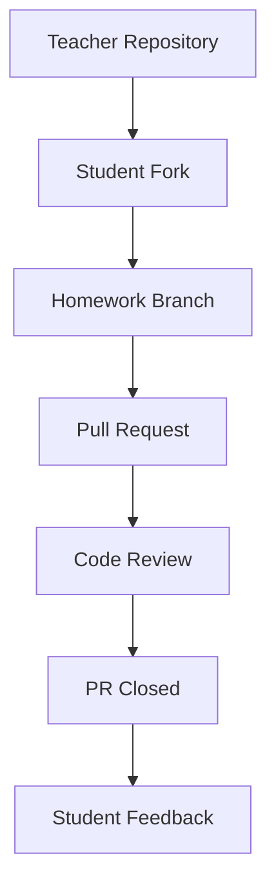
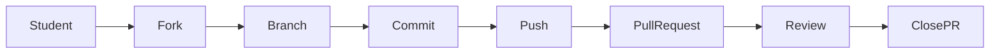

# Архітектура репозиторію

Цей документ описує структуру та робочий процес репозиторію курсу.

Мета репозиторію — організувати матеріали курсу Python, домашні завдання
та взаємодію студентів через GitHub.

---

# Структура репозиторію

```
PY-Course-Victor-Nikoriak-23_02/
│
├── module_1/                        ← Модуль 1: Python Basics (уроки 03–12)
│   ├── docs/                        ← Документація модуля 1
│   │   ├── 00_python_mental_model.md
│   │   ├── 01_zen_of_python.md
│   │   └── git-cheatsheet.md
│   └── lessons/                     ← Уроки модуля 1
│       ├── lesson_03_variables_and_data_types/
│       ├── lesson_04_boolean_logic_and_control/
│       ├── lesson_05_modules_imports_cli/
│       ├── lesson_06_lists_tuples_sets/
│       ├── lesson_07_loops_dicts_comprehensions/
│       ├── lesson_08_functions/
│       ├── lesson_09_modules_standard_library/
│       ├── lesson_10_exceptions_error_handling/
│       ├── lesson_11_file_io_json/
│       └── lesson_12_module1_review/
│
├── module_2/                        ← Модуль 2: Python Intermediate (майбутнє)
│   └── lessons/                     ← Порожньо — уроки будуть додані
│
├── assignments/                     ← Домашні завдання (HW3/, HW4/ …)
│   ├── HW3/
│   │   └── README.md
│   └── HW4/
│       └── README.md
│
├── tools/                           ← Автоматизація курсу
│
├── course.yaml                      ← Конфіг курсу та модулів
├── course.json                      ← Конфіг курсу (JSON)
├── requirements.txt                 ← Python залежності
├── architecture.md                  ← цей файл
├── instructor.md                    ← Профіль викладача
├── README.md                        ← Інструкція для студентів
└── SETUP.md                         ← Інструкція запуску
```

### Пояснення

| Папка / файл | Призначення |
|---|---|
| `module_1/lessons/` | матеріали уроків та приклади коду (Модуль 1) |
| `module_2/lessons/` | майбутні уроки (Модуль 2) |
| `assignments/` | домашні завдання |
| `tools/` | допоміжні скрипти |
| `module_1/docs/` | документація модуля 1 |
| `course.yaml` / `course.json` | конфігурація модулів для Django LMS |
| `README.md` | основна інформація про курс |

---

# Структура уроку

Кожен урок знаходиться у власній папці всередині модуля:

```
module_1/lessons/lesson_NN_topic_slug/
├── notes_*.ipynb          ← Конспект викладача 
├── *_student.ipynb        ← Версія для студентів 
└── *.py                   ← Приклади модулів
```

---

# Структура домашніх завдань

Кожне домашнє завдання має окрему папку:

```
assignments/HW4/README.md
```

Приклад змісту:

```markdown
# Homework 4 — Boolean Logic

## Task 1
Напишіть програму, яка повертає перші два та останні два символи рядка.

Приклад:
helloworld → held
my → mymy
x → ""

---

## Task 2
Зробіть перевірку номера телефону.

Умови:
- довжина = 10
- тільки цифри
```

---

# GitHub workflow

Студенти взаємодіють з репозиторієм через стандартний GitHub workflow.



---

# Робочий процес студента



---

# Навіщо така архітектура

Така структура допомагає:

* організувати матеріали курсу по модулях
* відокремити уроки від домашніх завдань
* підтримувати чисту структуру репозиторію
* використовувати реальний GitHub workflow
* навчити студентів працювати з Pull Request

---
