# 📘 Git Cheatsheet для студентів

## Що таке Git

**Git** — це система контролю версій.

Вона дозволяє:

* зберігати історію змін коду
* працювати у команді
* повернутись до попередніх версій
* відправляти код на GitHub
* співпрацювати через Pull Request

Git використовують **усі IT-компанії**.

---

# Як Git зберігає історію

Git не зберігає просто файли.

Він створює **ланцюжок commit**.

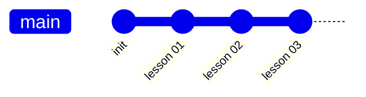

Кожен commit — це **знімок проєкту у певний момент часу**.

---

# Що таке commit

Commit — це **збереження змін у репозиторії**.

Кожен commit має:

* автора
* дату
* опис
* список змінених файлів

Приклад:

```
commit 91ab21
Author: Student
Message: Homework 04
```

---

# Що таке branch

Branch — це **окрема гілка розробки**.

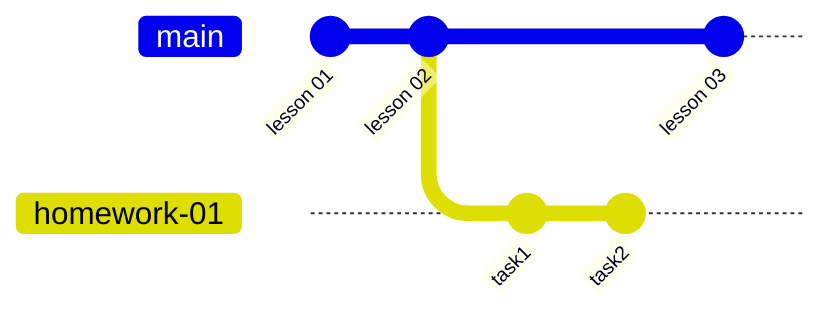

Це дозволяє:

* працювати над новим кодом
* не ламати основний код

---

# Структура курсу

У курсі використовується такий workflow.

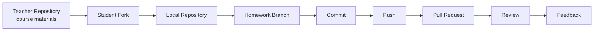

---

# Репозиторії у курсі

У студентів є **два remote**.

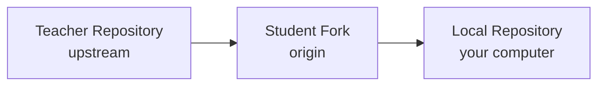

---

# Remote repositories

Перевірити remote:

```bash
git remote -v
```

Приклад:

```
origin   → ваш fork
upstream → repo викладача
```

| remote   | значення               |
| -------- | ---------------------- |
| origin   | ваш GitHub репозиторій |
| upstream | репозиторій викладача  |

---

# Найважливіші команди Git

Для роботи на курсі студентам достатньо знати **8 базових команд Git**.

| Команда           | Короткий опис              |
| ----------------- | -------------------------- |
| `git status`      | показує стан репозиторію   |
| `git branch`      | показує список гілок       |
| `git switch`      | переключає між гілками     |
| `git checkout -b` | створює нову гілку         |
| `git add`         | додає файли до commit      |
| `git commit`      | зберігає зміни             |
| `git push`        | відправляє зміни на GitHub |
| `git pull`        | отримує зміни з GitHub     |

Ці команди покривають **приблизно 90% роботи з Git**.

---

# 1️⃣ git status

```bash
git status
```

### Що робить команда

Показує **поточний стан репозиторію**.

Git повідомляє:

* у якій гілці ви знаходитесь
* які файли змінені
* які файли нові
* які файли готові до commit

---

### Приклад

```
On branch homework-01

Changes not staged for commit:
  modified: task1.py

Untracked files:
  test.py
```

---

# 2️⃣ git branch

```bash
git branch
```

Показує всі **гілки репозиторію**.

```
* main
homework-01
homework-02
```

`*` означає **активну гілку**.

---

# 3️⃣ git switch

```bash
git switch branch_name
```

Переключає на іншу гілку.

```
git switch main
```

---

# 4️⃣ git checkout -b

```bash
git checkout -b branch_name
```

Створює нову гілку **і одразу переходить у неї**.

```
git checkout -b homework-05
```

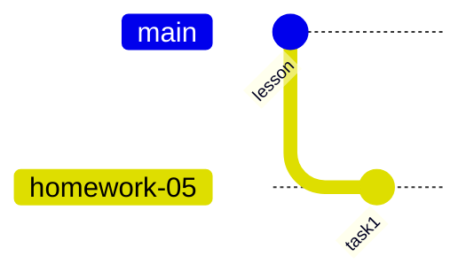

---

# 5️⃣ git add

```bash
git add file_name
```

або

```
git add .
```

Додає файли у **staging area**.

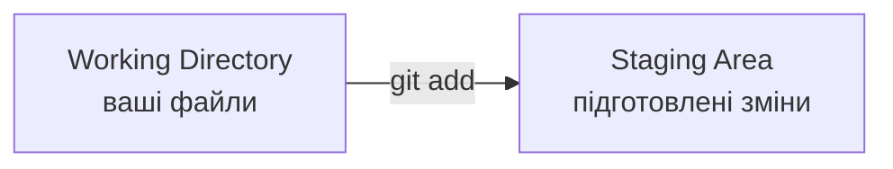

---

# 6️⃣ git commit

```bash
git commit -m "message"
```

Створює **commit** — збереження змін у історії Git.

```
git commit -m "Homework 01"
```

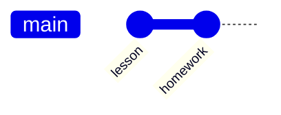

---

# 7️⃣ git push

```bash
git push origin branch_name
```

Відправляє commit **на GitHub**.

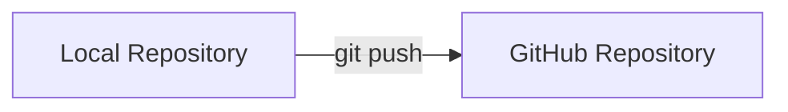

---

# 8️⃣ git pull

```bash
git pull
```

Отримує нові зміни **з GitHub**.

Фактично:

```
git fetch
git merge
```

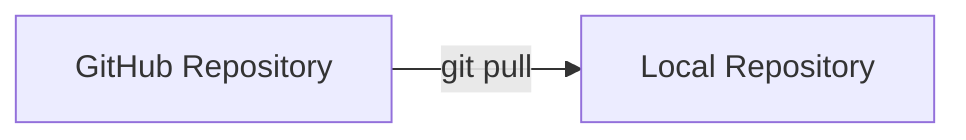

---

# Повний workflow студента

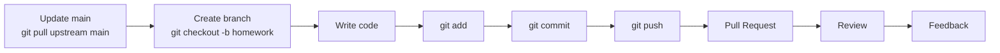

---

# Merge

Merge — це **об'єднання гілок**.

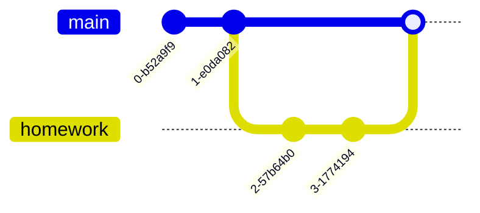

---

# Головне правило Git

Перед будь-якою роботою перевіряйте:

```
git status
```

---

# Порада

Git здається складним лише на початку.

Через кілька тижнів роботи ці команди стають **повністю автоматичними**.

---

# Корисні ресурси

Git documentation
[https://git-scm.com/docs](https://git-scm.com/docs)

Git visualization
[https://git-school.github.io/visualizing-git/](https://git-school.github.io/visualizing-git/)

---

