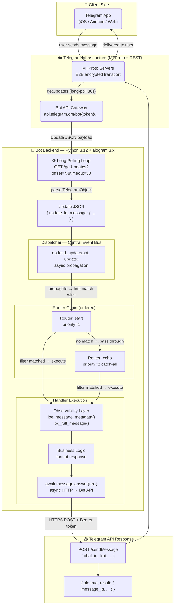
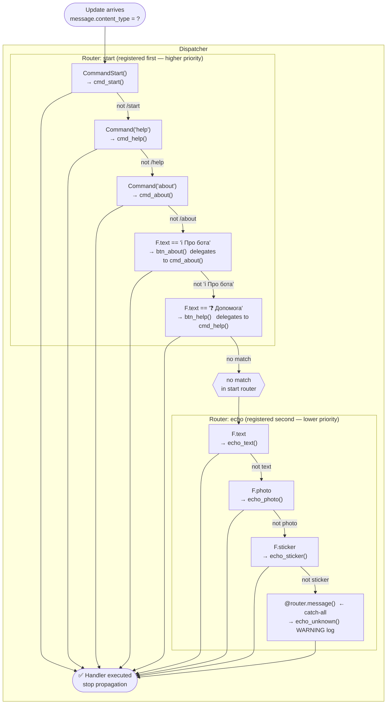
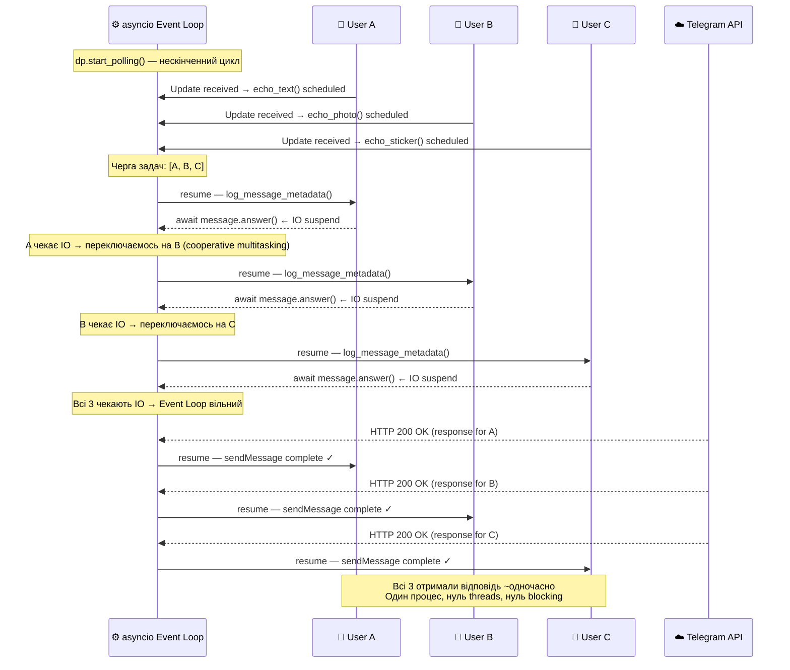
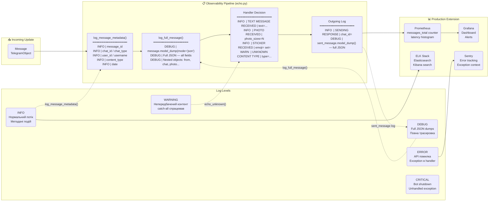
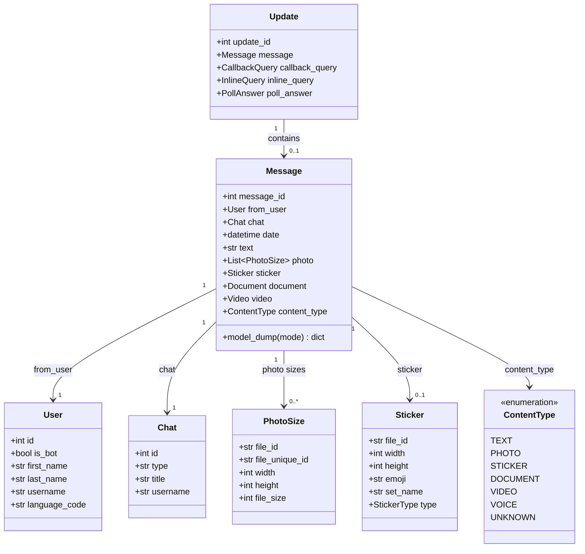
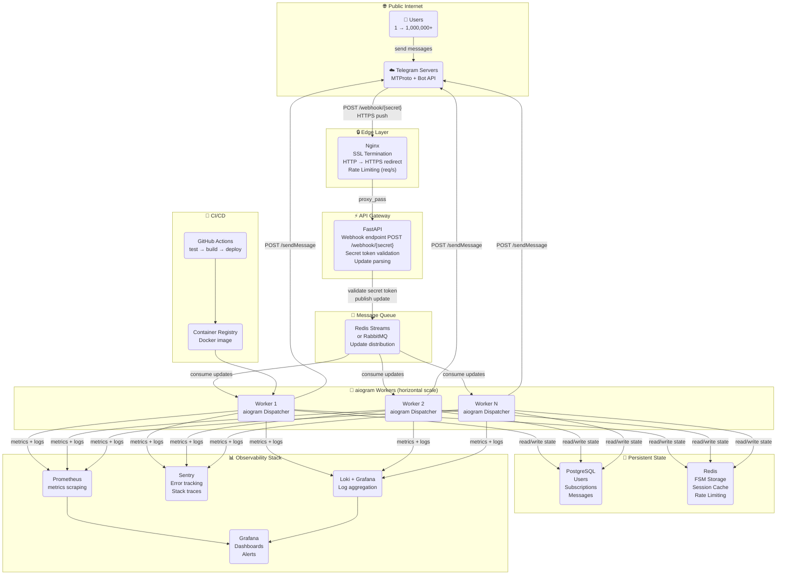

# Echo Bot — Event-Driven Backend Architecture

> **Ментальна модель:** Telegram Bot — це не "просто бот".  
> Це **event-driven distributed backend system** з async I/O, routing pipeline і observability layer.

```
Update → Dispatcher → Router Chain → Filter Engine → Handler → Observability → Response
```

---

## Diagram 1 — High-Level Telegram Flow

> Повний шлях події від натискання кнопки у Telegram до відповіді бота.



**Ключові точки:**
- **Long Polling** — бот сам опитує Telegram кожні 30 секунд. Альтернатива: webhook (Telegram пушить до бота).
- **Update JSON** — Telegram надсилає весь об'єкт: `update_id`, `message`, `from_user`, `chat`. aiogram парсить це у Pydantic-моделі.
- **Один HTTP-запит = одна подія** = один прохід через весь pipeline.

---

## Diagram 2 — aiogram Internal Routing Pipeline

> Як aiogram вирішує, який handler викликати. Перший збіг виграє — далі пошук зупиняється.



**Чому порядок роутерів критичний:**

```python
# bot.py — порядок реєстрації = порядок пошуку
dp.include_router(start.router)   # 1. команди + кнопки клавіатури
dp.include_router(echo.router)    # 2. ехо + fallback
```

Якби `echo.router` стояв першим — `F.text` перехопив би натискання кнопок `"ℹ️ Про бота"` до того, як `start.router` міг би їх обробити.

---

## Diagram 3 — Event Loop & Async Concurrency

> Як `asyncio` дозволяє одному процесу обслуговувати сотні користувачів одночасно без threading.



**Синхронний vs Асинхронний:**

```
Sync (blocking):
  User A  ████████████ 3s
  User B              ████████████ 3s
  User C                          ████████████ 3s
  Total: 9 seconds

Async (non-blocking):
  User A  ████████████ 3s
  User B  ████████████ 3s   ← паралельно!
  User C  ████████████ 3s   ← паралельно!
  Total: ~3 seconds
```

Ключ — `await`: коли handler чекає відповіді від Telegram API, Event Loop перемикається на іншу задачу.

---

## Diagram 4 — Observability Layer

> Що і де логується в echo_bot. Production-style structured logging.



**Налаштування рівня логування:**

```bash
# .env
LOG_LEVEL=DEBUG   # повний JSON кожного update
LOG_LEVEL=INFO    # тільки metadata (production default)
LOG_LEVEL=WARNING # тільки аномалії
```

---

## Diagram 5 — Telegram Update Object Schema

> Структура JSON, який Telegram надсилає боту. aiogram парсить це у Pydantic-моделі.



**Як aiogram читає цей JSON:**

```python
# Telegram надсилає raw JSON:
# { "update_id": 123, "message": { "message_id": 456, "from": {...}, "text": "hello" } }

# aiogram автоматично парсить у Pydantic:
message.from_user.id        # int
message.from_user.username  # str | None
message.chat.type           # "private" | "group" | "supergroup" | "channel"
message.content_type        # ContentType.TEXT

# model_dump() — назад у JSON для логування:
message.model_dump(mode="json")  # → dict, JSON serializable
```

---

## Diagram 6 — Production Scaling Path

> Від навчального polling-бота до production-ready горизонтально масштабованої системи.



**Еволюція архітектури:**

| Стадія | Підхід | Юзери | Складність |
|--------|--------|-------|------------|
| ⭐ Echo Bot (зараз) | Long Polling, 1 процес | 1–100 | Мінімальна |
| ⭐⭐ AI Bot | Long Polling + Redis | 100–1K | Середня |
| ⭐⭐⭐ Production | Webhook + FastAPI + PostgreSQL | 1K–100K | Висока |
| 🚀 Scale | Webhook + Workers + Redis Streams | 100K+ | Розподілена |

**Перехід Polling → Webhook:**

```python
# Polling (розробка):
await dp.start_polling(bot, drop_pending_updates=True)
# Бот сам питає Telegram кожні 30 сек

# Webhook (production):
await bot.set_webhook(url="https://yourdomain.com/webhook/SECRET")
# Telegram сам пушить updates до бота — менше затримка, менше трафік
```

---

## Backend Engineering Mental Model

```
Telegram Bot
  = Event-Driven System
    + Async I/O Runtime
    + Routing Pipeline
    + Observability Layer

Event
  = Update (JSON from Telegram)

Event-Driven
  = handler виконується тільки при надходженні події
  = система не "поллює" постійно — вона реагує

Async I/O
  = один потік обслуговує N одночасних з'єднань
  = await = "паузую цю задачу, роби інших, повернись коли IO готово"

Routing Pipeline
  = Update → Dispatcher → Router → Filter → Handler
  = кожен рівень звужує набір можливих handlers

Observability
  = логи (що сталось) + метрики (скільки/як довго) + трейси (де)
  = без observability — система "чорна скринька"
```
