# Урок 46 — Telegram Bot API: Mermaid Діаграми

---

## Діаграма 1: Архітектура системи — від User до Handler

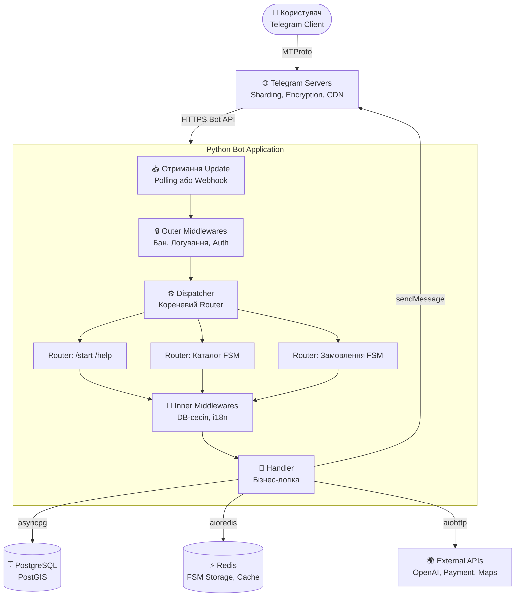
```mermaid
flowchart TD
    USER([👤 Користувач\nTelegram Client]) -->|MTProto| TG[🌐 Telegram Servers\nSharding, Encryption, CDN]

    TG -->|HTTPS Bot API| BOT_ARCH

    subgraph BOT_ARCH["Python Bot Application"]
        direction TB
        RECV[📥 Отримання Update\nPolling або Webhook]
        RECV --> OUTER[🔒 Outer Middlewares\nБан, Логування, Auth]
        OUTER --> DISP[⚙️ Dispatcher\nКореневий Router]
        DISP --> R1[Router: /start /help]
        DISP --> R2[Router: Каталог FSM]
        DISP --> R3[Router: Замовлення FSM]
        R1 --> INNER[🔧 Inner Middlewares\nDB-сесія, i18n]
        R2 --> INNER
        R3 --> INNER
        INNER --> HANDLER[🎯 Handler\nБізнес-логіка]
    end

    HANDLER -->|asyncpg| DB[(🗄️ PostgreSQL\nPostGIS)]
    HANDLER -->|aioredis| REDIS[(⚡ Redis\nFSM Storage, Cache)]
    HANDLER -->|aiohttp| EXT[🌍 External APIs\nOpenAI, Payment, Maps]
    HANDLER -->|sendMessage| TG
```

---

## Діаграма 2: Polling vs Webhook — Порівняння архітектур

# ✅ 1. LONG POLLING

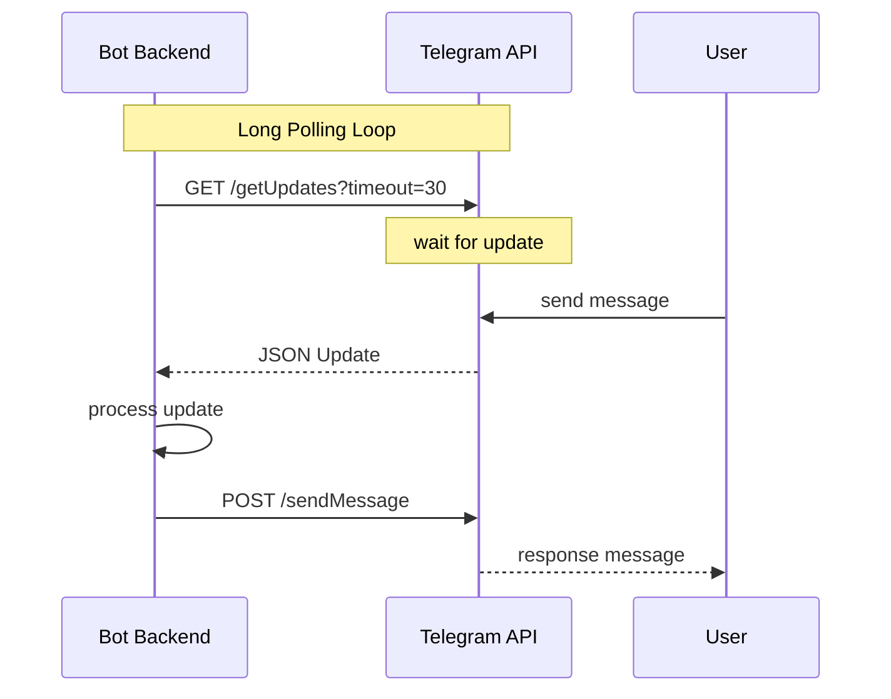
```mermaid
sequenceDiagram

    participant BOT as Bot Backend
    participant TG as Telegram API
    participant USER as User

    Note over BOT,TG: Long Polling Loop

    BOT->>TG: GET /getUpdates?timeout=30

    Note over TG: wait for update

    USER->>TG: send message

    TG-->>BOT: JSON Update

    BOT->>BOT: process update

    BOT->>TG: POST /sendMessage

    TG-->>USER: response message
```

---

# ✅ 2. WEBHOOK

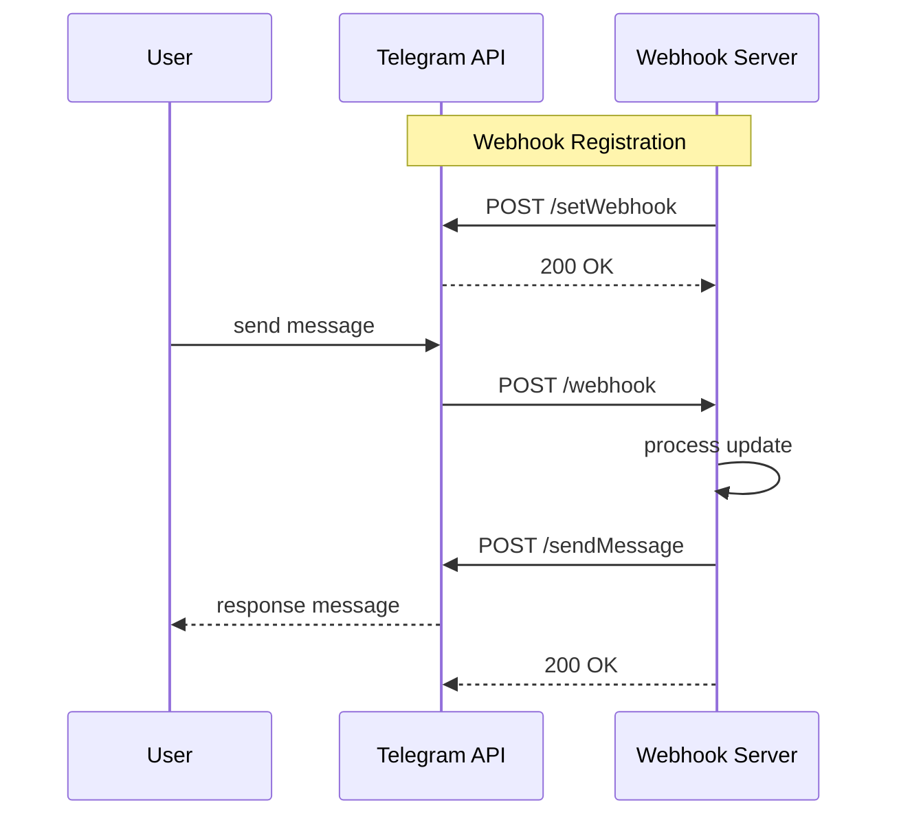
```mermaid
sequenceDiagram

    participant USER as User
    participant TG as Telegram API
    participant BOT as Webhook Server

    Note over BOT,TG: Webhook Registration

    BOT->>TG: POST /setWebhook

    TG-->>BOT: 200 OK

    USER->>TG: send message

    TG->>BOT: POST /webhook

    BOT->>BOT: process update

    BOT->>TG: POST /sendMessage

    TG-->>USER: response message

    BOT-->>TG: 200 OK
```

---

# Архітектурне порівняння.

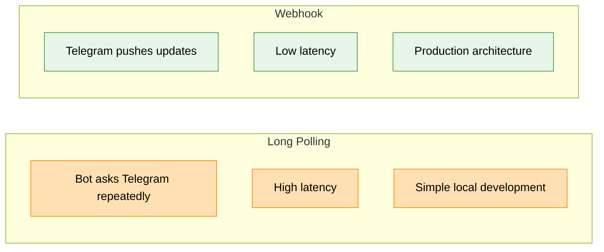
```mermaid
flowchart LR

    classDef polling fill:#FFE0B2,stroke:#FB8C00,color:#000
    classDef webhook fill:#E8F5E9,stroke:#43A047,color:#000

    subgraph POLLING["Long Polling"]
        P1["Bot asks Telegram repeatedly"]:::polling
        P2["High latency"]:::polling
        P3["Simple local development"]:::polling
    end

    subgraph WEBHOOK["Webhook"]
        W1["Telegram pushes updates"]:::webhook
        W2["Low latency"]:::webhook
        W3["Production architecture"]:::webhook
    end
```

---

# NETWORK THINKING

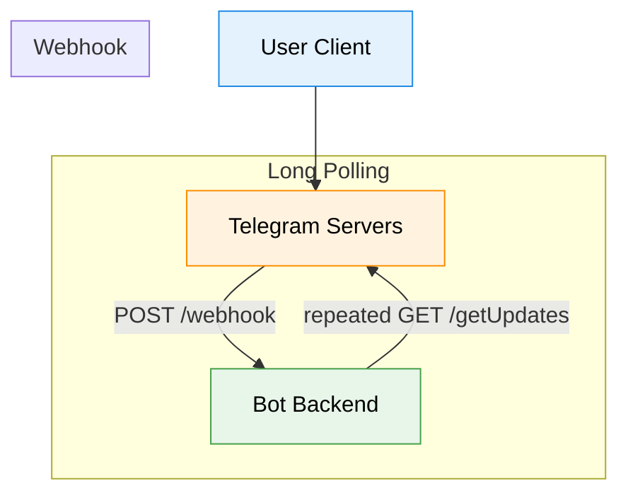
```mermaid
flowchart TB

    classDef client fill:#E3F2FD,stroke:#1E88E5,color:#000
    classDef telegram fill:#FFF3E0,stroke:#FB8C00,color:#000
    classDef backend fill:#E8F5E9,stroke:#43A047,color:#000

    User["User Client"]:::client

    Telegram["Telegram Servers"]:::telegram

    Bot["Bot Backend"]:::backend

    User --> Telegram

    subgraph POLLING["Long Polling"]
        Bot -->|"repeated GET /getUpdates"| Telegram
    end

    subgraph WEBHOOK["Webhook"]
        Telegram -->|"POST /webhook"| Bot
    end
```

---

## Діаграма 3: Lifecycle об'єкта Update

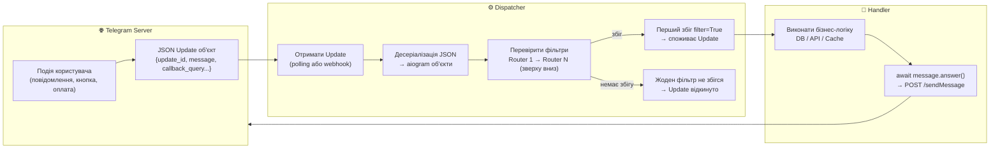
```mermaid
flowchart LR
    subgraph TG["🌐 Telegram Server"]
        EV["Подія користувача\n(повідомлення, кнопка, оплата)"]
        JSON["JSON Update об'єкт\n{update_id, message, callback_query...}"]
        EV --> JSON
    end

    subgraph DISP["⚙️ Dispatcher"]
        RECV["Отримати Update\n(polling або webhook)"]
        DESER["Десеріалізація JSON\n→ aiogram об'єкти"]
        ROUTE["Перевірити фільтри\nRouter 1 → Router N (зверху вниз)"]
        FIRST["Перший збіг filter=True\n→ споживає Update"]
        DROP["Жоден фільтр не збігся\n→ Update відкинуто"]
        RECV --> DESER --> ROUTE
        ROUTE -- збіг --> FIRST
        ROUTE -- немає збігу --> DROP
    end

    subgraph HANDLER["🎯 Handler"]
        EXEC["Виконати бізнес-логіку\nDB / API / Cache"]
        RESP["await message.answer()\n→ POST /sendMessage"]
        EXEC --> RESP
    end

    JSON --> RECV
    FIRST --> EXEC
    RESP --> TG
```

---

## Діаграма 4: Asyncio Event Loop у Telegram Bot

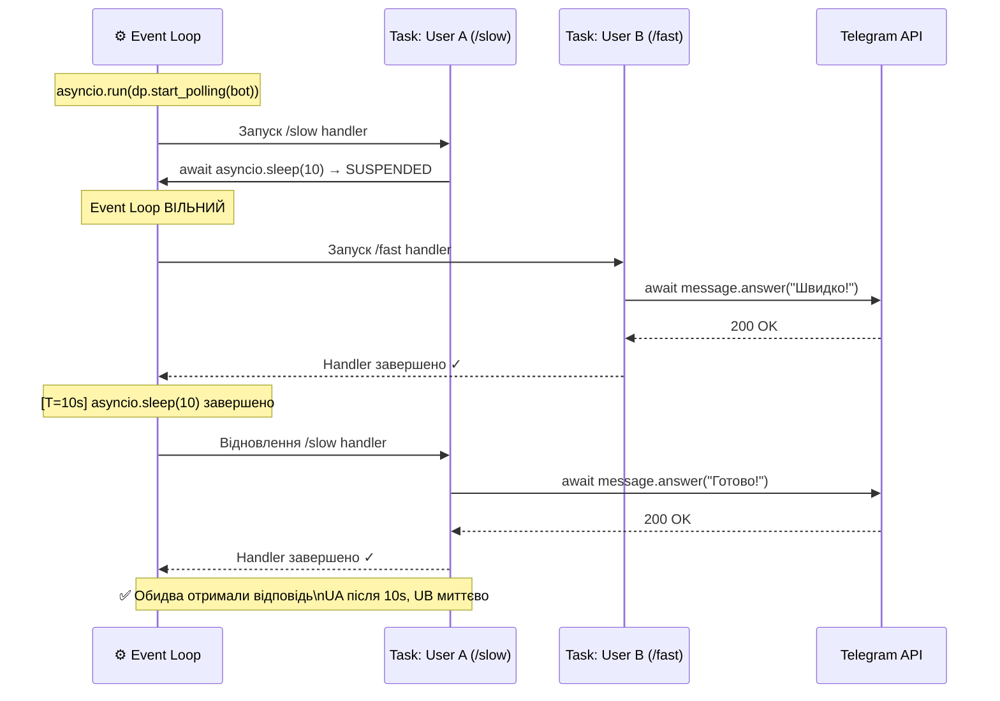
```mermaid
sequenceDiagram
    participant EL as ⚙️ Event Loop
    participant UA as Task: User A (/slow)
    participant UB as Task: User B (/fast)
    participant TG as Telegram API

    Note over EL: asyncio.run(dp.start_polling(bot))

    EL->>UA: Запуск /slow handler
    UA->>EL: await asyncio.sleep(10) → SUSPENDED
    Note over EL: Event Loop ВІЛЬНИЙ

    EL->>UB: Запуск /fast handler
    UB->>TG: await message.answer("Швидко!")
    TG-->>UB: 200 OK
    UB-->>EL: Handler завершено ✓

    Note over EL: [T=10s] asyncio.sleep(10) завершено
    EL->>UA: Відновлення /slow handler
    UA->>TG: await message.answer("Готово!")
    TG-->>UA: 200 OK
    UA-->>EL: Handler завершено ✓

    Note over EL,UA: ✅ Обидва отримали відповідь\nUA після 10s, UB миттєво
```

---

## Діаграма 5: Blocking vs Non-Blocking порівняння

#  1. BLOCKING EVENT LOOP

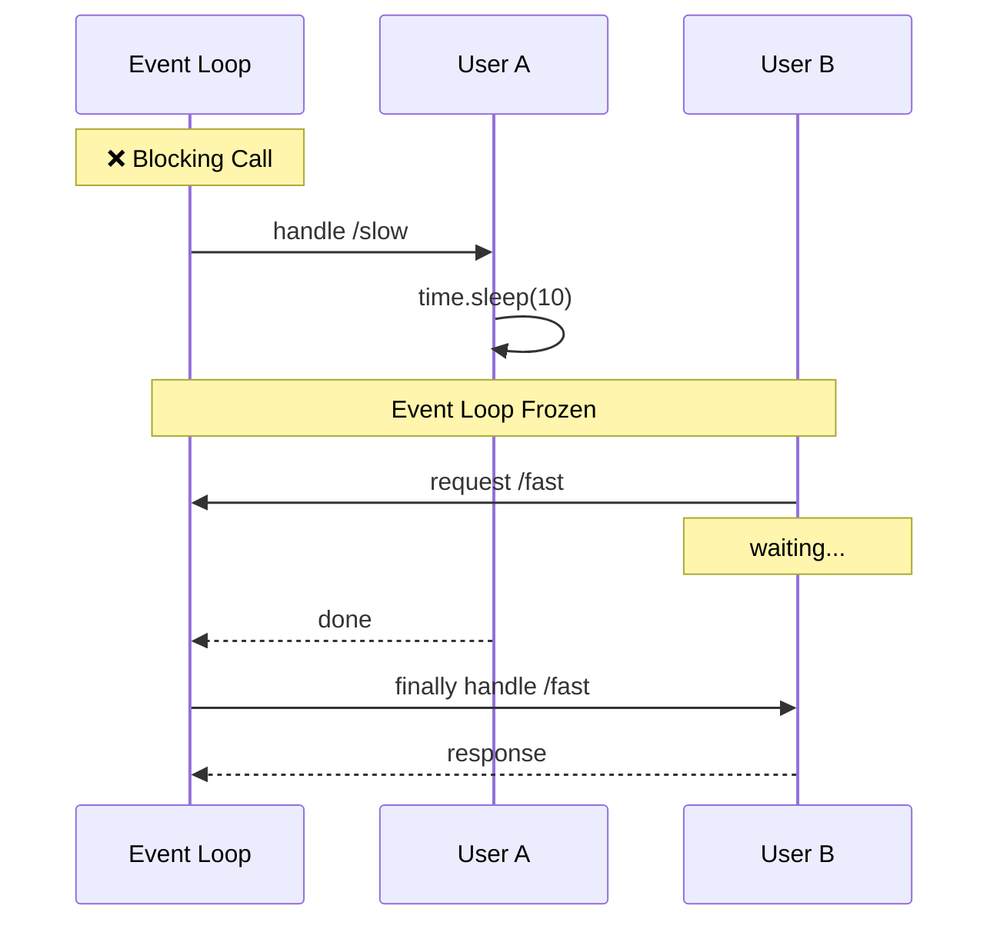
```mermaid
sequenceDiagram

    participant EL as Event Loop
    participant A as User A
    participant B as User B

    Note over EL: ❌ Blocking Call

    EL->>A: handle /slow

    A->>A: time.sleep(10)

    Note over EL,B: Event Loop Frozen

    B->>EL: request /fast

    Note over B: waiting...

    A-->>EL: done

    EL->>B: finally handle /fast

    B-->>EL: response
```

---

#  2. NON-BLOCKING ASYNCIO

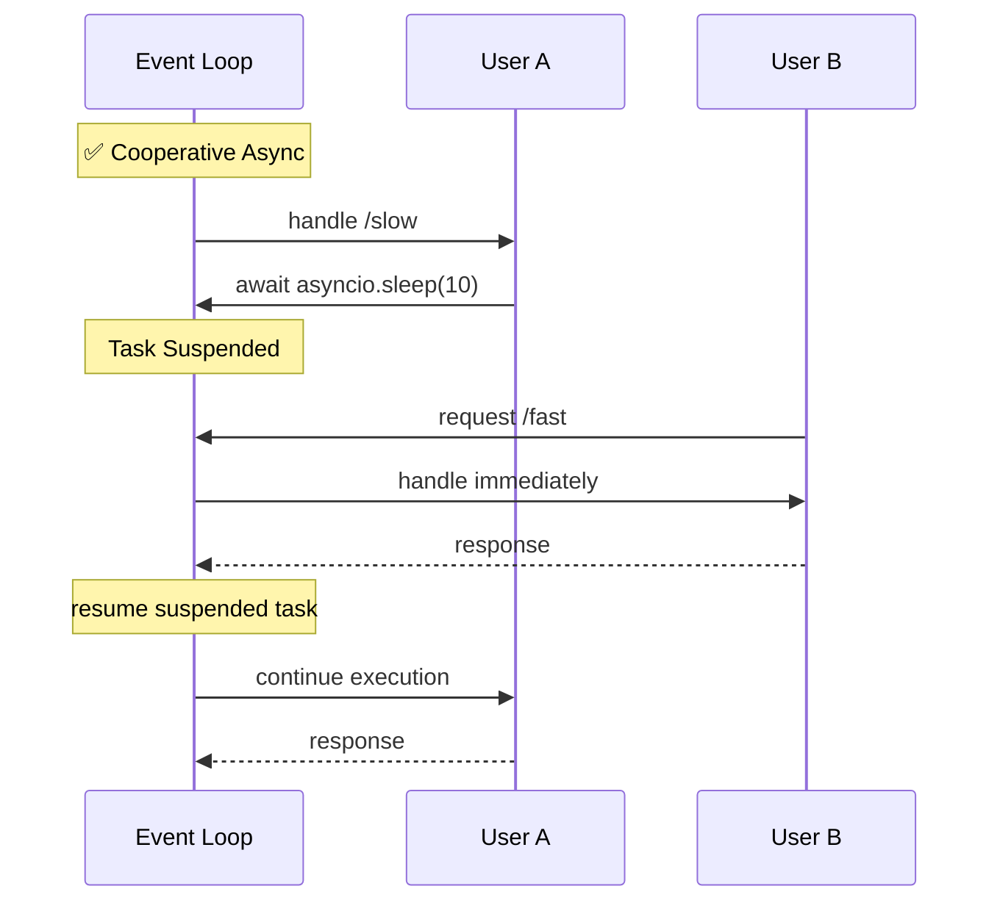
```mermaid
sequenceDiagram

    participant EL as Event Loop
    participant A as User A
    participant B as User B

    Note over EL: ✅ Cooperative Async

    EL->>A: handle /slow

    A->>EL: await asyncio.sleep(10)

    Note over EL: Task Suspended

    B->>EL: request /fast

    EL->>B: handle immediately

    B-->>EL: response

    Note over EL: resume suspended task

    EL->>A: continue execution

    A-->>EL: response
```

---

# Event Loop Scheduler Visualization

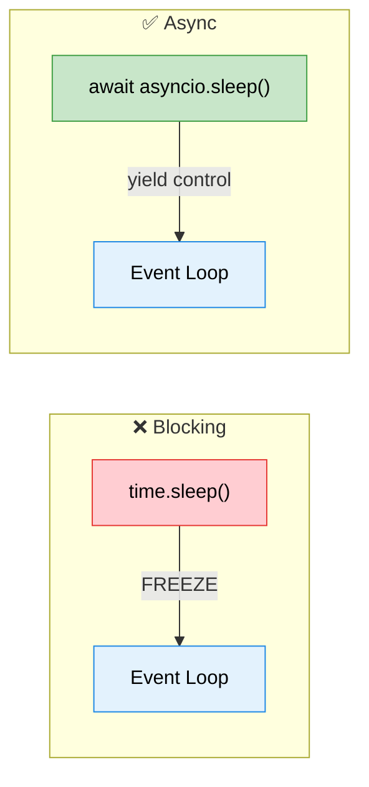
```mermaid
flowchart LR

    classDef blocked fill:#FFCDD2,stroke:#E53935,color:#000
    classDef async fill:#C8E6C9,stroke:#43A047,color:#000
    classDef loop fill:#E3F2FD,stroke:#1E88E5,color:#000

    subgraph BLOCKING["❌ Blocking"]
        BL["time.sleep()"]:::blocked

        EL1["Event Loop"]:::loop

        BL -->|"FREEZE"| EL1
    end

    subgraph ASYNC["✅ Async"]
        AS["await asyncio.sleep()"]:::async

        EL2["Event Loop"]:::loop

        AS -->|"yield control"| EL2
    end
```

---

# TIMELINE

```mermaid
gantt
    title Blocking vs Async Timeline
    dateFormat X
    axisFormat %s

    section Blocking
    User A slow task :0, 10
    User B waits     :0, 10

    section Async
    User A suspended :0, 10
    User B executes  :1, 2
```

---

## Діаграма 6: Маршрутизація Handler — каскадний пошук

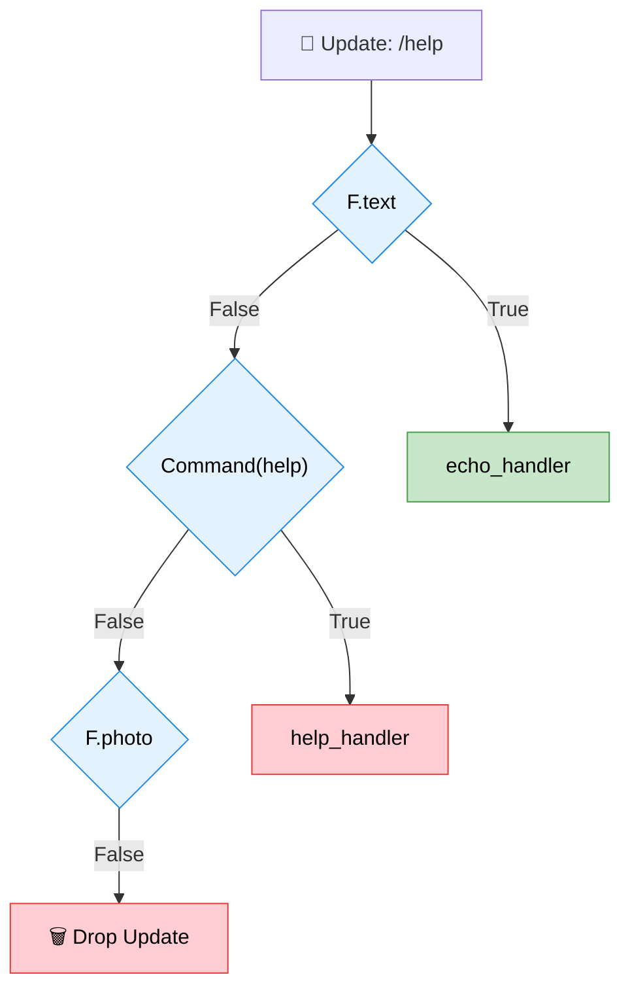
```mermaid 
flowchart TD

    classDef handler fill:#E3F2FD,stroke:#1E88E5,color:#000
    classDef success fill:#C8E6C9,stroke:#43A047,color:#000
    classDef fail fill:#FFCDD2,stroke:#E53935,color:#000

    Update["📩 Update: /help"]

    H1{"F.text"}:::handler
    H2{"Command(help)"}:::handler
    H3{"F.photo"}:::handler

    Echo["echo_handler"]:::success

    Help["help_handler"]:::fail

    Drop["🗑️ Drop Update"]:::fail

    Update --> H1

    H1 -->|"True"| Echo
    H1 -->|"False"| H2

    H2 -->|"True"| Help
    H2 -->|"False"| H3

    H3 -->|"False"| Drop
```

---

# Архітектурне мислення dispatcher pipeline.

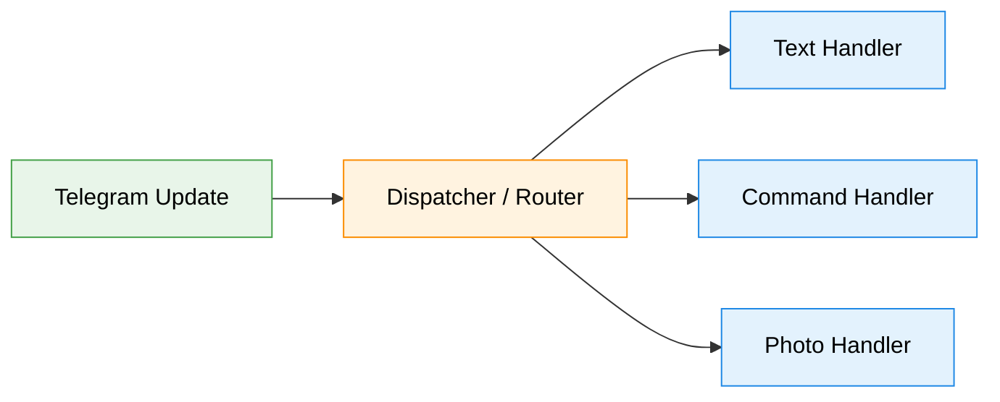
```mermaid
flowchart LR

    classDef update fill:#E8F5E9,stroke:#43A047,color:#000
    classDef router fill:#FFF3E0,stroke:#FB8C00,color:#000
    classDef handler fill:#E3F2FD,stroke:#1E88E5,color:#000

    Update["Telegram Update"]:::update

    Router["Dispatcher / Router"]:::router

    Text["Text Handler"]:::handler
    Command["Command Handler"]:::handler
    Photo["Photo Handler"]:::handler

    Update --> Router

    Router --> Text
    Router --> Command
    Router --> Photo
```

---

# First Match Wins

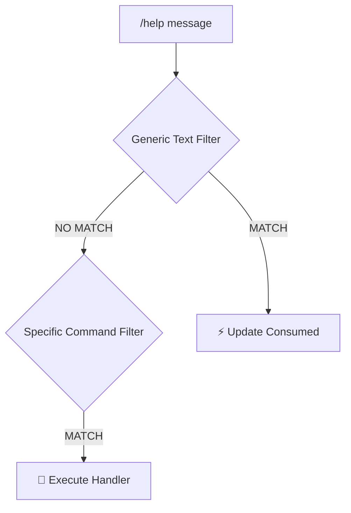
```mermaid
flowchart TB

    Update["/help message"]

    Check1{"Generic Text Filter"}

    Check2{"Specific Command Filter"}

    Update --> Check1

    Check1 -->|"MATCH"| Consume["⚡ Update Consumed"]

    Check1 -->|"NO MATCH"| Check2

    Check2 -->|"MATCH"| Handle["🎯 Execute Handler"]
```

---

## Діаграма 7: FSM — Кінцевий Автомат (State Machine)

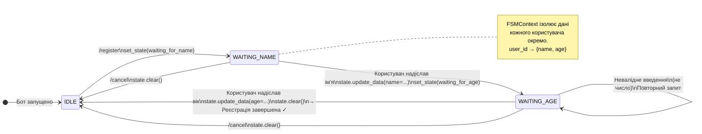
```mermaid
stateDiagram-v2
    direction LR

    [*] --> IDLE : Бот запущено

    IDLE --> WAITING_NAME : /register\nset_state(waiting_for_name)

    WAITING_NAME --> WAITING_AGE : Користувач надіслав ім'я\nstate.update_data(name=...)\nset_state(waiting_for_age)

    WAITING_NAME --> IDLE : /cancel\nstate.clear()

    WAITING_AGE --> IDLE : Користувач надіслав вік\nstate.update_data(age=...)\nstate.clear()\n→ Реєстрація завершена ✓

    WAITING_AGE --> WAITING_AGE : Невалідне введення\n(не число)\nПовторний запит

    WAITING_AGE --> IDLE : /cancel\nstate.clear()

    note right of WAITING_NAME
        FSMContext ізолює дані
        кожного користувача окремо.
        user_id → {name, age}
    end note
```

---

## Діаграма 8: MemoryStorage vs RedisStorage

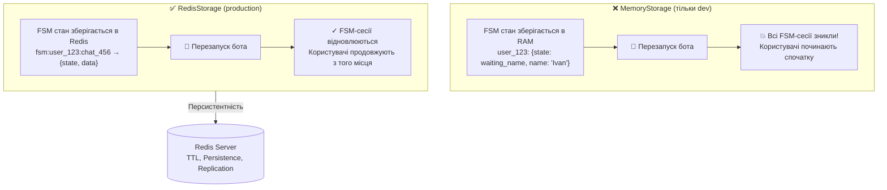
```mermaid
flowchart TD
    subgraph MEM["❌ MemoryStorage (тільки dev)"]
        M1["FSM стан зберігається в RAM\nuser_123: {state: waiting_name, name: 'Ivan'}"]
        M2["🔄 Перезапуск бота"]
        M3["💥 Всі FSM-сесії зникли!\nКористувачі починають спочатку"]
        M1 --> M2 --> M3
    end

    subgraph REDIS["✅ RedisStorage (production)"]
        R1["FSM стан зберігається в Redis\nfsm:user_123:chat_456 → {state, data}"]
        R2["🔄 Перезапуск бота"]
        R3["✓ FSM-сесії відновлюються\nКористувачі продовжують з того місця"]
        R1 --> R2 --> R3
    end

    REDIS -->|Персистентність| DB[(Redis Server\nTTL, Persistence, Replication)]
```

---

## Діаграма 9: Middleware — "цибулина" навколо Handler

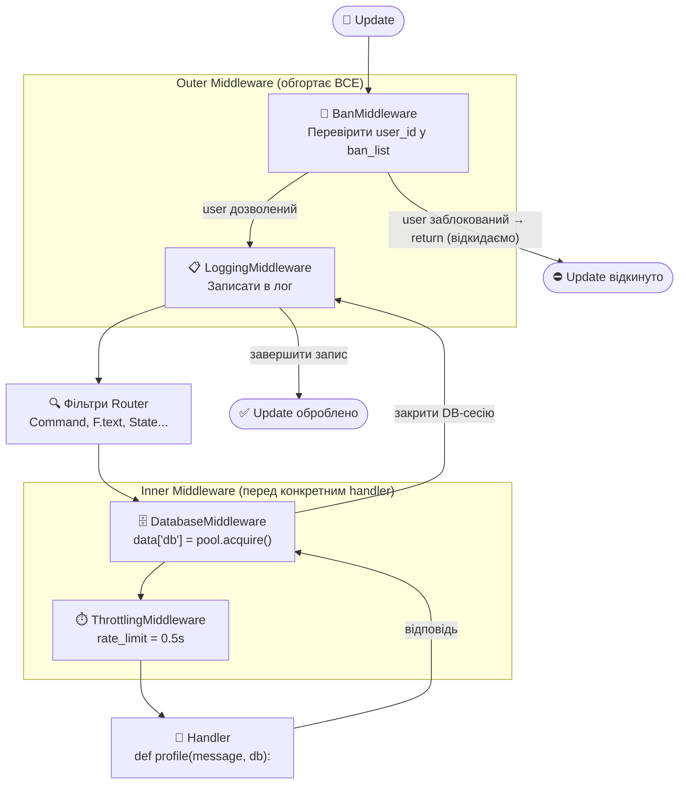
```mermaid
flowchart TD
    UPD([📩 Update]) --> BAN

    subgraph OUTER["Outer Middleware (обгортає ВСЕ)"]
        BAN["🚫 BanMiddleware\nПеревірити user_id у ban_list"]
        LOG["📋 LoggingMiddleware\nЗаписати в лог"]
    end

    subgraph INNER["Inner Middleware (перед конкретним handler)"]
        DB_MW["🗄️ DatabaseMiddleware\ndata['db'] = pool.acquire()"]
        THROTTLE["⏱️ ThrottlingMiddleware\nrate_limit = 0.5s"]
    end

    BAN -- "user заблокований → return (відкидаємо)" --> BLOCKED([⛔ Update відкинуто])
    BAN -- "user дозволений" --> LOG
    LOG --> FILTERS["🔍 Фільтри Router\nCommand, F.text, State..."]
    FILTERS --> DB_MW
    DB_MW --> THROTTLE
    THROTTLE --> HANDLER["🎯 Handler\ndef profile(message, db):"]

    HANDLER -- "відповідь" --> DB_MW
    DB_MW -- "закрити DB-сесію" --> LOG
    LOG -- "завершити запис" --> RESP([✅ Update оброблено])
```

---

## Діаграма 10: Webhook + FastAPI — Production Архітектура

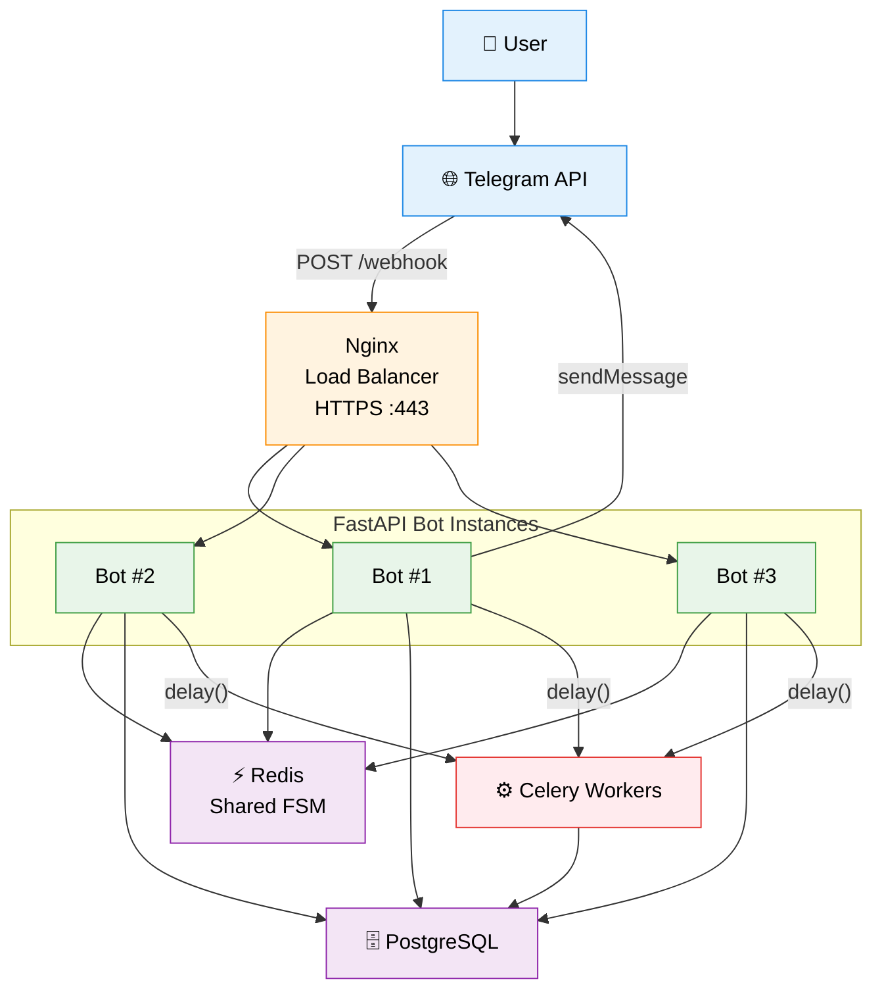
```mermaid
flowchart TB

    classDef client fill:#E3F2FD,stroke:#1E88E5,color:#000
    classDef proxy fill:#FFF3E0,stroke:#FB8C00,color:#000
    classDef bot fill:#E8F5E9,stroke:#43A047,color:#000
    classDef db fill:#F3E5F5,stroke:#8E24AA,color:#000
    classDef worker fill:#FFEBEE,stroke:#E53935,color:#000

    USER["👤 User"]:::client

    TG["🌐 Telegram API"]:::client

    NGINX["Nginx\nLoad Balancer\nHTTPS :443"]:::proxy

    subgraph BOTS["FastAPI Bot Instances"]
        B1["Bot #1"]:::bot
        B2["Bot #2"]:::bot
        B3["Bot #3"]:::bot
    end

    REDIS["⚡ Redis\nShared FSM"]:::db

    POSTGRES["🗄️ PostgreSQL"]:::db

    CELERY["⚙️ Celery Workers"]:::worker

    USER --> TG

    TG -->|"POST /webhook"| NGINX

    NGINX --> B1
    NGINX --> B2
    NGINX --> B3

    B1 --> REDIS
    B2 --> REDIS
    B3 --> REDIS

    B1 --> POSTGRES
    B2 --> POSTGRES
    B3 --> POSTGRES

    B1 -->|"delay()"| CELERY
    B2 -->|"delay()"| CELERY
    B3 -->|"delay()"| CELERY

    CELERY --> POSTGRES

    B1 -->|"sendMessage"| TG
```

---

# Production request lifecycle.

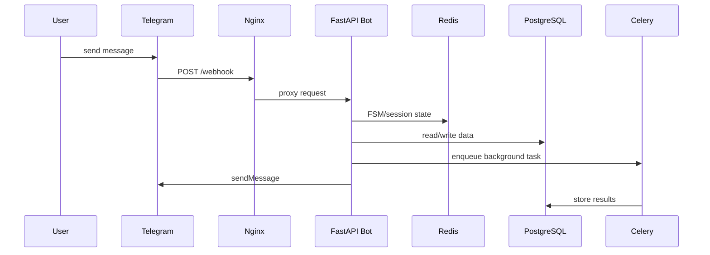
```mermaid 
sequenceDiagram

    participant USER as User
    participant TG as Telegram
    participant NGINX as Nginx
    participant BOT as FastAPI Bot
    participant REDIS as Redis
    participant DB as PostgreSQL
    participant CELERY as Celery

    USER->>TG: send message

    TG->>NGINX: POST /webhook

    NGINX->>BOT: proxy request

    BOT->>REDIS: FSM/session state

    BOT->>DB: read/write data

    BOT->>CELERY: enqueue background task

    BOT->>TG: sendMessage

    CELERY->>DB: store results
```

---

# Horizontal scaling problem.

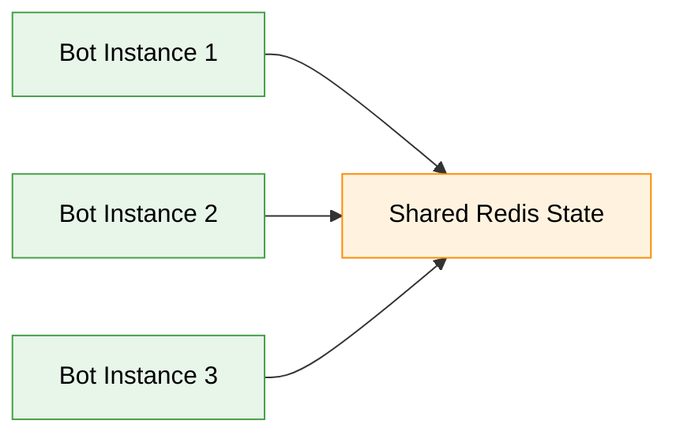
```mermaid
flowchart LR

    classDef bot fill:#E8F5E9,stroke:#43A047,color:#000
    classDef shared fill:#FFF3E0,stroke:#FB8C00,color:#000

    B1["Bot Instance 1"]:::bot
    B2["Bot Instance 2"]:::bot
    B3["Bot Instance 3"]:::bot

    Shared["Shared Redis State"]:::shared

    B1 --> Shared
    B2 --> Shared
    B3 --> Shared
```

---

# Event-Driven Architecture

```mermaid
flowchart LR

    Webhook["Webhook Event"]

    Bot["FastAPI Bot"]

    Queue["Redis/Celery Queue"]

    Worker["Background Worker"]

    DB["Database"]

    Webhook --> Bot

    Bot --> Queue

    Queue --> Worker

    Worker --> DB
```

---

## Діаграма 11: Планування задач у часі

```mermaid
sequenceDiagram
    participant USER as 👤 Користувач
    participant BOT as Bot Handler
    participant EL as Event Loop
    participant SCHED as APScheduler
    participant DB as PostgreSQL

    USER->>BOT: /remind "Зустріч" 14:00
    BOT->>DB: INSERT INTO reminders (user_id, text, at)
    BOT->>SCHED: scheduler.add_job(send_reminder, 'date', run_date=14:00)
    BOT-->>USER: "✅ Нагадаю о 14:00"

    Note over EL: [T=13:45 — 15 хвилин до]
    SCHED->>EL: Запланований job спрацював
    EL->>BOT: send_reminder(user_id, "Зустріч")
    BOT->>USER: "⏰ 15 хвилин до: Зустріч"

    Note over EL: [T=14:00]
    SCHED->>EL: Запланований job спрацював
    EL->>BOT: send_reminder(user_id, "Зустріч")
    BOT->>USER: "🔔 Час! Зустріч"
    BOT->>DB: DELETE FROM reminders WHERE id=...
```

---

## Діаграма 12: Update Processing Flow — повний цикл

```mermaid
flowchart LR
    subgraph INPUT["📥 Вхід"]
        POLL["Long Polling\ngetUpdates loop"]
        HOOK["Webhook\nPOST /webhook"]
    end

    subgraph PROCESS["⚙️ Dispatcher Processing"]
        DESER["Десеріалізація\nJSON → Update objects"]
        OUTER_MW["Outer Middlewares\nBan, Log, Auth"]
        ROUTER["Router Tree\nFilters check (top→down)"]
        INNER_MW["Inner Middlewares\nDB Session, i18n"]
        HANDLER["Handler Execution\nawait-based async"]
    end

    subgraph OUTPUT["📤 Вихід"]
        TG_API["Telegram API\nPOST /sendMessage\n/editMessageText\n/answerCallbackQuery"]
        DB_OUT[("DB Write\nINSERT/UPDATE")]
        CACHE[("Redis\nFSM Update\nCache Set")]
        QUEUE["Celery Queue\nBackground Job"]
    end

    POLL --> DESER
    HOOK --> DESER
    DESER --> OUTER_MW --> ROUTER --> INNER_MW --> HANDLER
    HANDLER --> TG_API
    HANDLER --> DB_OUT
    HANDLER --> CACHE
    HANDLER --> QUEUE
```

---

## Діаграма 13: FSM з глобальним словником — Race Condition

# ✅ 1. RACE CONDITION

```mermaid
sequenceDiagram

    participant A as User A
    participant BOT as Bot
    participant B as User B

    Note over BOT: global user_data = {}

    A->>BOT: set_name("Іван")

    BOT->>BOT: user_data["name"] = "Іван"

    BOT->>BOT: await asyncio.sleep(2)

    B->>BOT: set_name("Марія")

    BOT->>BOT: user_data["name"] = "Марія"

    Note over BOT: resume User A coroutine

    BOT-->>A: "Ваше ім'я: Марія"

    Note over A: ❌ wrong state
```

---

# ✅ 2. FSM ISOLATION

```mermaid 
sequenceDiagram

    participant A as User A
    participant BOT as FSM Bot
    participant B as User B

    A->>BOT: set_name("Іван")

    BOT->>BOT: state[A].name = "Іван"

    B->>BOT: set_name("Марія")

    BOT->>BOT: state[B].name = "Марія"

    BOT-->>A: "Іван"

    BOT-->>B: "Марія"
```

---

# SHARED MEMORY

```mermaid
flowchart TB

    classDef bad fill:#FFCDD2,stroke:#E53935,color:#000
    classDef good fill:#C8E6C9,stroke:#43A047,color:#000

    subgraph BAD["❌ Shared Global State"]
        Dict["global user_data"]:::bad

        A1["User A"] --> Dict
        B1["User B"] --> Dict
    end

    subgraph GOOD["✅ Isolated FSM State"]
        A2["state[user_id=A]"]:::good
        B2["state[user_id=B]"]:::good
    end
```

---

# Asyncio suspension

```mermaid
flowchart LR

    classDef task fill:#E3F2FD,stroke:#1E88E5,color:#000
    classDef shared fill:#FFCDD2,stroke:#E53935,color:#000

    TaskA["Coroutine A"]:::task

    Await["await asyncio.sleep()"]

    TaskB["Coroutine B"]:::task

    Shared["Shared Dict"]:::shared

    TaskA --> Shared

    TaskA --> Await

    Await --> TaskB

    TaskB --> Shared
```

---

```mermaid
flowchart TB

    Before["Before await:\nstate stable"]

    Await["await"]

    Switch["Event Loop may run another coroutine"]

    After["After await:\nshared state may change"]

    Before --> Await

    Await --> Switch

    Switch --> After
```

---

## Діаграма 14: Telegram Bot — Scalability Path

```mermaid
flowchart TD
    DEV["🛠️ Development\nPolling + MemoryStorage\nЛокально, 1 user"] 

    SMALL["📦 Small Production\nPolling + RedisStorage\n1 VPS, до 1000 users/day"]

    MED["⚡ Medium Production\nWebhook + FastAPI\nNginx + 2-3 instances\nRedis FSM + PostgreSQL"]

    LARGE["🚀 Large Scale\nWebhook + Load Balancer\nKubernetes / Docker Swarm\nN instances + Redis Cluster\nCelery + RabbitMQ\nMonitoring: Sentry + Grafana"]

    DEV -->|Зростання трафіку| SMALL
    SMALL -->|> 1000 users/day| MED
    MED -->|> 100k messages/day| LARGE

    DEV --- D1["✅ Простота\n❌ Не для production"]
    SMALL --- S1["✅ RedisStorage\n❌ Single point of failure"]
    MED --- M1["✅ Webhook = instant delivery\n✅ Горизонтальне масштабування"]
    LARGE --- L1["✅ Zero downtime deploys\n✅ Auto-scaling"]
```
