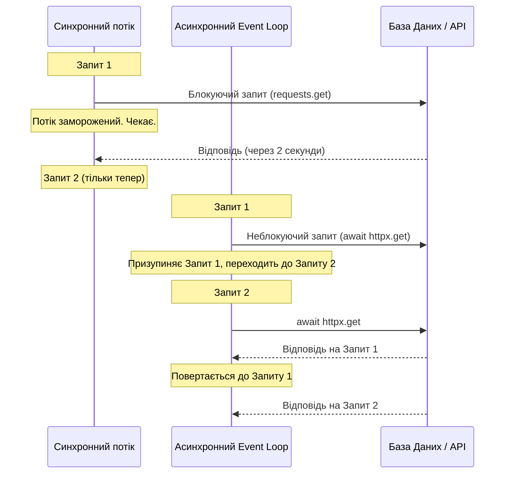
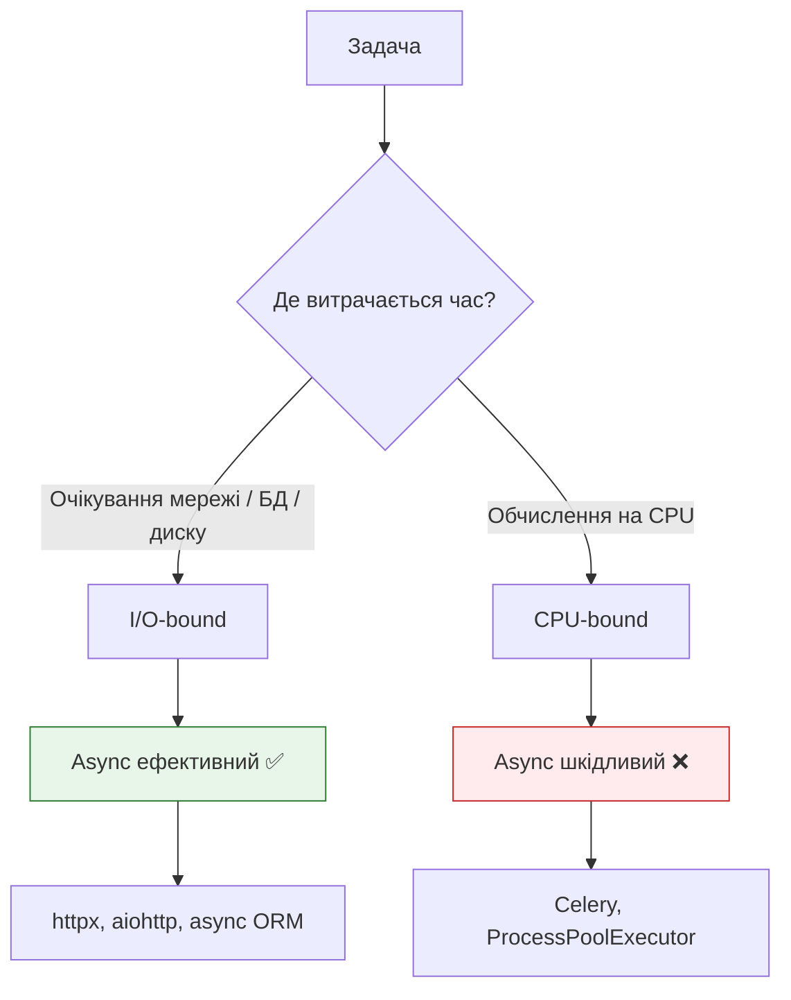

# 01 — Синхронне та асинхронне виконання

## Навіщо це потрібно

Перш ніж писати будь-який async-код у Django, потрібно зрозуміти одну просту річ: **чому взагалі виникла ідея асинхронності?**

Відповідь не в синтаксисі — вона в тому, як комп'ютери чекають.

---

## 🧠 Ментальна модель

Уяви кухаря в ресторані.

**Синхронний кухар:** ставить воду на плиту, стоїть і дивиться на неї, поки не закипить. Тільки потім ріже моркву. Потім знову чекає.

**Асинхронний кухар:** ставить воду на плиту, поки вода гріється — ріже моркву. Чує сигнал — повертається до плити.

Кухар один. Кухні паралельно не існує. Але другий кухар встигає зробити значно більше за той самий час — тому що він не чекає марно.

Ось суть асинхронного програмування.

---

## Ключові терміни

| Термін | Що означає |
|--------|-----------|
| **Синхронне виконання** | Програма виконує операції строго по черзі. Наступна починається тільки після завершення попередньої |
| **Асинхронне виконання** | Програма може призупинити одну операцію і виконувати іншу, поки перша чекає |
| **Blocking operation** | Операція, яка повністю зупиняє потік виконання до свого завершення |
| **Non-blocking operation** | Операція, яка запускається у фоні, не зупиняючи потік |
| **I/O-bound задача** | Задача, де більшість часу витрачається на очікування вводу-виводу: мережа, диск, БД |
| **CPU-bound задача** | Задача, де більшість часу витрачається на обчислення процесором |
| **Concurrency** | Здатність програми мати кілька задач "у прогресі" одночасно (не обов'язково паралельно) |
| **Parallelism** | Фізичне виконання кількох задач одночасно на різних ядрах процесора |
| **Cooperative multitasking** | Задача сама добровільно "відступає" і передає управління наступній |
| **Event loop** | Нескінченний цикл, який відстежує, яка задача готова продовжитись |

---

## Чому існує асинхронність: проблема блокування

### Зупинимось на швидкостях

Якщо ввести людський масштаб часу (L1-кеш = 3 секунди):

| Операція | Реальний час | "Людський" еквівалент |
|----------|-------------|----------------------|
| L1 cache hit | ~1 нс | 3 секунди |
| RAM access | ~100 нс | 5 хвилин |
| SSD read | ~100 мкс | 2.5 дні |
| Network request | ~150 мс | 7.6 років |

Коли Django-view робить запит до зовнішнього API — OS-потік просто **стоїть і чекає 7.6 умовних років**. Нічого більше не робить. Просто чекає.

Якщо 100 користувачів одночасно зайдуть на такий endpoint — сервер заморозить 100 потоків. Це швидко вичерпає пам'ять.

Асинхронність вирішує цю проблему: замість того щоб заморожувати потік, програма **виконує іншу роботу** поки чекає.

---

## Sync vs Async: порівняльна таблиця

| Характеристика | Синхронний код | Асинхронний код |
|---------------|---------------|-----------------|
| Виконання | Суворо послідовне | Може перемикатись між задачами |
| Блокування | Блокує потік під час I/O | Не блокує — передає управління |
| Складність коду | Простіший | Трохи складніший |
| Кількість потоків | Один потік = одна задача | Один потік = багато задач |
| Ідеальна задача | CPU-bound | I/O-bound |
| Небезпечна задача | Повільна паралельна I/O | CPU-bound (блокує event loop) |

---

## Як це працює: послідовність виконання



У синхронному варіанті — 4 секунди (2 + 2). В асинхронному — ~2 секунди, бо обидва запити виконуються "одночасно".

---

## Різниця між concurrency і parallelism

Це важлива різниця, яку часто плутають.

**Parallelism (паралелізм)** — фізичне одночасне виконання на різних ядрах CPU:

```
Core 1: [Task A =========]
Core 2: [Task B =========]
```

**Concurrency (конкурентність)** — перемикання між задачами на одному потоці:

```
Thread: [Task A ----][Task B ----][Task A ----][Task B ----]
```

`asyncio` — це concurrency, не parallelism. Один потік, багато задач. Поки одна задача чекає на мережу — виконується інша.

---

## CPU-bound vs I/O-bound



---

## Приклад: блокуючий vs неблокуючий код

### ❌ Синхронний код — блокує потік

```python
import time

def fetch_user():
    time.sleep(2)  # Імітує запит до БД
    return {"id": 1, "name": "Alice"}

def fetch_posts():
    time.sleep(2)  # Імітує запит до API
    return [{"title": "Post 1"}]

# Виконується 4 секунди (2 + 2)
user = fetch_user()
posts = fetch_posts()
```

### ✅ Асинхронний код — не блокує

```python
import asyncio

async def fetch_user():
    await asyncio.sleep(2)  # Не блокує! Передає управління
    return {"id": 1, "name": "Alice"}

async def fetch_posts():
    await asyncio.sleep(2)
    return [{"title": "Post 1"}]

async def main():
    # Виконуються одночасно — ~2 секунди замість 4
    user, posts = await asyncio.gather(fetch_user(), fetch_posts())

asyncio.run(main())
```

Ключова різниця: `asyncio.sleep()` на відміну від `time.sleep()` **не блокує потік** — вона передає управління event loop'у, поки чекає.

---

## Типова помилка початківця

### ❌ "Async завжди швидший"

```python
# Це НЕ швидший код — це просто async-синтаксис навколо CPU-роботи
async def compute():
    result = sum(range(10_000_000))  # CPU-bound! Блокує event loop
    return result
```

**Проблема:** `sum(range(10_000_000))` — це CPU-bound операція. Вона не "чекає" — вона активно обчислює. `async def` навколо неї нічого не змінює — event loop заморожений на весь час обчислення.

**Правило:** Async допомагає тільки тоді, коли є реальне **очікування** (I/O): мережа, база даних, файлова система.

---

### ❌ "Async = паралелізм"

```python
# Обидві функції НЕ виконуються одночасно на різних CPU-ядрах
# Це перемикання в межах одного потоку
async def task_a():
    await asyncio.sleep(1)

async def task_b():
    await asyncio.sleep(1)

# Concurrency, не parallelism
await asyncio.gather(task_a(), task_b())
```

---

## Практичне завдання

### Завдання 1

Напиши синхронну функцію `fetch_three_urls()`, яка тричі викликає `time.sleep(1)` і виводить повідомлення після кожного. Заміряй час виконання через `time.time()`.

Потім перепиши на асинхронну версію з `asyncio.sleep(1)` і `asyncio.gather()`. Порівняй час.

### Завдання 2

Поясни своїми словами: чому `asyncio` — це concurrency, а не parallelism? Наведи аналогію з реального життя (не кухаря).

### Завдання 3

Визнач, яка це задача — I/O-bound або CPU-bound:
- Завантаження зображення з інтернету
- Стиснення відео файлу
- Запит до бази даних PostgreSQL
- Обчислення числа Фібоначчі для великого n
- Відправка email через SMTP

### Самоперевірка

- [ ] Я розумію, що таке blocking operation
- [ ] Я можу пояснити різницю між sync і async кодом
- [ ] Я знаю різницю між concurrency і parallelism
- [ ] Я розумію, що async ефективний тільки для I/O-bound задач
- [ ] Я можу написати простий `asyncio.gather()` приклад

---

## Підсумок

Асинхронне програмування існує через величезну різницю в швидкості між CPU та зовнішніми операціями (мережа, диск, БД). Синхронний код змушує потік простоювати в очікуванні — async-код перемикається на іншу задачу в цей час.

Async — це **concurrency** (перемикання між задачами), а не **parallelism** (одночасне виконання на різних ядрах). Він добре підходить для I/O-bound задач і шкідливий для CPU-bound.

У наступному документі розберемо, як Python реалізує цю ідею через `asyncio`.

→ [02_asyncio.md](02_asyncio.md)
