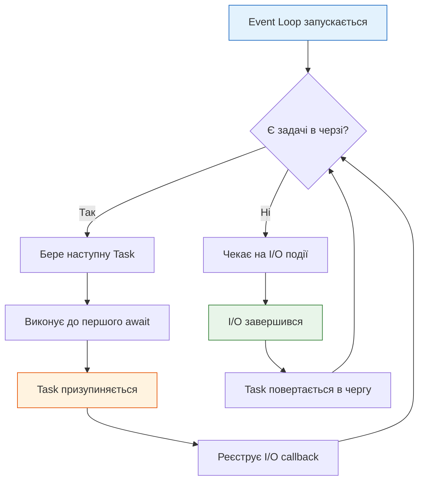
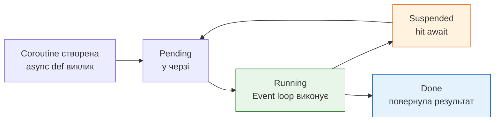
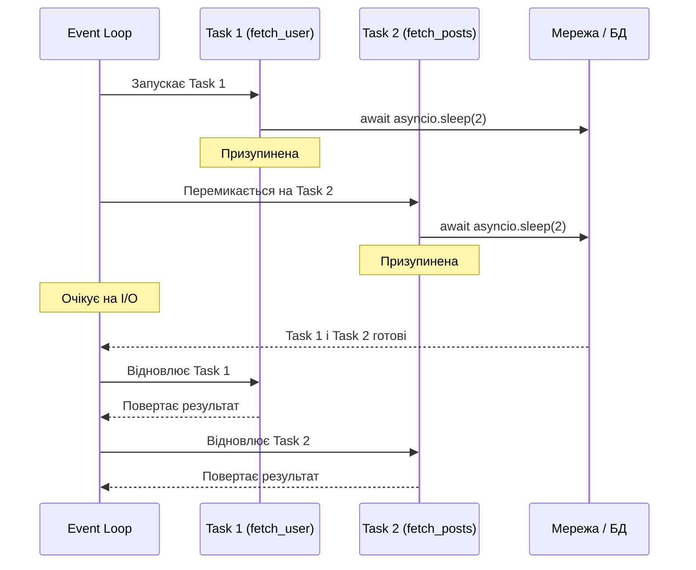

# 02 — Python asyncio: як виконується async-код

## Навіщо це потрібно

Ти вже знаєш, що async потрібен для I/O-bound задач. Але як саме Python виконує цей код?

Що відбувається, коли ти пишеш `async def`? Що таке `await`? Чому виклик async-функції нічого не запускає?

Цей документ пояснює механіку зсередини.

---

## 🧠 Ментальна модель

Уяви офіціанта в ресторані.

Офіціант (event loop) обходить столики (coroutines). На кожному столику може бути замовлення в стані "готується на кухні" або "готове до подачі".

Офіціант не стоїть біля плити й не чекає. Він обходить всі столики по колу: якщо страва не готова — іде далі. Коли кухня сигналізує "готово" — він повертається саме до цього столика.

`await` — це момент, коли офіціант передає замовлення на кухню й іде до наступного столика.

---

## Ключові терміни

| Термін | Що означає |
|--------|-----------|
| `async def` | Оголошує coroutine function — функцію, яка може призупинятись |
| **Coroutine object** | Об'єкт, що повертається при виклику async-функції (не результат!) |
| `await` | Призупиняє coroutine і передає управління event loop'у |
| **Event loop** | Центральний планувальник — нескінченний цикл, що керує задачами |
| **Task** | Coroutine, загорнута в об'єкт для планування event loop'ом |
| `asyncio.create_task()` | Планує coroutine для виконання у фоні, не чекаючи її завершення |
| `asyncio.gather()` | Запускає кілька coroutines паралельно і чекає на всі |
| **Cooperative multitasking** | Кожна coroutine сама вирішує, коли передати управління (через `await`) |

---

## Як це працює: крок за кроком

### 1. `async def` — це не звичайна функція

```python
async def fetch_data():
    await asyncio.sleep(1)
    return {"data": "result"}

# Виклик НЕ запускає функцію!
coro = fetch_data()
print(type(coro))  # <class 'coroutine'>

# Щоб запустити — потрібен event loop або await
result = await fetch_data()  # тільки всередині async контексту
```

Коли ти викликаєш `async def` функцію — ти отримуєш **coroutine object**. Це як рецепт, а не готова страва. Event loop виконає цей рецепт, коли прийде черга.

### 2. `await` — точка призупинення

```python
async def view_handler():
    # await: coroutine призупиняється тут
    # event loop може виконувати інші задачі поки чекаємо
    data = await fetch_from_database()
    return data
```

`await` робить дві речі:
1. Передає управління event loop'у
2. Відновлює виконання, коли операція завершена — з того самого місця

### 3. Event loop — серце asyncio



Event loop ніколи не спить безцільно. Він або виконує задачу, або чекає на сигнал від ОС ("I/O завершився").

---

## Lifecycle coroutine



---

## Послідовний async vs конкурентний async

### ❌ Послідовний — не дає переваги

```python
import asyncio

async def fetch_user():
    await asyncio.sleep(2)  # Чекаємо 2 сек
    return {"id": 1}

async def fetch_posts():
    await asyncio.sleep(2)  # Чекаємо ще 2 сек
    return [{"title": "Post 1"}]

async def main():
    # await один за одним — 4 секунди
    user = await fetch_user()
    posts = await fetch_posts()
    print(user, posts)

asyncio.run(main())
# Загальний час: ~4 секунди
```

### ✅ Конкурентний через gather — дає перевагу

```python
import asyncio

async def fetch_user():
    await asyncio.sleep(2)
    return {"id": 1}

async def fetch_posts():
    await asyncio.sleep(2)
    return [{"title": "Post 1"}]

async def main():
    # Запускаємо обидві одночасно — 2 секунди
    user, posts = await asyncio.gather(fetch_user(), fetch_posts())
    print(user, posts)

asyncio.run(main())
# Загальний час: ~2 секунди
```

`gather` запускає всі coroutines і чекає, поки **всі** завершаться. Результати повертаються в тому ж порядку, що й аргументи.

---

## create_task vs gather: різниця

```python
import asyncio

async def background_task(name, delay):
    await asyncio.sleep(delay)
    print(f"{name} завершено")
    return name

async def main():
    # create_task — запланувати у фоні, не чекати одразу
    task_a = asyncio.create_task(background_task("A", 2))
    task_b = asyncio.create_task(background_task("B", 1))

    print("Задачі заплановані, продовжуємо роботу...")
    
    # Тепер чекаємо результати
    result_a = await task_a  # "A"
    result_b = await task_b  # "B"
```

| | `create_task` | `gather` |
|--|--------------|---------|
| Коли запускає | Одразу, у фоні | Одразу, всі разом |
| Повертає | `Task` object | Список результатів |
| Коли чекати | Можна await пізніше | Чекає всіх одразу |
| Використання | Фонова логіка + основна | Паралельні запити |

---

## Як event loop керує кількома задачами



---

## Типові помилки початківця

### ❌ Помилка 1: забув `await`

```python
async def get_data():
    return "result"

async def main():
    # Без await — це coroutine object, не результат!
    data = get_data()
    print(data)  # <coroutine object get_data at 0x...>
```

```python
# ✅ Правильно
async def main():
    data = await get_data()
    print(data)  # "result"
```

### ❌ Помилка 2: `time.sleep()` всередині async-функції

```python
import time

async def my_view():
    time.sleep(2)  # БЛОКУЄ event loop на 2 секунди!
    return "ok"
```

**Що відбувається:** `time.sleep()` — це синхронна функція. Вона блокує весь потік — включно з event loop'ом. Всі інші запити зависають.

```python
# ✅ Правильно
import asyncio

async def my_view():
    await asyncio.sleep(2)  # Передає управління event loop'у
    return "ok"
```

### ❌ Помилка 3: CPU-bound робота в async-функції

```python
async def process():
    # Це блокує event loop на весь час обчислення!
    result = [x**2 for x in range(10_000_000)]
    return result
```

CPU-bound задачі потрібно виносити в `ProcessPoolExecutor` або Celery — не в async-функції.

---

## Практичне завдання

### Завдання 1

Напиши три async-функції: `fetch_weather()`, `fetch_news()`, `fetch_stock_price()` — кожна "чекає" 1 секунду через `asyncio.sleep(1)`.

Запусти їх:
- послідовно (через три окремих `await`) — заміряй час
- паралельно (через `asyncio.gather`) — заміряй час

Порівняй результати.

### Завдання 2

Напиши функцію `run_with_tasks()`, яка:
1. Планує три задачі через `asyncio.create_task()`
2. Виводить "Задачі заплановані" після планування (до їх завершення)
3. Дочікується результатів кожної задачі

### Завдання 3

Поясни: що станеться, якщо написати `time.sleep(5)` всередині async-функції? Чому це погано? Як виправити?

### Самоперевірка

- [ ] Я розумію, що `async def` повертає coroutine object, а не результат
- [ ] Я знаю, що робить `await`
- [ ] Я можу пояснити, як event loop керує кількома задачами
- [ ] Я розумію різницю між `gather()` і `create_task()`
- [ ] Я знаю, чому `time.sleep()` небезпечний в async-коді

---

## Підсумок

`async def` оголошує coroutine function, виклик якої повертає coroutine object — не результат. `await` — це точка призупинення: coroutine зупиняється і передає управління event loop'у, який виконує інші задачі.

`asyncio.gather()` дозволяє запустити кілька coroutines одночасно і значно скоротити час виконання I/O-bound операцій. `create_task()` — планує задачу у фоні без негайного очікування.

Головна небезпека: `time.sleep()` і CPU-bound код блокують event loop — async не рятує від цього.

→ [03_asgi.md](03_asgi.md)
