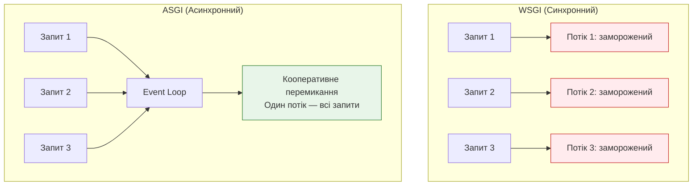
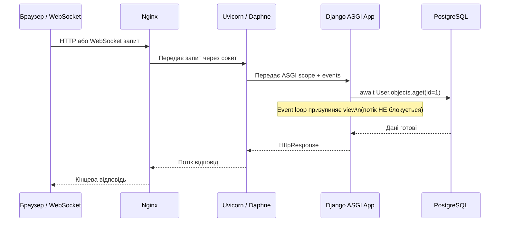

# 03 — WSGI та ASGI: як Django отримав async-підтримку

## Навіщо це потрібно

Ти вже вмієш писати `async def` функції. Але якщо ти просто напишеш `async def` у Django view і задепілоїш на звичайному сервері — нічого особливого не відбудеться.

Щоб Django справді обслуговував тисячі одночасних з'єднань — йому потрібна правильна інфраструктура. Ця інфраструктура називається **ASGI**.

---

## 🧠 Ментальна модель

Уяви кол-центр.

**WSGI-центр:** На кожен вхідний дзвінок є один оператор, який займається тільки цим клієнтом. Поки клієнт думає або чекає на відповідь — оператор просто мовчить і чекає разом з ним. Якщо зателефонують ще 100 клієнтів — потрібно 100 операторів.

**ASGI-центр:** Один оператор може вести кілька розмов одночасно. Поки один клієнт "ставить на паузу" для уточнення — оператор відповідає іншому. Один оператор ефективно обслуговує десятки з'єднань.

WSGI — перший кол-центр. ASGI — другий.

---

## Ключові терміни

| Термін | Що означає |
|--------|-----------|
| **WSGI** | Web Server Gateway Interface — стандарт для синхронних Python-додатків |
| **ASGI** | Asynchronous Server Gateway Interface — стандарт для async Python-додатків |
| **Gunicorn** | Популярний WSGI-сервер (кілька OS-потоків/процесів) |
| **Uvicorn** | Швидкий ASGI-сервер на основі `uvloop` |
| **Daphne** | ASGI-сервер від Django-команди (підтримує WebSockets) |
| **Hypercorn** | ASGI-сервер з підтримкою HTTP/2 і HTTP/3 |
| **wsgi.py** | Точка входу Django для WSGI-серверів |
| **asgi.py** | Точка входу Django для ASGI-серверів |

---

## WSGI: класичний стандарт і його обмеження

WSGI з'явився у 2003 році як єдиний стандарт для Python веб-додатків. Він простий і надійний — для свого часу.

Принцип роботи WSGI:
1. Клієнт надсилає HTTP-запит
2. Сервер виділяє окремий OS-потік (або процес) для цього запиту
3. Django обробляє запит синхронно
4. Відповідь надсилається клієнту
5. Потік звільняється

**Проблема:** кожен запит = один заблокований потік. Поки Django чекає на відповідь від БД або API — потік просто стоїть. На 100 одночасних запитів — 100 заморожених потоків. Пам'ять і ресурси витрачаються даремно.

WSGI добре підходить для:
- Стандартних CRUD-додатків
- Швидких запитів (< 100мс)
- Невеликого навантаження

WSGI погано підходить для:
- WebSockets (постійні з'єднання)
- Streaming (великі файли, SSE)
- High-concurrency (тисячі одночасних запитів)

---

## ASGI: сучасний стандарт

ASGI (2018) — async-наступник WSGI. Замість того щоб виділяти потік на кожне з'єднання, ASGI-сервер використовує **event loop**.

Один event loop може "жонглювати" тисячами з'єднань одночасно — бо поки одне чекає на БД, інше обробляється.



---

## WSGI vs ASGI: порівняльна таблиця

| Характеристика | WSGI | ASGI |
|---------------|------|------|
| Рік появи | 2003 | 2018 |
| Тип виконання | Синхронне | Асинхронне |
| Потоки | 1 потік = 1 запит | 1 event loop = N запитів |
| WebSockets | ❌ Не підтримує | ✅ Підтримує |
| Streaming | Обмежена підтримка | ✅ Повна підтримка |
| Async views | Емуляція (один цикл на запит) | ✅ Нативна підтримка |
| Сервери | Gunicorn, uWSGI | Uvicorn, Daphne, Hypercorn |
| Django підтримка | Стандартна (з 1.0) | З Django 3.0+ |

---

## Чому Django потребує ASGI для справжнього async

Технічно Django може виконати `async def` view навіть під WSGI-сервером. Але робить це так:

> Для кожного запиту до async view — Django створює **тимчасовий event loop** всередині OS-потоку, виконує view, знищує loop.

Це:
- Витрачає ресурси на створення/знищення event loop
- Залишає потік заблокованим (WSGI потік не вивільняється)
- Не дає жодної переваги по concurrency

Справжня асинхронність — це коли ASGI-сервер сам керує event loop'ом і Django виконує views нативно, без додаткових потоків.

---

## ASGI Request Lifecycle



---

## ASGI-сервери: Uvicorn, Daphne, Hypercorn

### Uvicorn

```bash
pip install uvicorn
uvicorn myproject.asgi:application --host 0.0.0.0 --port 8000 --workers 4
```

- Найшвидший варіант для чистого HTTP та WebSocket
- Побудований на `uvloop` (швидший замінник стандартного asyncio event loop)
- Рекомендується для production з Gunicorn як process manager

### Daphne

```bash
pip install daphne
daphne -b 0.0.0.0 -p 8000 myproject.asgi:application
```

- Офіційний ASGI-сервер від Django/Channels
- Ідеальний для WebSocket-додатків
- Встановлюється разом з `django-channels`

### Hypercorn

```bash
pip install hypercorn
hypercorn myproject.asgi:application --bind 0.0.0.0:8000
```

- Підтримує HTTP/2 і HTTP/3
- Гарний вибір якщо потрібний HTTP/2

---

## Файл asgi.py у Django

Коли ти створюєш Django-проєкт командою `django-admin startproject`, автоматично генерується файл `asgi.py`:

```python
# myproject/asgi.py
import os
from django.core.asgi import get_asgi_application

os.environ.setdefault('DJANGO_SETTINGS_MODULE', 'myproject.settings')

# Точка входу для ASGI-сервера
application = get_asgi_application()
```

Цей файл — еквівалент `wsgi.py`, але для ASGI-серверів. Uvicorn, Daphne і Hypercorn шукають саме `application` у цьому файлі.

Якщо використовуєш Django Channels для WebSockets — `asgi.py` розширюється:

```python
# myproject/asgi.py (з Channels)
import os
from django.core.asgi import get_asgi_application
from channels.routing import ProtocolTypeRouter, URLRouter

os.environ.setdefault('DJANGO_SETTINGS_MODULE', 'myproject.settings')

application = ProtocolTypeRouter({
    "http": get_asgi_application(),
    "websocket": URLRouter([...]),
})
```

---

## Типова помилка початківця

### ❌ Запускати async Django під Gunicorn без ASGI

```bash
# Це WSGI — async views не отримають переваг
gunicorn myproject.wsgi:application
```

```bash
# ✅ Правильно для async — ASGI через Uvicorn
uvicorn myproject.asgi:application --workers 4
```

### ❌ Думати, що будь-який сервер підійде

Django не видасть помилку, якщо ти запустиш async view під WSGI. Код просто виконається повільніше і без будь-яких переваг по concurrency.

---

## Практичне завдання

### Завдання 1

Знайди у своєму Django-проєкті файл `asgi.py`. Прочитай його. Яку функцію він імпортує з Django? Що повертає `get_asgi_application()`?

### Завдання 2

Встанови `uvicorn` і запусти свій Django-проєкт через ASGI:

```bash
pip install uvicorn
uvicorn myproject.asgi:application --reload
```

Порівняй з `python manage.py runserver`. Що змінилось в логах?

### Завдання 3

Поясни своїми словами: чому WSGI-сервер погано підходить для WebSocket-з'єднань? Що відбувається з потоком, якщо клієнт підключений через WebSocket 10 хвилин?

### Самоперевірка

- [ ] Я розумію, що таке WSGI і чому він виник
- [ ] Я розумію, чим ASGI відрізняється від WSGI
- [ ] Я знаю, для чого файл `asgi.py`
- [ ] Я можу назвати хоча б два ASGI-сервери і їх відмінності
- [ ] Я розумію, чому async view під WSGI не дає переваг

---

## Підсумок

WSGI — синхронний стандарт: один потік на запит. При великому навантаженні і I/O-bound задачах — потоки витрачаються даремно.

ASGI вирішує цю проблему: один event loop обслуговує тисячі з'єднань. Коли одне чекає на БД — інше обробляється. Django підтримує ASGI з версії 3.0.

Для деплою ASGI-Django використовують Uvicorn (швидкість), Daphne (WebSockets), або Hypercorn (HTTP/2). Точка входу — файл `asgi.py`.

→ [04_django_async_views.md](04_django_async_views.md)
