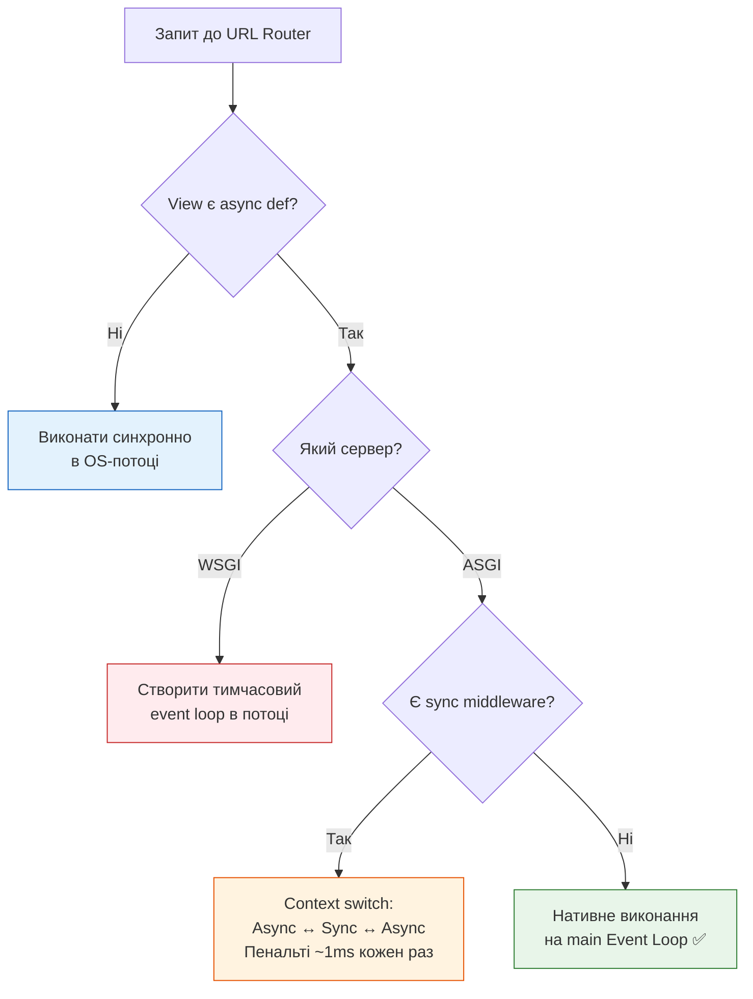
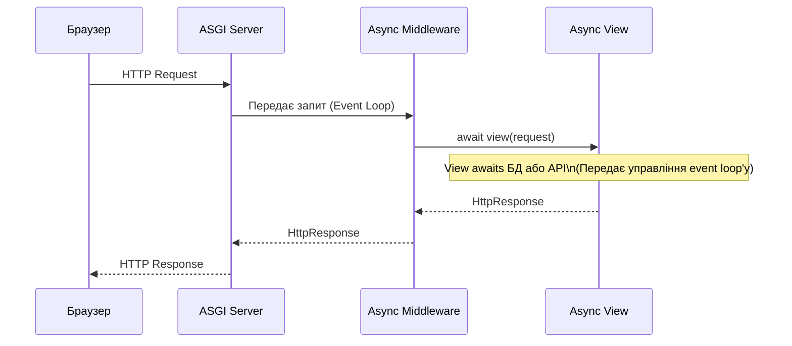
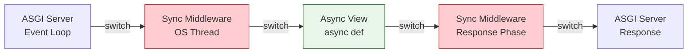

# 04 — Django Async Views: як писати та коли використовувати

## Навіщо це потрібно

Тепер у тебе є фундамент: ти знаєш asyncio, розумієш event loop і знаєш що таке ASGI. Час перейти до конкретного Django.

Як виглядає async view? Як Django його виконує? Коли він дійсно корисний?

---

## 🧠 Ментальна модель

Звичайний sync view — це офіціант, який бере замовлення, іде на кухню, стоїть там і чекає готову страву, потім повертається до клієнта. Все зупинено.

Async view — це офіціант, який бере замовлення, передає на кухню і одразу повертається до залу. Коли страва готова — він несе її. Тим часом обслужив ще трьох клієнтів.

Але є нюанс: якщо кухар (ORM) все одно працює синхронно — офіціант все одно змушений чекати. `async def` — це тільки половина справи.

---

## Ключові терміни

| Термін | Що означає |
|--------|-----------|
| **Sync view** | Звичайна `def` функція — виконується в OS-потоці |
| **Async view** | `async def` функція — може призупинятись і не блокувати event loop |
| **Middleware** | Шари обробки запиту/відповіді до і після view |
| **Context switch** | Перемикання між async event loop і sync OS-потоком |
| **SynchronousOnlyOperation** | Помилка Django, якщо sync-код виконується в async-контексті |

---

## Як виглядає async view

### Sync view (звичайний)

```python
from django.http import JsonResponse

def my_sync_view(request):
    # Виконується синхронно в OS-потоці
    return JsonResponse({"status": "ok", "mode": "sync"})
```

### Async view (мінімальний)

```python
from django.http import JsonResponse

async def my_async_view(request):
    # Виконується на event loop (під ASGI)
    return JsonResponse({"status": "ok", "mode": "async"})
```

Різниця — тільки `async def`. Django автоматично визначає тип view і виконує відповідно.

---

## Як Django виконує async view

Результат залежить від того, який сервер ти використовуєш:



---

## Pure Async Lifecycle (максимальна продуктивність)



Весь шлях — через event loop. Жодних context switches. Максимальна ефективність.

---

## Mixed Sync/Async: штраф за перемикання



Кожен `switch` — близько **1 мілісекунди** штрафу. Якщо middleware синхронний — Django мусить перемикатись між event loop і OS-потоком туди-назад на кожному запиті.

---

## Async view з реальним прикладом: зовнішній API

```python
import httpx
from django.http import JsonResponse

async def weather_view(request):
    city = request.GET.get("city", "Kyiv")
    
    async with httpx.AsyncClient() as client:
        # await: view призупиняється, event loop обслуговує інших
        response = await client.get(
            f"https://api.example.com/weather?city={city}",
            timeout=5.0
        )
        data = response.json()
    
    return JsonResponse({
        "city": city,
        "temperature": data["temp"],
        "description": data["desc"]
    })
```

Поки `client.get()` очікує відповідь від зовнішнього сервера — Django може обслуговувати інших користувачів. Це і є перевага async view.

---

## Async view з кількома паралельними запитами

```python
import asyncio
import httpx
from django.http import JsonResponse

async def dashboard_view(request):
    async with httpx.AsyncClient() as client:
        # Запускаємо три запити одночасно
        weather_task = client.get("https://api.example.com/weather")
        news_task = client.get("https://api.example.com/news")
        stocks_task = client.get("https://api.example.com/stocks")

        # Чекаємо на всі три — час = час найповільнішого запиту
        weather, news, stocks = await asyncio.gather(
            weather_task, news_task, stocks_task
        )

    return JsonResponse({
        "weather": weather.json(),
        "news": news.json(),
        "stocks": stocks.json()
    })
```

Замість 3 секунд (1+1+1) отримуємо ~1 секунду — час найповільнішого з трьох.

---

## Коли async views корисні

✅ **Кілька зовнішніх API-запитів** — замість послідовних, паралельно через `gather`

✅ **Довгі з'єднання** — WebSockets, long-polling, Server-Sent Events

✅ **Висока конкурентність** — тисячі одночасних запитів при малому CPU-навантаженні

✅ **Streaming відповідей** — надсилання великих даних по частинах

---

## Коли async views НЕ корисні

| Ситуація | Причина |
|----------|---------|
| WSGI-сервер | Потік все одно заблокований — переваги немає |
| Sync middleware у стеку | Context switches знищують будь-який виграш |
| Стандартний CRUD | ORM + швидкий запит — sync view простіший і достатній |
| CPU-bound обчислення | Блокує event loop — гірше, ніж sync |
| Транзакції з БД | `transaction.atomic()` не підтримується natively async |

---

## Важливий блок

> **Не роби async view просто тому, що можеш.**
>
> Async view додає складність: потрібен ASGI-сервер, async middleware, async ORM-методи.
> Якщо твій view робить один запит до БД і повертає шаблон — sync view простіший, зрозуміліший і цілком достатній.
>
> Async view виправданий тоді, коли є **реальний I/O bottleneck**: кілька зовнішніх API-запитів, WebSockets, або висока конкурентність.

---

## Типова помилка початківця

### ❌ Sync ORM у async view

```python
from django.http import JsonResponse
from myapp.models import User

async def user_view(request):
    # ПОМИЛКА! Стандартний ORM-виклик у async-контексті
    user = User.objects.get(id=1)  # Підніме SynchronousOnlyOperation!
    return JsonResponse({"name": user.username})
```

### ✅ Правильно — async ORM-метод

```python
async def user_view(request):
    user = await User.objects.aget(id=1)  # Асинхронний варіант
    return JsonResponse({"name": user.username})
```

Детально про async ORM — у наступному документі.

---

## Тестування async views

Django надає `AsyncRequestFactory` для тестування:

```python
from django.test import AsyncRequestFactory, TestCase
from myapp.views import my_async_view

class MyAsyncViewTest(TestCase):
    async def test_async_view(self):
        factory = AsyncRequestFactory()
        request = factory.get('/async-url/')
        
        # await — бо view асинхронний
        response = await my_async_view(request)
        
        self.assertEqual(response.status_code, 200)
```

---

## Практичне завдання

### Завдання 1

Створи Django-додаток і напиши два views:
- `sync_view` — повертає `JsonResponse({"type": "sync"})`
- `async_view` — те саме, але `async def`

Запусти через `uvicorn` і перевір обидва через браузер або `curl`.

### Завдання 2

Напиши `async def aggregator_view(request)`, який робить два `await asyncio.sleep(1)` паралельно через `asyncio.gather()`. Заміряй час виконання (можна через `time.time()`).

### Завдання 3

Поясни: що відбудеться, якщо sync middleware стоїть перед async view під ASGI? Скільки context switches відбудеться за один запит?

### Самоперевірка

- [ ] Я можу написати async def view у Django
- [ ] Я розумію різницю між виконанням async view під WSGI і ASGI
- [ ] Я знаю, що таке context switch і чому він коштує ~1мс
- [ ] Я розумію, коли async view доречний, а коли ні
- [ ] Я знаю, що стандартний `User.objects.get()` не можна викликати в async view

---

## Підсумок

Async view у Django — це просто `async def` замість `def`. Але щоб отримати реальні переваги — потрібен ASGI-сервер і async middleware. Під WSGI async view виконується без переваг по concurrency.

Async views корисні для I/O-bound задач: кілька зовнішніх API-запитів, WebSockets, streaming. Для стандартного CRUD — sync view простіший і цілком достатній.

Головна пастка: sync ORM у async view підніме `SynchronousOnlyOperation`. Про це — в наступному документі.

→ [05_async_orm.md](05_async_orm.md)
