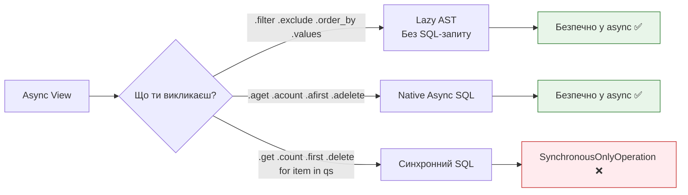
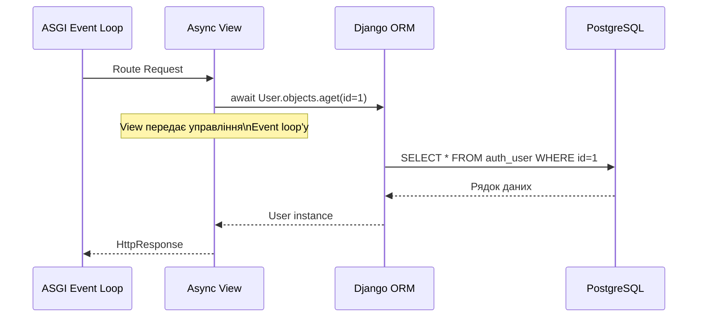

# 05 — Async ORM: чому async view не робить БД асинхронною

## Навіщо це потрібно

Ти написав `async def view`. Похвально. Але зробив усередині звичайний `User.objects.get(id=1)` — і Django впав з помилкою `SynchronousOnlyOperation`.

Чому? Хіба view не async?

Ця документ пояснює: **`async def` не магічно робить ORM асинхронним**. І що з цим робити.

---

## 🧠 Ментальна модель

Уяви async view як сучасний асинхронний офіс, де всі спілкуються через месенджер — ніхто не чекає біля телефону.

Але база даних — це старий архів у підвалі, де все паперово і синхронно. Щоб отримати документ — потрібно фізично піти туди, постояти в черзі та принести папір.

Якщо ти пишеш листи через месенджер (async), але за документами ходиш особисто (sync ORM) — весь офіс чекає, поки ти повернешся.

Async ORM — це кур'єр: ти надсилаєш заявку, він іде до архіву, а ти тим часом продовжуєш роботу.

---

## Ключові терміни

| Термін | Що означає |
|--------|-----------|
| **Lazy QuerySet** | QuerySet, що НЕ звертається до БД при створенні |
| **Evaluation** | Момент, коли QuerySet реально виконує SQL-запит |
| **SynchronousOnlyOperation** | Виняток Django: sync-код виконується в async-контексті |
| `aget()` | Async версія `get()` |
| `acount()` | Async версія `count()` |
| `afirst()` | Async версія `first()` |
| `adelete()` | Async версія `delete()` |
| `asave()` | Async версія `save()` |
| `async for` | Async ітерація по QuerySet без блокування |

---

## Проблема: чому sync ORM блокує async view

Стандартні адаптери до БД (psycopg2, mysqlclient) — **суто синхронні**. Вони роблять мережевий запит до PostgreSQL і блокують потік до отримання відповіді.

Якщо ти викликаєш такий адаптер зсередини async event loop — ти блокуєш весь event loop. Всі інші запити "підвисають".

Django захищає від цього: якщо async-контекст виявлено — піднімає виняток:

```python
from django.http import JsonResponse
from myapp.models import Article

async def article_view(request):
    # ❌ ПОМИЛКА! Sync ORM у async-контексті
    article = Article.objects.get(id=1)
    return JsonResponse({"title": article.title})
```

```
django.core.exceptions.SynchronousOnlyOperation:
You cannot call this from an async context - use a thread or sync_to_async.
```

Django буквально каже: "Ти не можеш це зробити тут. Або використовуй thread, або sync_to_async."

---

## Важливо: `filter()` — безпечний, `get()` — ні

Найпоширеніша плутанина у новачків — `filter()` не виконує SQL.



---

## filter() — ще не SQL-запит

```python
async def view(request):
    # Це БЕЗПЕЧНО — filter() лише будує QuerySet, не виконує SQL
    qs = Article.objects.filter(published=True).order_by("-created_at")

    # А це вже виконає SQL — потрібна async версія
    count = await qs.acount()

    return JsonResponse({"count": count})
```

`filter()`, `exclude()`, `order_by()`, `values()`, `annotate()` — все це **lazy** операції. Вони лише будують опис запиту (AST). SQL виконується тільки коли ти **просиш дані**: `get()`, `first()`, `list()`, `for item in qs`.

---

## Таблиця: sync ORM → async ORM

| Синхронний метод | Асинхронний аналог | Що робить |
|-----------------|-------------------|-----------|
| `.get(...)` | `.aget(...)` | Повертає один об'єкт |
| `.first()` | `.afirst()` | Перший або None |
| `.last()` | `.alast()` | Останній або None |
| `.count()` | `.acount()` | Кількість записів |
| `.exists()` | `.aexists()` | Чи є хоча б один |
| `.delete()` | `.adelete()` | Видалити |
| `.update(...)` | `.aupdate(...)` | Оновити |
| `obj.save()` | `await obj.asave()` | Зберегти об'єкт |
| `for obj in qs` | `async for obj in qs` | Ітерація по QuerySet |
| `list(qs)` | `await sync_to_async(list)(qs)` або `[o async for o in qs]` | Отримати список |

---

## Приклади правильного async ORM

### Отримати один об'єкт

```python
from myapp.models import User

async def user_detail_view(request, user_id):
    # ✅ aget замість get
    try:
        user = await User.objects.aget(id=user_id)
    except User.DoesNotExist:
        return JsonResponse({"error": "Not found"}, status=404)

    return JsonResponse({"id": user.id, "name": user.username})
```

### Ітерація по QuerySet

```python
async def articles_view(request):
    # ✅ async for замість for
    articles = []
    async for article in Article.objects.filter(published=True):
        articles.append({"id": article.id, "title": article.title})

    return JsonResponse({"articles": articles})
```

### List comprehension з async for

```python
async def articles_view(request):
    # ✅ Async list comprehension
    articles = [
        {"id": a.id, "title": a.title}
        async for a in Article.objects.filter(published=True).order_by("-created_at")[:10]
    ]
    return JsonResponse({"articles": articles})
```

### Зберегти об'єкт

```python
async def create_article_view(request):
    article = Article(
        title="Нова стаття",
        published=True
    )
    await article.asave()  # ✅

    return JsonResponse({"id": article.id})
```

---

## ORM Execution Model



---

## Обмеження async ORM

### Транзакції

`transaction.atomic()` ще не підтримується нативно в async-режимі:

```python
# ❌ Не працює напряму в async view
async def view(request):
    with transaction.atomic():
        ...
```

```python
# ✅ Через sync_to_async (детально в наступному документі)
from asgiref.sync import sync_to_async

@sync_to_async
def create_with_transaction():
    with transaction.atomic():
        user = User.objects.create(username="new_user")
        Profile.objects.create(user=user)
    return user

async def view(request):
    user = await create_with_transaction()
```

### CONN_MAX_AGE

При async-режимі рекомендується вимкнути `CONN_MAX_AGE` (постійні з'єднання) або використовувати спеціальні connection poolers:

```python
# settings.py
DATABASES = {
    "default": {
        "ENGINE": "django.db.backends.postgresql",
        # ...
        "CONN_MAX_AGE": 0,  # Вимкнути persistent connections
    }
}
```

---

## Типова помилка початківця

### ❌ Ітерація через звичайний `for`

```python
async def view(request):
    # ПОМИЛКА! Звичайний for виконує синхронний SQL
    for article in Article.objects.all():
        print(article.title)  # SynchronousOnlyOperation!
```

### ✅ Правильно — `async for`

```python
async def view(request):
    async for article in Article.objects.all():
        print(article.title)  # ✅
```

---

## Практичне завдання

### Завдання 1

Напиши async view, який:
1. Фільтрує `Article.objects.filter(published=True)` (lazy — безпечно)
2. Рахує кількість через `acount()`
3. Отримує перші 5 статей через `async for`
4. Повертає `JsonResponse` з кількістю та списком

### Завдання 2

Спробуй навмисно зробити `User.objects.get(id=1)` в async view і прочитай повний текст помилки `SynchronousOnlyOperation`. Зрозумій, що Django пропонує зробити натомість.

### Завдання 3

Напиши функцію `create_article_async(title, content)`, яка:
- Створює `Article` об'єкт
- Зберігає його через `asave()`
- Повертає `article.id`

### Самоперевірка

- [ ] Я розумію, чому sync ORM блокує async event loop
- [ ] Я знаю, що `filter()` — lazy і безпечний
- [ ] Я можу назвати 5 async-аналогів sync ORM методів
- [ ] Я вмію ітерувати по QuerySet через `async for`
- [ ] Я знаю, чому транзакції вимагають окремої обробки

---

## Підсумок

`async def` view не робить ORM магічно асинхронним. Стандартні ORM-методи (`get`, `count`, `for`) блокують event loop і призводять до `SynchronousOnlyOperation`.

Django надає async-аналоги: `aget`, `acount`, `afirst`, `adelete`, `asave`, `async for`. `filter()` і схожі "builder" методи — lazy і безпечні в async-контексті.

Транзакції і деякі інші операції потребують `sync_to_async` — про це в наступному документі.

→ [06_sync_to_async.md](06_sync_to_async.md)
