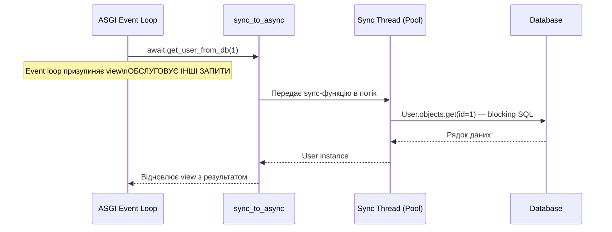
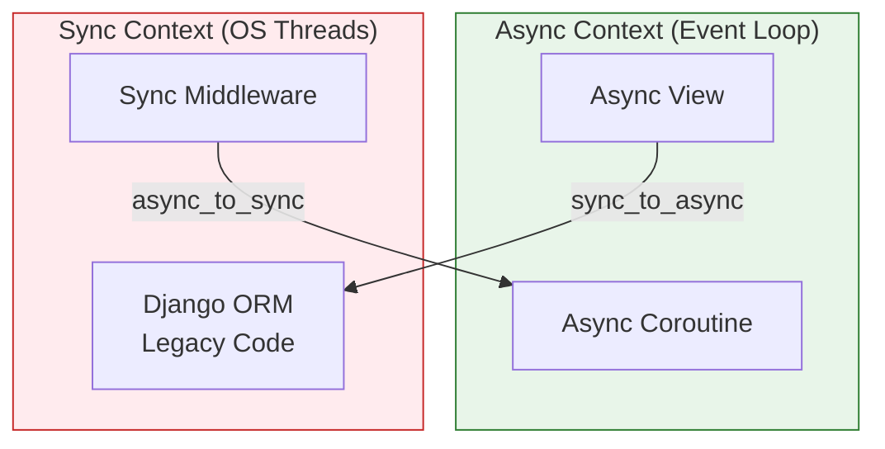
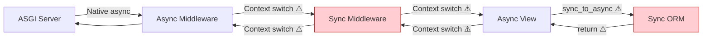

# 06 — sync_to_async: міст між sync і async кодом

## Навіщо це потрібно

Не весь код можна просто "зробити async". Є бібліотеки, що працюють тільки синхронно. Є транзакції з БД. Є legacy-код.

`sync_to_async` і `async_to_sync` — це два "мости", що дозволяють безпечно запускати sync-код у async-контексті (і навпаки) без блокування event loop'у.

---

## 🧠 Ментальна модель

Уяви міжнародний аеропорт.

Є термінал A (async зона) і термінал B (sync зона). Пасажири не можуть просто перебігти через злітну смугу — є спеціальні переходи.

`sync_to_async` — це шатл від async терміналу до sync. Async view "садить" sync-код у шатл, той їде до sync-термінала, виконує роботу і повертається. Тим часом async-термінал обслуговує інших пасажирів.

`async_to_sync` — шатл у зворотній бік: sync-код, якому треба "дістатись" до async-функції.

---

## Ключові терміни

| Термін | Що означає |
|--------|-----------|
| `sync_to_async` | Загортає sync-функцію для безпечного виклику з async-контексту |
| `async_to_sync` | Загортає async-функцію для виклику з sync-контексту |
| **Thread-sensitive mode** | Режим за замовчуванням: sync-код виконується в одному фіксованому потоці |
| **Thread pool** | Пул OS-потоків для виконання sync-коду в фоні |
| **Context switch** | Перемикання між event loop і OS-потоком |
| **Zigzag anti-pattern** | Постійні перемикання sync↔async, що знищують будь-яку перевагу |

---

## `sync_to_async`: виконання sync-коду з async view

### Базовий синтаксис

```python
from asgiref.sync import sync_to_async

# Спосіб 1: декоратор
@sync_to_async
def get_user_from_db(user_id):
    from myapp.models import User
    return User.objects.get(id=user_id)  # Sync ORM — ОК тут

async def my_view(request):
    user = await get_user_from_db(1)  # Безпечний виклик
    return JsonResponse({"name": user.username})
```

```python
# Спосіб 2: inline
from asgiref.sync import sync_to_async
from myapp.models import User

async def my_view(request):
    # Загортаємо sync-функцію inline
    user = await sync_to_async(User.objects.get)(id=1)
    return JsonResponse({"name": user.username})
```

---

## Як це працює всередині



Event loop **не блокується** під час виконання sync-коду. Він продовжує обслуговувати інших користувачів, поки потік виконує синхронний запит до БД.

---

## Thread-sensitive режим: навіщо він існує

За замовчуванням `sync_to_async` працює в `thread_sensitive=True` режимі.

**Чому це важливо:** Бібліотеки для роботи з БД (psycopg2, SQLite) вимагають, щоб з'єднання відкривалось і використовувалось в **одному і тому ж потоці**. Якщо кожен виклик потрапляє в різний потік — виникають помилки.

Thread-sensitive режим гарантує: весь sync-код з одного запиту виконується в одному виділеному потоці.

```python
# thread_sensitive=True (за замовчуванням) — один фіксований поток
@sync_to_async(thread_sensitive=True)
def db_operation():
    return User.objects.get(id=1)

# thread_sensitive=False — новий поток для кожного виклику
@sync_to_async(thread_sensitive=False)
def isolated_operation():
    return do_something_thread_safe()
```

---

## Обгортання ORM-транзакцій

Транзакції (`transaction.atomic()`) не підтримуються нативно в async-режимі — їх потрібно виконувати через `sync_to_async`:

```python
from django.db import transaction
from asgiref.sync import sync_to_async
from myapp.models import User, Profile

@sync_to_async
def create_user_with_profile(username, email):
    with transaction.atomic():
        user = User.objects.create_user(username=username, email=email)
        Profile.objects.create(user=user, bio="")
        return user

async def register_view(request):
    if request.method == "POST":
        user = await create_user_with_profile(
            username=request.POST["username"],
            email=request.POST["email"]
        )
        return JsonResponse({"id": user.id, "created": True})
```

Вся транзакційна логіка — всередині sync-функції. Async view лише викликає її через міст.

---

## `async_to_sync`: async-код у sync-контексті

Іноді є зворотна потреба: у звичайному sync view треба викликати async-функцію (наприклад, async HTTP-клієнт):

```python
from asgiref.sync import async_to_sync
import httpx

async def fetch_data_async(url):
    async with httpx.AsyncClient() as client:
        response = await client.get(url)
        return response.json()

# Звичайний sync view
def my_sync_view(request):
    # Викликаємо async-функцію з sync-контексту
    data = async_to_sync(fetch_data_async)("https://api.example.com/data")
    return JsonResponse(data)
```

`async_to_sync` створює тимчасовий event loop, виконує async-функцію в окремому потоці, чекає результату і повертає його в sync-контекст.

---

## Sync/Async Bridge: архітектурна діаграма



---

## Zigzag Anti-Pattern: що не треба робити



Кожен ⚠️ — це ~1мс штрафу. При великому навантаженні — це відчутно.

**Правило:** мінімізуй кількість перетинів sync/async межі. Якщо більшість коду sync — залиш його sync. Не перетворюй весь стек на async заради кількох async-операцій.

---

## Типова помилка початківця

### ❌ Постійне перемикання замість ізоляції

```python
async def view(request):
    # Погано: кожен виклик — окремий context switch
    user = await sync_to_async(User.objects.get)(id=1)
    profile = await sync_to_async(Profile.objects.get)(user=user)
    articles = await sync_to_async(list)(Article.objects.filter(author=user))
    await sync_to_async(Log.objects.create)(action="view", user=user)
```

### ✅ Краще: зібрати всю sync-роботу в одну функцію

```python
@sync_to_async
def get_user_data(user_id):
    user = User.objects.get(id=user_id)
    profile = Profile.objects.get(user=user)
    articles = list(Article.objects.filter(author=user))
    Log.objects.create(action="view", user=user)
    return user, profile, articles

async def view(request):
    user, profile, articles = await get_user_data(1)
```

Один перетин межі замість чотирьох. Код чистіший і ефективніший.

---

## Практичне завдання

### Завдання 1

Напиши async view, який:
1. Через `sync_to_async` отримує список всіх активних користувачів (`User.objects.filter(is_active=True)`)
2. Повертає `JsonResponse` зі списком імен

### Завдання 2

Напиши `@sync_to_async` функцію `create_order(user_id, product_id, quantity)`, яка:
- Використовує `transaction.atomic()`
- Перевіряє, що продукт існує
- Створює `Order` об'єкт
- Оновлює кількість на складі

Виклич її з async view.

### Завдання 3

Поясни: навіщо існує `thread_sensitive=True` за замовчуванням? Що може піти не так, якщо виконувати ORM-запити в різних потоках?

### Самоперевірка

- [ ] Я розумію, навіщо потрібен `sync_to_async`
- [ ] Я можу загорнути sync ORM-логіку для виклику з async view
- [ ] Я знаю, навіщо потрібен `thread_sensitive=True`
- [ ] Я розумію zigzag anti-pattern і можу його уникнути
- [ ] Я знаю, коли використовувати `async_to_sync`

---

## Підсумок

`sync_to_async` — це міст: дозволяє безпечно виконувати sync-код (ORM, транзакції, legacy бібліотеки) з async-контексту без блокування event loop'у. Sync-код виконується у виділеному потоці.

`async_to_sync` — зворотній міст: для виклику async-функцій з sync-контексту.

Головне правило: мінімізуй кількість перетинів межі sync/async. Збирай всю sync-роботу в одну функцію і роби один виклик — замість кількох.

→ [07_async_http_clients.md](07_async_http_clients.md)
