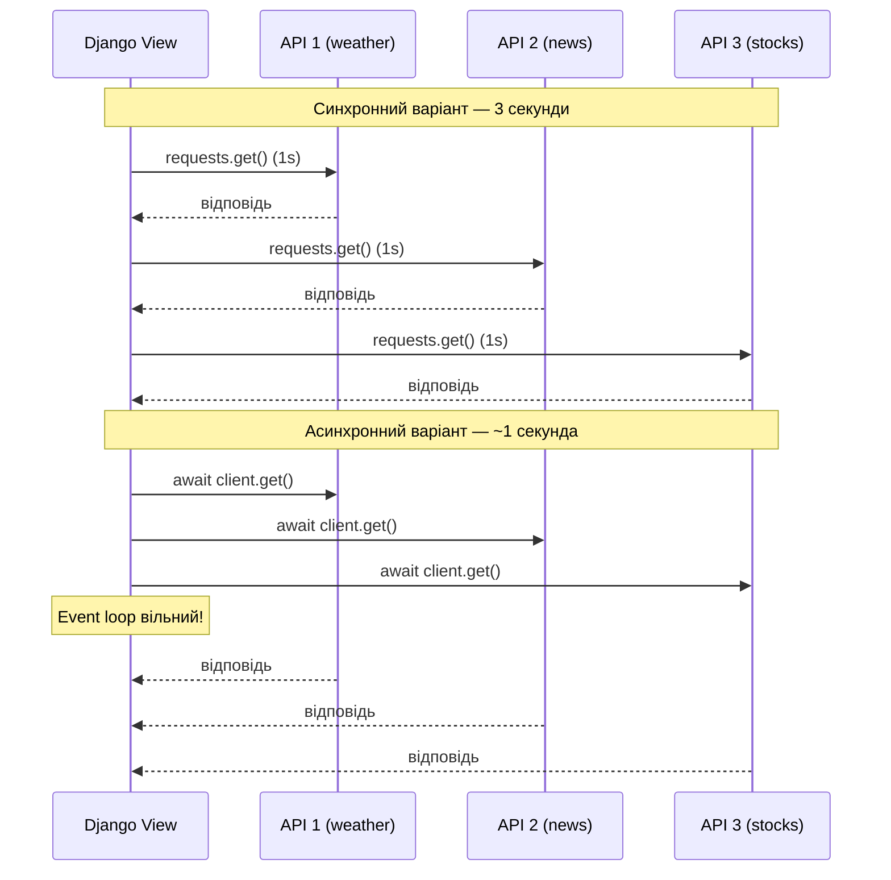
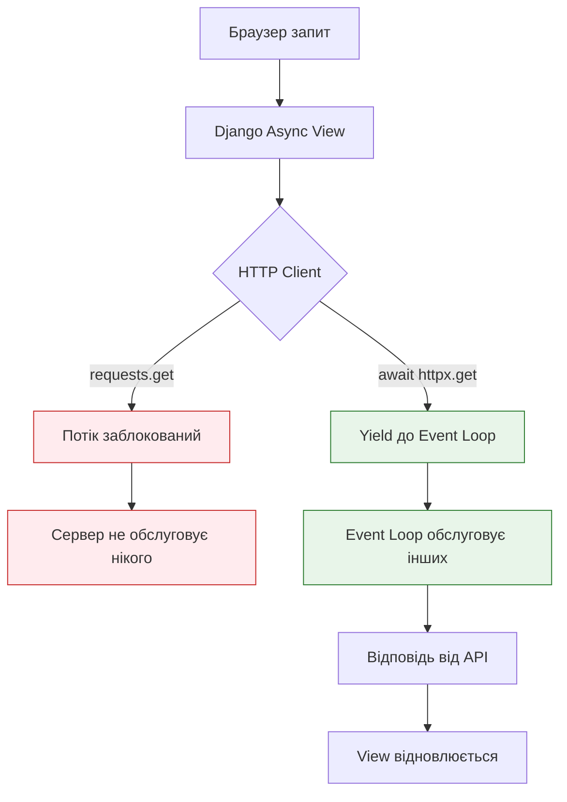

# 07 — Async HTTP Clients: правильні зовнішні запити

## Навіщо це потрібно

Ти вже вмієш писати async views і знаєш про `sync_to_async`. Тепер — найпоширеніший реальний use case: **зовнішні HTTP-запити**.

Кожен Django backend рано чи пізно звертається до зовнішніх API: платіжні шлюзи, погодні сервіси, мікросервіси. І тут починається проблема — якщо ти використовуєш `requests`, ти блокуєш event loop.

---

## 🧠 Ментальна модель

Уяви кур'єра, що розвозить листи.

**Sync-кур'єр (requests):** їде до першої адреси, стоїть біля дверей і чекає, поки господар відкриє. Тільки після того — до другої адреси. Третя — тільки після другої.

**Async-кур'єр (httpx):** залишає листи у всіх поштових скриньках одночасно. Не чекає, поки відкриють двері. Просто кидає в скриньку і летить до наступного.

Один async-кур'єр встигає більше, ніж три sync-кур'єри.

---

## Ключові терміни

| Термін | Що означає |
|--------|-----------|
| `requests` | Стандартна sync HTTP-бібліотека Python |
| `httpx` | Modern HTTP-клієнт: підтримує sync і async режими |
| `aiohttp` | Async-only HTTP-клієнт (повністю асинхронний) |
| `httpx.AsyncClient` | Async-варіант httpx-клієнта |
| `asyncio.gather` | Запуск кількох async-операцій паралельно |
| **Connection pool** | Кеш відкритих з'єднань для повторного використання |

---

## Чому `requests` блокує async view

`requests` — чудова бібліотека для sync-коду. Але всередині async view вона небезпечна:

```python
import requests
from django.http import JsonResponse

async def weather_view(request):
    # ❌ НЕПРАВИЛЬНО: requests.get блокує весь event loop!
    response = requests.get("https://api.example.com/weather")
    return JsonResponse(response.json())
```

**Що відбувається:**
1. `requests.get()` — синхронна функція
2. Вона блокує OS-потік до отримання відповіді
3. Але OS-потік — це наш event loop!
4. Всі інші async-запити "підвисають" на весь час очікування

Якщо зовнішній API відповідає за 3 секунди — весь твій сервер заморожений на 3 секунди для всіх користувачів.

---

## Таблиця: requests vs httpx vs aiohttp

| Характеристика | `requests` | `httpx` | `aiohttp` |
|---------------|-----------|---------|-----------|
| Режим | Тільки sync | Sync і async | Тільки async |
| API схожість | — | Майже ідентичний `requests` | Свій API |
| ASGI сумісність | ❌ Блокує event loop | ✅ Повна | ✅ Повна |
| HTTP/2 | ❌ | ✅ | Частково |
| Складність переходу | — | Мінімальна | Потребує навчання |
| Рекомендація | Legacy WSGI apps | Modern ASGI Django | High-performance async |

**Рекомендація для Django ASGI:** використовуй `httpx.AsyncClient`. API майже ідентичний `requests` — мінімальна крива навчання.

---

## Один запит: sync vs async

### ❌ Синхронний запит (блокує)

```python
import requests
from django.http import JsonResponse

def sync_weather_view(request):
    # Sync view + sync client — правильна пара для WSGI
    response = requests.get("https://api.example.com/weather?city=Kyiv")
    return JsonResponse(response.json())
```

Під WSGI — це нормально. Під ASGI в async view — небезпечно.

### ✅ Асинхронний запит (не блокує)

```python
import httpx
from django.http import JsonResponse

async def async_weather_view(request):
    city = request.GET.get("city", "Kyiv")
    
    async with httpx.AsyncClient() as client:
        # await: view призупиняється, event loop обслуговує інших
        response = await client.get(
            f"https://api.example.com/weather?city={city}",
            timeout=10.0
        )
        data = response.json()
    
    return JsonResponse({
        "city": city,
        "temperature": data.get("temp"),
        "description": data.get("desc")
    })
```

`async with httpx.AsyncClient() as client` — правильний спосіб. Клієнт:
- автоматично переробляє з'єднання (connection pooling)
- закривається після `async with` блоку
- не тримає ресурси відкритими

---

## Кілька паралельних запитів через gather

Найбільша перевага async HTTP — паралельні запити:



### Код паралельних запитів

```python
import asyncio
import httpx
from django.http import JsonResponse

async def dashboard_view(request):
    async with httpx.AsyncClient(timeout=10.0) as client:
        # Визначаємо всі запити
        weather_req = client.get("https://api.example.com/weather?city=Kyiv")
        news_req = client.get("https://api.example.com/news?lang=uk")
        stocks_req = client.get("https://api.example.com/stocks?ticker=AAPL")

        # Запускаємо всі три одночасно
        # Час = час найповільнішого з трьох (не сума!)
        weather, news, stocks = await asyncio.gather(
            weather_req,
            news_req,
            stocks_req,
            return_exceptions=True  # Не падаємо якщо один API недоступний
        )

    return JsonResponse({
        "weather": weather.json() if not isinstance(weather, Exception) else None,
        "news": news.json() if not isinstance(news, Exception) else None,
        "stocks": stocks.json() if not isinstance(stocks, Exception) else None,
    })
```

`return_exceptions=True` дуже важливий: якщо один із трьох API недоступний — `gather` повертає exception як значення замість того, щоб зупинити все.

---

## Event Loop Diagram: Sync vs Async HTTP



---

## Правильне використання AsyncClient

### ✅ Context manager (рекомендовано)

```python
async def view(request):
    async with httpx.AsyncClient() as client:
        response = await client.get("https://api.example.com/data")
    # client автоматично закрито
    return JsonResponse(response.json())
```

### ✅ Повторне використання клієнта (для production)

Якщо view викликається часто — краще тримати один клієнт на весь час роботи додатка:

```python
# services/http_client.py
import httpx

# Один клієнт для всього додатка
_client = None

async def get_client() -> httpx.AsyncClient:
    global _client
    if _client is None:
        _client = httpx.AsyncClient(timeout=10.0)
    return _client
```

```python
# views.py
from services.http_client import get_client

async def my_view(request):
    client = await get_client()
    response = await client.get("https://api.example.com/data")
    return JsonResponse(response.json())
```

---

## Типова помилка початківця

### ❌ `requests` у async view без обгортки

```python
import requests

async def bad_view(request):
    # Блокує весь сервер!
    data = requests.get("https://api.example.com/data").json()
    return JsonResponse(data)
```

### ✅ Якщо не можеш використати httpx — обгортай у sync_to_async

```python
import requests
from asgiref.sync import sync_to_async

@sync_to_async
def fetch_data_sync():
    return requests.get("https://api.example.com/data").json()

async def view(request):
    # Тепер sync-виклик у окремому потоці — event loop вільний
    data = await fetch_data_sync()
    return JsonResponse(data)
```

Це не так ефективно як `httpx`, але безпечно.

---

## Практичне завдання

### Завдання 1

Встанови `httpx` (`pip install httpx`) і напиши async view, який:
1. Робить GET-запит до `https://httpbin.org/get`
2. Повертає `JsonResponse` з полями `url` і `headers` з відповіді

### Завдання 2

Напиши `dashboard_view`, який паралельно запитує три URL через `asyncio.gather()`:
- `https://httpbin.org/delay/1`
- `https://httpbin.org/delay/1`
- `https://httpbin.org/delay/1`

Заміряй час виконання. Має бути ~1 секунда, а не 3.

### Завдання 3

Поясни: чому `return_exceptions=True` важливий у `asyncio.gather()` для продакшн-коду? Що відбудеться без цього прапорця, якщо один з трьох API недоступний?

### Самоперевірка

- [ ] Я розумію, чому `requests` небезпечний в async view
- [ ] Я можу написати async view з `httpx.AsyncClient`
- [ ] Я вмію запускати кілька HTTP-запитів паралельно через `gather`
- [ ] Я знаю, що `return_exceptions=True` захищає від падіння при помилці одного з запитів
- [ ] Я знаю, як безпечно обернути `requests` у sync view через `sync_to_async`

---

## Підсумок

`requests` — синхронна бібліотека. Всередині async view вона блокує весь event loop. Правильна альтернатива — `httpx.AsyncClient` з `await`.

Головна перевага async HTTP: `asyncio.gather()` дозволяє запускати кілька запитів паралельно. Три API по 1 секунді → ~1 секунда загального часу замість 3.

Для продакшну: використовуй `return_exceptions=True` у gather, щоб один недоступний API не ламав всю відповідь.

→ [08_benchmarking.md](08_benchmarking.md)
