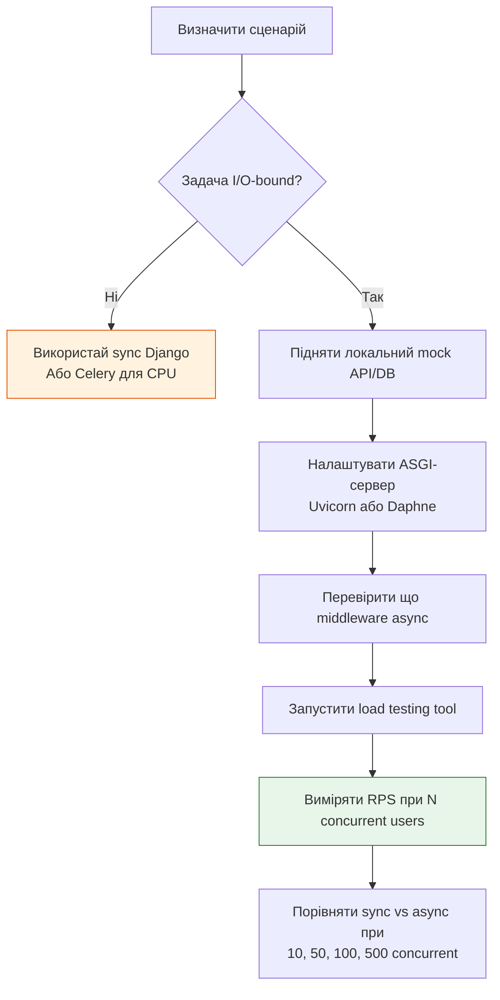
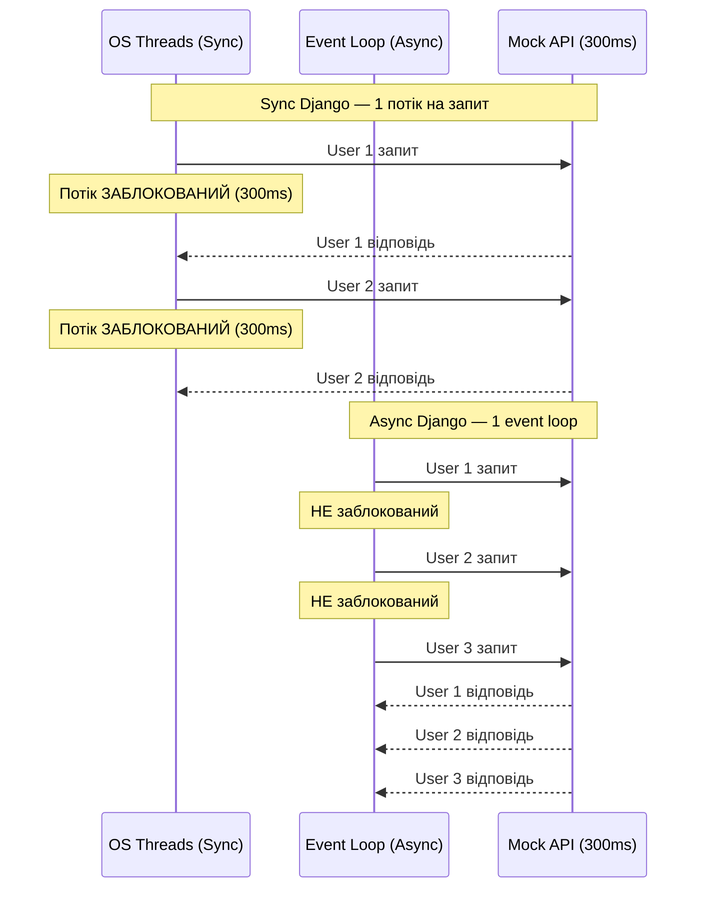

# 08 — Benchmarking: як об'єктивно порівняти sync і async Django

## Навіщо це потрібно

"Async швидший" — це ти вже чув. Але як це довести? Як виміряти?

Більшість початківців порівнюють неправильно: тестують одиночний запит і дивуються, що async не швидший. Або тестують проти публічних API і отримують 429 Too Many Requests.

Цей документ — про те, **що** і **як** правильно вимірювати.

---

## 🧠 Ментальна модель

Уяви дві каси у супермаркеті.

**Стара каса (sync):** один покупець — касир обслуговує, всі інші чекають у черзі.

**Нова каса (async):** касир починає скан покупок у першого, поки система "думає" — починає скан у другого. Жодних простоїв.

Якщо прийде **один** покупець — обидві каси впораються однаково. Різниця видно тільки коли приходять **50 людей одночасно**.

Benchmark одиночного запиту — це тестування з одним покупцем. Це нічого не доводить.

---

## Ключові терміни

| Термін | Що означає |
|--------|-----------|
| **Latency** | Час від надсилання запиту до отримання відповіді (мілісекунди) |
| **Throughput** | Кількість запитів, які сервер обробляє за секунду (RPS) |
| **Concurrency** | Кількість одночасних з'єднань/запитів |
| **IO-bound workload** | Навантаження, де більшість часу — очікування I/O |
| **Load testing** | Тестування під навантаженням (багато одночасних запитів) |
| **Mock API** | Локальний фейковий сервер для тестів без реального зовнішнього API |

---

## Що треба вимірювати

### ✅ Throughput (RPS) під навантаженням

Скільки запитів за секунду обробляє сервер при **N одночасних** клієнтах.

Це головна метрика для async. Async не робить один запит швидшим — він дозволяє обслуговувати більше запитів одночасно.

### ✅ Latency при зростанні concurrency

Як змінюється час відповіді, коли від 1 → 10 → 100 → 500 одночасних клієнтів.

Sync-сервер при великому навантаженні почне деградувати (черга потоків). Async — витримає значно довше.

### ✅ Максимальна concurrency до деградації

При якій кількості одночасних клієнтів latency починає зростати. Це "поріг" сервера.

---

## Що НЕ треба вимірювати

### ❌ Одиночний запит

```
Sync view: 45ms
Async view: 47ms
```

Async може бути трохи **повільнішим** для одного запиту — через overhead event loop'у. Це нормально і не важливо.

### ❌ CPU-bound операції

```python
async def bad_benchmark(request):
    # CPU-bound у async — блокує event loop
    result = sum(range(10_000_000))
    return JsonResponse({"result": result})
```

Тут async програє безумовно. Це не сценарій для async.

### ❌ Тести проти публічних API

```python
# Не роби цього — публічний API заблокує тебе за rate limit
response = await client.get("https://api.openweathermap.org/...")
```

При load testing ти надсилаєш сотні запитів за секунду. Публічні API мають rate limits і блокують такі запити. Результати будуть хибними.

---

## Правильна методологія



---

## Локальний Mock API для тестів

Ніколи не тестуй проти реальних зовнішніх API. Підніми локальний mock:

```python
# mock_api.py — простий mock-сервер на FastAPI або aiohttp
from fastapi import FastAPI
import asyncio

app = FastAPI()

@app.get("/weather")
async def weather():
    await asyncio.sleep(0.3)  # Імітуємо 300мс відповіді
    return {"temp": 22, "desc": "Sunny"}

@app.get("/news")
async def news():
    await asyncio.sleep(0.5)  # Імітуємо 500мс відповіді
    return {"items": ["Новина 1", "Новина 2"]}
```

```bash
# Запустити mock API
uvicorn mock_api:app --port 8001
```

Тепер тестуй Django views проти `http://localhost:8001` — ніяких rate limits, контрольована затримка.

---

## Load testing: приклад з locust

```python
# locustfile.py
from locust import HttpUser, task, between

class DjangoUser(HttpUser):
    wait_time = between(0.1, 0.5)

    @task
    def sync_view(self):
        self.client.get("/api/sync-weather/")

    @task
    def async_view(self):
        self.client.get("/api/async-weather/")
```

```bash
pip install locust
locust -f locustfile.py --host=http://localhost:8000
# Відкрий http://localhost:8089 і запусти тест
```

Параметри тесту:
- Users: 100–500
- Spawn rate: 10 users/sec
- Duration: 60 seconds

---

## Sync vs Async: типова часова лінія



---

## Benchmarking Checklist

Перед кожним тестом перевір:

- [ ] Тестуєш IO-bound workload (не CPU-bound)
- [ ] Використовуєш локальний mock API (не публічний)
- [ ] Під sync — `gunicorn` з `--workers` або WSGI
- [ ] Під async — `uvicorn` або `daphne` (ASGI)
- [ ] Middleware у async-стеку — всі async (перевірити!)
- [ ] Використовуєш `asyncio.sleep()` для імітації затримки (не `time.sleep()`)
- [ ] Тестуєш concurrency від 10 до 500+ одночасних користувачів
- [ ] Вимірюєш RPS (не тільки latency одного запиту)
- [ ] Перевірив connection pool БД — він не вичерпаний?

---

## Чому database connection pool — критичний bottleneck

Async дозволяє тисячі одночасних запитів. Але якщо в БД є максимум 20 з'єднань — 980 запитів чекатимуть у черзі незалежно від async.

```python
# settings.py
DATABASES = {
    "default": {
        "ENGINE": "django.db.backends.postgresql",
        # ...
        "OPTIONS": {
            "pool_size": 20,        # Максимум одночасних з'єднань
            "max_overflow": 5,      # Додаткові при пікі
        },
        "CONN_MAX_AGE": 0,          # Вимкнути для async
    }
}
```

При async-навантаженні: моніторь `pg_stat_activity` в PostgreSQL — якщо connection count близько до максимуму, це bottleneck, а не код.

---

## Типова помилка початківця

### ❌ Тестувати один запит і робити висновок

```bash
# Один запит — нічого не доводить
curl http://localhost:8000/api/weather/
# Sync: 45ms
# Async: 48ms
# "Async повільніший!" — хибний висновок
```

### ✅ Тестувати при конкурентному навантаженні

```bash
# Apache Bench: 1000 запитів, 50 одночасних
ab -n 1000 -c 50 http://localhost:8000/api/weather/

# Sync результат: ~15 RPS (потоки вичерпуються)
# Async результат: ~200+ RPS (event loop справляється)
```

---

## Практичне завдання

### Завдання 1

Підніми простий mock API (можна через `python -m http.server` або FastAPI). Напиши два Django endpoints:
- `/sync/` — sync view з `requests.get()` до mock API
- `/async/` — async view з `httpx.AsyncClient()`

Запусти обидва під `uvicorn`. Протестуй через Apache Bench або locust.

### Завдання 2

Напиши два Django views з `asyncio.sleep(0.5)` і `time.sleep(0.5)`. Запусти load test і порівняй RPS. Поясни результат.

### Завдання 3

Перевір свій Django-проект: всі middleware у `MIDDLEWARE` списку — async-сумісні? Як це перевірити?

### Самоперевірка

- [ ] Я розумію різницю між latency і throughput
- [ ] Я знаю, що async переваги видно тільки при конкурентному навантаженні
- [ ] Я розумію, чому не можна тестувати проти публічних API
- [ ] Я знаю, що `time.sleep()` в async — помилка benchmark
- [ ] Я розумію роль database connection pool при async навантаженні

---

## Підсумок

Async Django перевершує sync не для одного запиту — а для сотень одночасних. Тестувати потрібно throughput (RPS) при зростаючому concurrency, а не latency одиночного запиту.

Завжди використовуй локальний mock API замість публічного. Перевіряй що весь стек (middleware, ORM) async-сумісний. Не забувай про database connection pool — він може стати справжнім bottleneck раніше, ніж event loop.

→ [09_async_use_cases.md](09_async_use_cases.md)
