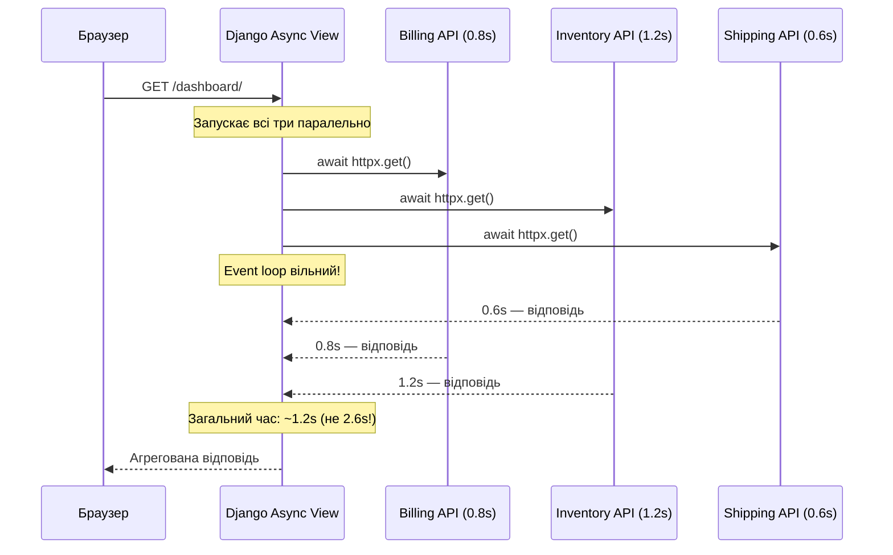
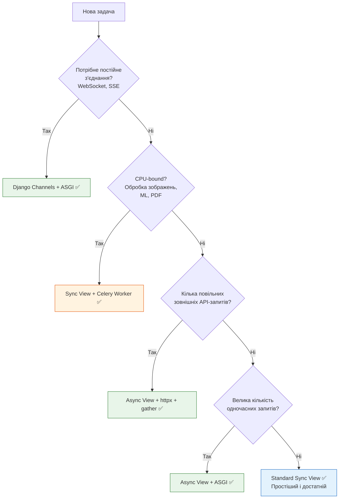
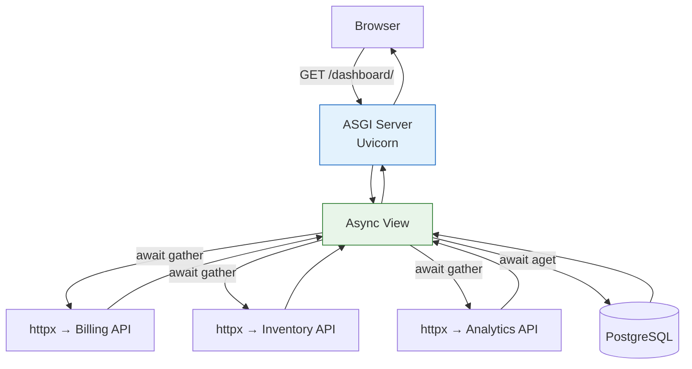
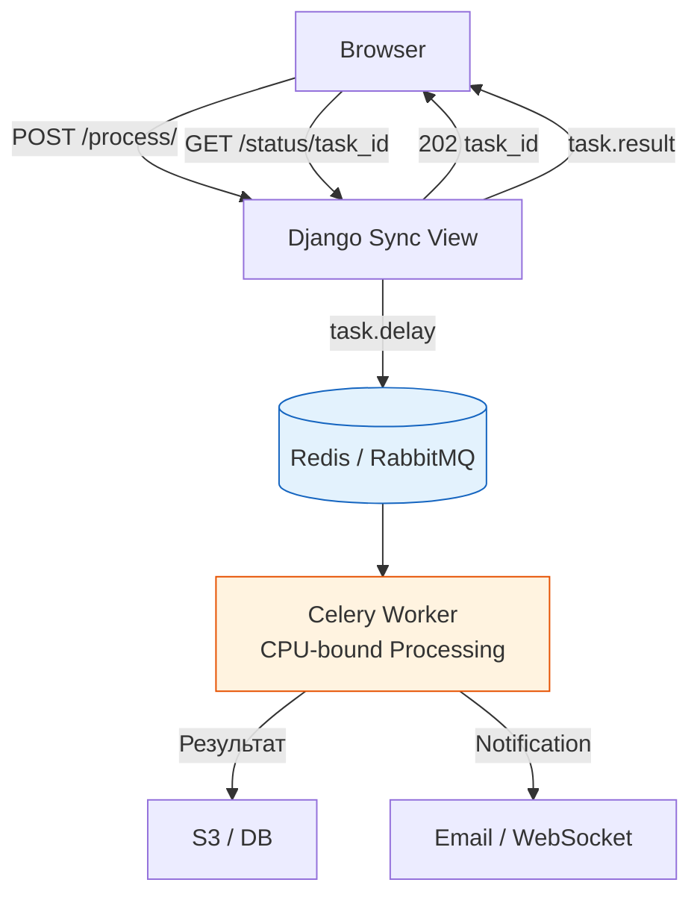

# 09 — Real-World Use Cases: коли async Django справді потрібен

## Навіщо це потрібно

Ти пройшов весь шлях: asyncio, ASGI, async views, async ORM, sync_to_async, httpx, benchmarking.

Останнє питання: **коли все це справді варто використовувати?**

Async — це інструмент. Як молоток: ідеальний для цвяхів і марний для гвинтів. Цей документ — карта: де цвяхи, де гвинти.

---

## 🧠 Ментальна модель

Уяви диспетчера екстреної служби.

**Синхронний диспетчер:** бере один дзвінок, повністю вирішує ситуацію (відправляє машину, чекає підтвердження, закриває справу), потім бере наступний.

**Асинхронний диспетчер:** приймає 10 дзвінків одночасно. Кожному говорить "зрозумів, машина їде" і тримає в курсі. Не чекає поки кожна машина доїде — просто координує.

Для складних справ що потребують повної уваги (CPU-bound) — кращий синхронний диспетчер. Для координації багатьох одночасних з'єднань — асинхронний.

---

## Async Suitability Matrix

| Тип задачі | Приклад | Архітектура | Причина |
|-----------|---------|------------|---------|
| **Concurrent I/O** | Агрегація даних з 5 API | ASGI + Async View + httpx | `await` звільняє event loop між запитами |
| **Persistent connections** | Чат, Live dashboard, WebSockets | Django Channels + ASGI | Один event loop тримає тисячі відкритих з'єднань |
| **High-volume webhooks** | Stripe, GitHub webhooks | Async View + ASGI | Миттєво приймає й підтверджує без блокування |
| **Streaming відповіді** | CSV/JSON streaming, SSE | Async + StreamingHttpResponse | Надсилає частинами без блокування сервера |
| **Стандартний CRUD** | Список статей, профіль користувача | Sync View (WSGI або ASGI) | ORM достатньо швидкий, async додає складність |
| **Image/Video processing** | Resize аватару, конвертація відео | Celery Worker | CPU-bound: блокує event loop, краще у фоні |
| **ML inference** | Класифікація тексту, рекомендації | Celery + GPU Worker | Тяжкий CPU/GPU, не для event loop |
| **PDF/report generation** | Звіти, рахунки-фактури | Celery Worker | CPU-bound + I/O, довго виконується |

---

## Коли async справді корисний

### 1. Агрегація з кількох зовнішніх API

Класичний use case: дашборд, що збирає дані з кількох джерел.



```python
import asyncio
import httpx
from django.http import JsonResponse

async def dashboard_view(request):
    async with httpx.AsyncClient(timeout=10.0) as client:
        billing, inventory, shipping = await asyncio.gather(
            client.get("https://billing.internal/summary"),
            client.get("https://inventory.internal/status"),
            client.get("https://shipping.internal/active"),
            return_exceptions=True
        )

    return JsonResponse({
        "billing": billing.json() if not isinstance(billing, Exception) else None,
        "inventory": inventory.json() if not isinstance(inventory, Exception) else None,
        "shipping": shipping.json() if not isinstance(shipping, Exception) else None,
    })
```

### 2. WebSockets і чат-системи

Django Channels з ASGI дозволяє один event loop тримати тисячі відкритих WebSocket-з'єднань:

```python
# consumers.py (Django Channels)
from channels.generic.websocket import AsyncWebsocketConsumer
import json

class ChatConsumer(AsyncWebsocketConsumer):
    async def connect(self):
        self.room_name = self.scope["url_route"]["kwargs"]["room_name"]
        await self.channel_layer.group_add(self.room_name, self.channel_name)
        await self.accept()

    async def disconnect(self, close_code):
        await self.channel_layer.group_discard(self.room_name, self.channel_name)

    async def receive(self, text_data):
        data = json.loads(text_data)
        # Розсилаємо повідомлення всій групі
        await self.channel_layer.group_send(
            self.room_name,
            {"type": "chat_message", "message": data["message"]}
        )

    async def chat_message(self, event):
        await self.send(text_data=json.dumps({"message": event["message"]}))
```

### 3. High-volume webhooks

Endpoints що приймають тисячі webhook-запитів (Stripe, GitHub):

```python
from django.http import JsonResponse
from django.views.decorators.csrf import csrf_exempt
from asgiref.sync import sync_to_async

@csrf_exempt
async def stripe_webhook_view(request):
    if request.method != "POST":
        return JsonResponse({"error": "Method not allowed"}, status=405)

    payload = request.body
    
    # Швидко підтверджуємо отримання (Stripe очікує < 30s)
    # Реальна обробка — в Celery task
    await sync_to_async(enqueue_webhook_processing)(payload)

    return JsonResponse({"status": "received"})
```

### 4. Server-Sent Events (Live updates)

```python
import asyncio
from django.http import StreamingHttpResponse

async def live_updates(request):
    async def event_stream():
        count = 0
        while True:
            count += 1
            yield f"data: {{\"update\": {count}}}\n\n"
            await asyncio.sleep(2)  # Оновлення кожні 2 секунди

    return StreamingHttpResponse(
        event_stream(),
        content_type="text/event-stream"
    )
```

---

## Коли async НЕ потрібен

### CPU-bound задачі: Event loop заморожується

```python
# ❌ НЕ роби так — блокує весь сервер
async def generate_report_view(request):
    # PDF генерація — CPU-bound!
    pdf_bytes = generate_pdf_report(request.user.id)  # 10 секунд
    return HttpResponse(pdf_bytes, content_type="application/pdf")
```

Поки генерується PDF — сервер не відповідає нікому.

### Правильна архітектура: Celery Worker

```mermaid
graph TD
    A[Браузер] -->|POST /generate-report/| B[Django View\nSync або Async]
    B -->|Celery task| C[Redis / RabbitMQ]
    B -->|202 Accepted + task_id| A
    C --> D[Celery Worker\nGenerates PDF]
    D --> E[Зберігає файл\nNotifies user]
    A -->|GET /report/status/task_id| B
    B --> F[{"status": "done", "url": "..."}]

    style D fill:#fff3e0,stroke:#e65100
    style C fill:#e3f2fd,stroke:#1565c0
```

```python
# tasks.py (Celery)
from celery import shared_task

@shared_task
def generate_pdf_report(user_id):
    # CPU-bound — безпечно у Celery worker
    user = User.objects.get(id=user_id)
    pdf = create_pdf(user)  # Займає скільки завгодно часу
    save_to_storage(pdf, user_id)
    notify_user(user_id)

# views.py
from django.http import JsonResponse
from .tasks import generate_pdf_report

def request_report_view(request):
    # Запускаємо задачу і одразу повертаємо відповідь
    task = generate_pdf_report.delay(request.user.id)
    return JsonResponse({"task_id": str(task.id), "status": "processing"}, status=202)
```

---

## Decision Tree: коли обирати async



---

## Архітектурна діаграма: async дашборд



---

## Архітектурна діаграма: Celery для CPU-bound



---

## Типова помилка початківця

### ❌ Async скрізь без причини

```python
# У тебе звичайний CRUD view — навіщо async?
async def article_list_view(request):
    articles = [a async for a in Article.objects.all()[:20]]
    return JsonResponse({"articles": [...]})
```

Якщо view просто читає зі своєї БД і повертає JSON — sync view простіший, зрозуміліший і не вимагає ASGI, async ORM і всього стеку.

### ✅ Async тільки там, де є реальна потреба

```python
# Async виправданий: три зовнішні API одночасно
async def dashboard_view(request):
    weather, news, stocks = await asyncio.gather(
        fetch_weather(), fetch_news(), fetch_stocks()
    )
    return JsonResponse({...})
```

---

## Практичне завдання

### Завдання 1

Переглянь свій останній або поточний Django-проект. Визнач:
- Які endpoints зараз sync — і чи варто їх переводити в async?
- Які задачі зараз виконуються у view і потребують Celery?
- Чи є будь-які зовнішні API-виклики, що могли б бути паралельними?

### Завдання 2

Напиши async view `/api/summary/`, який:
1. Через `httpx.AsyncClient` + `gather` робить два паралельних запити до mock endpoints
2. Через `await User.objects.acount()` рахує кількість користувачів у БД
3. Повертає все в одному `JsonResponse`

### Завдання 3

Намалюй (або опиши) архітектуру Django-додатку для обробки завантажених відео:
- User завантажує відео
- Сервер приймає файл
- Задача конвертації йде в Celery
- User отримує посилання на статус завдання
- Після завершення — посилання на готовий файл

### Самоперевірка

- [ ] Я знаю, коли async views справді корисні
- [ ] Я знаю, чому CPU-bound задачі не підходять для async
- [ ] Я розумію архітектуру Celery для важких операцій
- [ ] Я можу прийняти рішення: async view чи sync + Celery?
- [ ] Я не буду додавати async "просто тому що можу"

---

## Фінальний підсумок усього уроку

Ти пройшов повний шлях від основ до практики:

**01 — Sync vs Async:** Асинхронність існує через величезну різницю в швидкості між CPU і зовнішніми операціями. Async — це concurrency (перемикання), не parallelism (одночасне виконання).

**02 — asyncio:** `async def` повертає coroutine object. `await` — точка призупинення. Event loop керує всіма задачами. `gather()` — паралельне виконання кількох coroutines.

**03 — ASGI:** WSGI — один потік на запит. ASGI — event loop обслуговує тисячі. Uvicorn, Daphne, Hypercorn — ASGI-сервери для Django.

**04 — Async Views:** `async def view` під ASGI — нативне виконання. Sync middleware додає context switch penalties. Async view не означає автоматично кращу продуктивність.

**05 — Async ORM:** `filter()` — lazy, безпечний. `get()`, `for` — блокуючий, підніме `SynchronousOnlyOperation`. Використовуй `aget()`, `acount()`, `async for`.

**06 — sync_to_async:** Міст між sync і async світами. Sync-код виконується у виділеному потоці, event loop залишається вільним. Мінімізуй кількість перетинів межі.

**07 — Async HTTP Clients:** `requests` блокує event loop. `httpx.AsyncClient` + `gather` — правильна пара для паралельних API-запитів.

**08 — Benchmarking:** Async переваги видно тільки при concurrent навантаженні. Тестуй RPS, а не latency одного запиту. Використовуй локальний mock API.

**09 — Use Cases:** Async для I/O-bound concurrent задач. Celery для CPU-bound. Sync view для стандартного CRUD.

---

> **Головне правило:** async — це інструмент для конкретних проблем. Якщо проблеми немає — інструмент не потрібен. Почни зі звичайного sync Django, і додавай async тільки там, де є реальний bottleneck.

← [08_benchmarking.md](08_benchmarking.md) | [INDEX.md](INDEX.md) ↑
