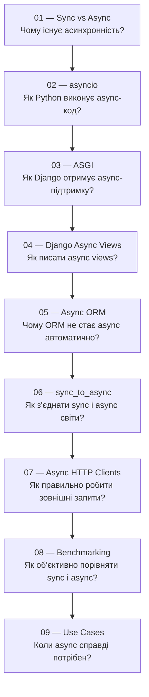

# Асинхронний Django: від основ до production

> Серія навчальних документів для студентів курсу Python/Django.
> Тема: асинхронне програмування — від Python asyncio до реальних Django-проєктів.

---

## Для кого цей урок

Цей урок для тебе, якщо:

- ти вже знаєш базовий Python (функції, класи, цикли);
- ти почав вивчати Django і розумієш, що таке view, ORM, request/response;
- ти чув слово "async" але ще не до кінця розумієш, навіщо воно і як працює.

Після цього уроку ти розумітимеш не просто синтаксис, а **чому** async існує і **коли** його справді варто використовувати.

---

## Карта уроку

---

## Таблиця файлів

| № | Файл | Тема | Що студент зрозуміє |
|---|------|------|---------------------|
| 1 | [01_sync_vs_async.md](01_sync_vs_async.md) | Синхронне vs асинхронне виконання | Навіщо існує async і що таке blocking |
| 2 | [02_asyncio.md](02_asyncio.md) | Python asyncio | Як coroutine, await і event loop працюють разом |
| 3 | [03_asgi.md](03_asgi.md) | WSGI та ASGI | Чому Django потребує ASGI для справжнього async |
| 4 | [04_django_async_views.md](04_django_async_views.md) | Django Async Views | Як писати async def view і коли це корисно |
| 5 | [05_async_orm.md](05_async_orm.md) | Async ORM | Чому async view не робить ORM автоматично асинхронним |
| 6 | [06_sync_to_async.md](06_sync_to_async.md) | sync_to_async | Як безпечно з'єднати sync і async код у Django |
| 7 | [07_async_http_clients.md](07_async_http_clients.md) | Async HTTP Clients | Чому `requests` блокує і як використовувати `httpx` |
| 8 | [08_benchmarking.md](08_benchmarking.md) | Benchmarking | Як правильно вимірювати performance sync vs async |
| 9 | [09_async_use_cases.md](09_async_use_cases.md) | Real-world Use Cases | Коли async справді потрібен, а коли ні |

---

## Рекомендований порядок читання

**Читай по порядку** — від `01` до `09`. Кожен наступний документ спирається на попередній.

Якщо хочеш тільки практику Django — пропусти глибокий asyncio і читай:
`01` → `03` → `04` → `05` → `06` → `09`

---

## Що потрібно знати перед початком

- [ ] Базовий синтаксис Python: функції, класи, цикли, словники
- [ ] Що таке Django view (хоча б мінімально)
- [ ] Що таке HTTP request / response
- [ ] Що таке база даних і ORM (на рівні `User.objects.get(id=1)`)

---

## Що вмітимеш після проходження

- [ ] Пояснити різницю між sync і async виконанням
- [ ] Написати async def view у Django
- [ ] Правильно робити async ORM-запити (`aget`, `async for`)
- [ ] Обгорнути sync-код через `sync_to_async`
- [ ] Робити кілька зовнішніх API-запитів паралельно через `httpx` і `gather`
- [ ] Розуміти, коли async дійсно потрібен, а коли це overengineering

---

## Важливе попередження

> **Async ≠ "завжди швидше".**
>
> Асинхронність — це інструмент для конкретних задач. Якщо ти додаєш `async def` скрізь без розуміння — ти не покращуєш код, а додаєш складність.
>
> Цей урок пояснить, **коли** цей інструмент справді потрібен.
