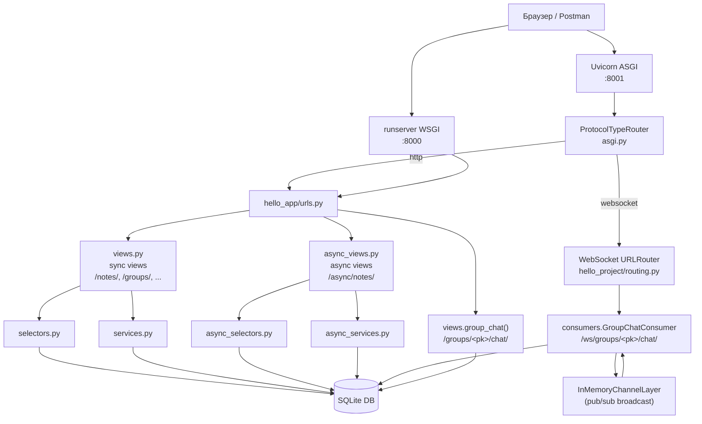
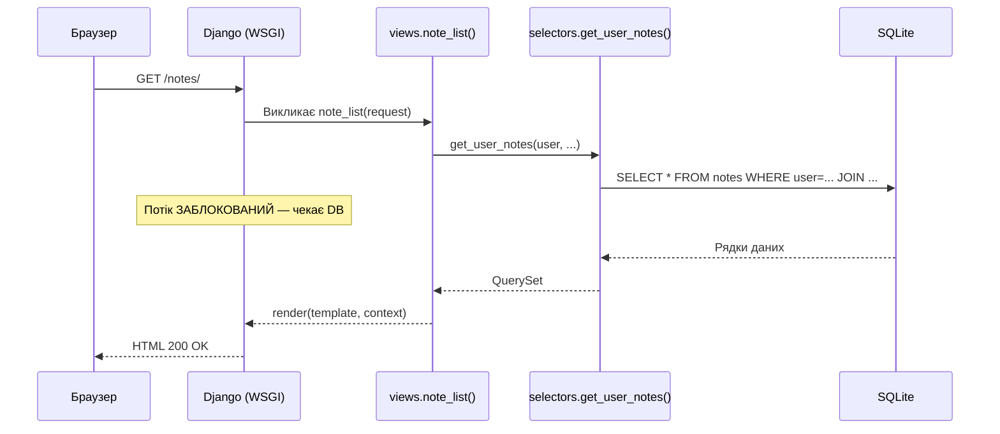
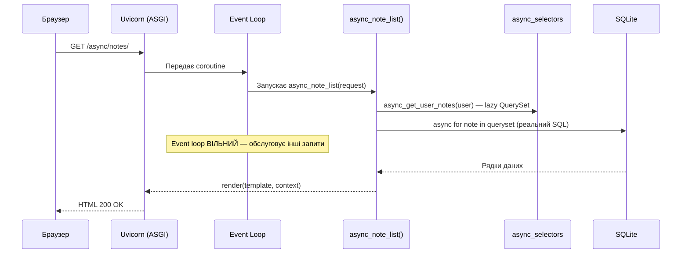
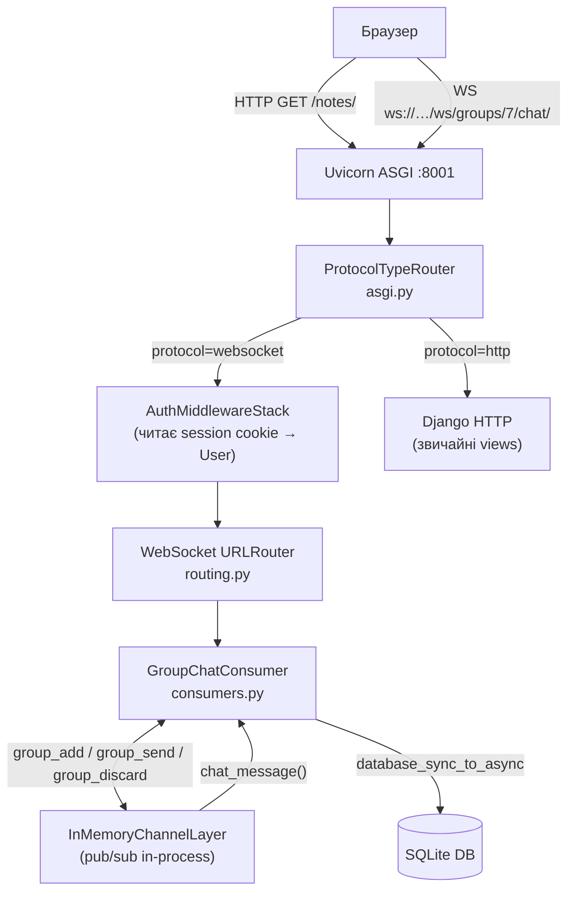
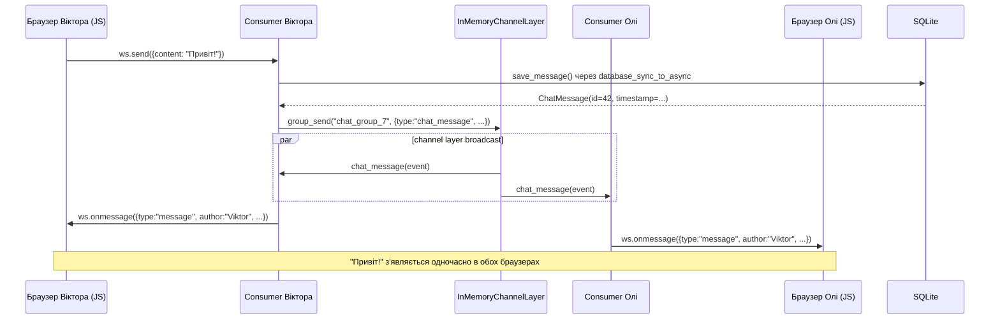

# Crispy Notes Project: Sync vs Async Django

> Навчальний проєкт для курсу Python/Django.
> Демонструє **синхронний** і **асинхронний** Django паралельно на одному коді.

---

## 00. Про що цей проєкт

Це вже готовий Django-додаток для нотаток (Notes, Notebooks, Tags, TodoList, ShoppingList).
Ми **не переписуємо його з нуля** — ми додаємо async можливості **поруч** із sync-кодом.

**Дві демонстрації async в одному проєкті:**

```
# Частина 1: Async views (той самий результат — різна архітектура)
http://127.0.0.1:8000/notes/          ← Sync view (класичний Django)
http://127.0.0.1:8001/async/notes/    ← Async view (той самий результат, async ORM)

# Частина 2: Real-time чат (тут async — єдиний правильний підхід)
http://127.0.0.1:8001/groups/<pk>/chat/   ← Груповий WebSocket чат
```

Async views і async ORM показують **як** писати async код.
Груповий чат показує **навіщо** async потрібен — тут sync просто не підходить.

---

## 01. Що студент вивчить

Після проходження цього проєкту ти зрозумієш:

**Async views та ORM:**
- [ ] Чому `async def view` не стає корисним просто від написання `async`
- [ ] Що таке lazy QuerySet і де SQL реально виконується
- [ ] Як `async for` замінює `for` при ітерації по QuerySet
- [ ] Коли і чому `sync_to_async` потрібен для `transaction.atomic()`
- [ ] Як запустити Django під ASGI через Uvicorn
- [ ] Як писати тести для async views через `AsyncClient`
- [ ] Що `aupdate()` + `F()` — атомарний SQL UPDATE без завантаження об'єкта

**Real-time чат (Django Channels + WebSocket):**
- [ ] Чому HTTP не підходить для real-time і де async стає необхідністю
- [ ] Що таке WebSocket і як він відрізняється від HTTP
- [ ] Що таке Consumer і як він відрізняється від View
- [ ] Як channel layer доставляє повідомлення всім учасникам (pub/sub)
- [ ] Як `ProtocolTypeRouter` об'єднує HTTP і WebSocket в одному ASGI-процесі
- [ ] Як `AuthMiddlewareStack` автентифікує WebSocket-з'єднання
- [ ] Що таке `database_sync_to_async` і навіщо він потрібен у Consumer

---

## 02. Архітектура проєкту



### Таблиця файлів

| Файл | Роль | Чи змінювали? |
|------|------|---------------|
| `models.py` | 9 моделей: Note, Notebook, Tag, ..., **ChatMessage** | ✅ Додали ChatMessage |
| `views.py` | 50+ sync views + **group_chat** | ✅ Додали group_chat |
| `selectors.py` | Sync ORM SELECT-запити | ❌ Без змін |
| `services.py` | Sync business logic | ❌ Без змін |
| `forms.py` | Django Forms | ❌ Без змін |
| **`async_selectors.py`** | **Async ORM SELECT-запити** | **✅ Новий** |
| **`async_services.py`** | **Async business logic** | **✅ Новий** |
| **`async_views.py`** | **Async def views** | **✅ Новий** |
| **`consumers.py`** | **WebSocket Consumer (Django Channels)** | **✅ Новий** |
| **`tests/test_async_views.py`** | **Async тести** | **✅ Новий** |
| `urls.py` | URL routing | ✅ Додали async URLs + chat |
| `requirements.txt` | Залежності | ✅ Додали uvicorn, httpx, channels |
| `settings.py` | Конфігурація Django | ✅ CHANNEL_LAYERS, channels у INSTALLED_APPS |
| `asgi.py` | ASGI точка входу | ✅ ProtocolTypeRouter |
| **`hello_project/routing.py`** | **WebSocket URL patterns** | **✅ Новий** |
| **`static/hello_app/js/group_chat.js`** | **Vanilla JS WebSocket клієнт** | **✅ Новий** |

---

## 03. Sync-версія: класичний Django

Sync-код в цьому проєкті — це стандартний Django без жодних змін.

### Як працює sync request



### Sync URL-и

| URL | Метод | View | Що робить |
|-----|-------|------|-----------|
| `/notes/` | GET | `note_list` | Список нотаток |
| `/notes/<pk>/` | GET | `note_detail` | Деталі нотатки |
| `/notes/new/` | GET/POST | `note_create` | Форма створення |
| `/notes/<pk>/edit/` | GET/POST | `note_edit` | Форма редагування |
| `/notes/<pk>/delete/` | GET/POST | `note_delete` | Видалення |

---

## 04. Async-версія: що ми додали і чому

Ми додали нові файли **не змінюючи** sync-код.
Студент може відкрити `views.py` і `async_views.py` поруч і побачити різницю.

### Як працює async request



### Async URL-и

| URL | Метод | Async View | Sync-аналог |
|-----|-------|-----------|-------------|
| `/async/notes/` | GET | `async_note_list` | `note_list` |
| `/async/notes/<pk>/` | GET | `async_note_detail` | `note_detail` |
| `/async/notes/create/` | GET/POST | `async_note_create` | `note_create` |
| `/async/notes/<pk>/delete/` | GET/POST | `async_note_delete` | `note_delete` |
| `/async/notes/<pk>/pin/` | POST | `async_note_toggle_pin` | _(немає окремого URL)_ |

---

## 05. Коли async виправданий, а коли — ні

Async — це не "краще". Async — це "для іншого типу задач".

### ❌ Async не потрібен (sync достатній)

| Функціонал | Чому sync вистачає |
|------------|-------------------|
| CRUD нотаток | Прості DB запити, один запит = одна відповідь |
| TodoList, ShoppingList | Немає bottleneck, короткі запити |
| Форми, авторизація | CPU-операції без I/O очікування |
| Адмін-панель | Рідкісні складні запити, concurrency не потрібна |

### ✅ Async виправданий

| Функціонал | Чому async потрібен |
|------------|---------------------|
| **Груповий чат (цей проєкт!)** | WebSocket = тисячі відкритих з'єднань одночасно |
| Паралельні API-запити | `asyncio.gather()` → кілька запитів одночасно |
| Streaming відповіді | Server-Sent Events, великі файли |
| High-concurrency API | 10 000+ req/s без блокування потоків |

Якщо переписати весь проєкт в async без реального bottleneck — це
overengineering + складніший код + ті самі результати.

**Ми конвертуємо тільки Notes** щоб студент міг порівняти архітектуру.
**Груповий чат** — це окремий use case де async є єдиним правильним вибором (→ розділ 18).

---

## 06. Запуск sync Django через runserver

### Крок 1: Перехід до директорії

```bash
cd module_5/lesson_Django_Async/notes_chat_app
```

### Крок 2: Створення virtualenv

```bash
# Створення virtualenv
python -m venv .venv

# Активація (Linux / macOS)
source .venv/bin/activate

# Активація (Windows)
.venv\Scripts\activate
```

### Крок 3: Встановлення залежностей

```bash
pip install -r requirements.txt
# Встановить: Django 5.2, crispy-forms, uvicorn, httpx, та інші
```

### Крок 4: Міграції

```bash
python manage.py migrate
# Створить SQLite db.sqlite3 з усіма таблицями
```

### Крок 5: Суперюзер (опційно)

```bash
python manage.py createsuperuser
# Username: admin
# Password: (введи свій)
# → http://127.0.0.1:8000/admin/
```

### Крок 6: Запуск sync сервера

```bash
python manage.py runserver
# ↑ Django запускається на вбудованому WSGI сервері
# Порт: 8000 (за замовчуванням)
```

Відкрий браузер: **http://127.0.0.1:8000/**

Зареєструйся або логінься. Побач sync-список нотаток: **http://127.0.0.1:8000/notes/**

---

## 07. Запуск async Django через Uvicorn (ASGI)

Uvicorn — ASGI-сервер. На відміну від вбудованого runserver, він використовує
asyncio event loop і обслуговує async views нативно.

### Крок 1: Встанови залежності (включно з wsproto)

```bash
pip install -r requirements.txt
```

> **Чому важливо:** `requirements.txt` містить `wsproto` — бібліотеку WebSocket-протоколу
> для uvicorn. Без неї uvicorn логує `"No supported WebSocket library detected"` і повертає
> HTTP 404 на всі WS-запити. Async views працюють, але **чат — не буде**.

### Крок 2: Запусти ASGI-сервер

```bash
uvicorn notes_project.asgi:application --reload --port 8001
```

Розбір команди:

| Частина | Що означає |
|---------|-----------|
| `uvicorn` | ASGI-сервер (аналог gunicorn для async) |
| `notes_project.asgi` | Python module: `notes_project/asgi.py` |
| `:application` | Об'єкт у модулі (`application = ProtocolTypeRouter(...)`) |
| `--reload` | Автоперезапуск при зміні файлів (тільки для dev!) |
| `--port 8001` | Порт 8001 (8000 зайнятий runserver) |

### Очікуване попередження (НЕ є помилкою)

```
WARNING:  ASGI 'lifespan' protocol appears unsupported.
```

Uvicorn пробує lifespan protocol (startup/shutdown хуки) → Django не реалізує його →
uvicorn логує WARNING і продовжує роботу. Це нормально. Чат і async views працюють
повністю. Ігноруй це повідомлення.

Відкрий браузер: **http://127.0.0.1:8001/**

Тепер ти можеш порівняти:
- **http://127.0.0.1:8000/notes/** — sync view (WSGI)
- **http://127.0.0.1:8001/async/notes/** — async view (ASGI)
- **http://127.0.0.1:8001/groups/** — груповий чат (WebSocket)

> **Важливо:** Обидва сервери підключаються до ОДНОГО `db.sqlite3`.
> Дані — ті самі. Архітектура виконання — різна.

---

## 08. Таблиця порівняння URL-ів

| Sync URL | Async URL | Що порівнюємо |
|----------|-----------|---------------|
| `GET /notes/` | `GET /async/notes/` | Список нотаток, lazy ORM vs async for |
| `GET /notes/<pk>/` | `GET /async/notes/<pk>/` | Деталі нотатки, `.get()` vs `.aget()` |
| `GET/POST /notes/new/` | `GET/POST /async/notes/create/` | Форма + `create_note` vs `sync_to_async` |
| `GET/POST /notes/<pk>/delete/` | `GET/POST /async/notes/<pk>/delete/` | `.delete()` vs `.adelete()` |
| _(немає окремого URL)_ | `POST /async/notes/<pk>/pin/` | `.update(F(...))` vs `.aupdate(F(...))` |

---

## 09. Як працює async_selectors.py

Відкрий файл: `hello_app/async_selectors.py`

Порівняй із оригінальним: `hello_app/selectors.py`

### Ключова ідея: lazy vs evaluation

```python
# selectors.py (sync) — оригінал
def get_user_notes(user, ...):
    qs = Note.objects.filter(Q(user=user) | ...)
    qs = qs.select_related('notebook', 'group')
    qs = qs.prefetch_related('tags')
    return qs.order_by('-is_pinned', ...)
    # ↑ SQL ЩЕ НЕ ВИКОНУВАВСЯ — повертає lazy QuerySet
    # SQL виконується у views.py коли: for note in notes: ...
```

```python
# async_selectors.py — async версія
def async_get_user_notes(user, ...):
    qs = Note.objects.filter(Q(user=user) | ...)
    qs = qs.select_related('notebook', 'group')
    qs = qs.prefetch_related('tags')
    return qs.order_by('-is_pinned', ...)
    # ↑ ТА САМА ЛОГІКА — теж lazy QuerySet
    # SQL виконується у async_views.py коли: async for note in notes_qs: ...
```

| Django ORM метод | Тип | SQL виконується? |
|-----------------|-----|-----------------|
| `.filter(...)` | Lazy | ❌ Ні |
| `.select_related(...)` | Lazy | ❌ Ні |
| `.prefetch_related(...)` | Lazy | ❌ Ні |
| `.annotate(...)` | Lazy | ❌ Ні |
| `.order_by(...)` | Lazy | ❌ Ні |
| `.get()` | Eval | ✅ Так (sync — блокує) |
| `.aget()` | Eval | ✅ Так (async — не блокує) |
| `.count()` | Eval | ✅ Так (sync) |
| `.acount()` | Eval | ✅ Так (async) |
| `for obj in qs` | Eval | ✅ Так (sync — блокує) |
| `async for obj in qs` | Eval | ✅ Так (async — не блокує) |

### async def тільки там де є реальний SQL

```python
# async_get_user_notes — звичайна def (lazy QuerySet, SQL не виконується)
def async_get_user_notes(user, ...):
    return Note.objects.filter(...).select_related(...).order_by(...)

# async_get_note_detail — async def (реальний SQL через .aget())
async def async_get_note_detail(user, note_id):
    return await Note.objects.filter(...).select_related(...).aget(id=note_id)
    #      ↑ await: SQL виконується асинхронно, event loop вільний поки чекаємо
```

---

## 10. Як працює async_services.py

Відкрий файл: `hello_app/async_services.py`

Порівняй із оригінальним: `hello_app/services.py`

### Два підходи: sync_to_async vs native async

```python
# services.py (sync) — оригінал
def create_note(*, user, title, ...):
    with transaction.atomic():         # ← транзакція
        note = Note.objects.create(...)
        note.tags.set(valid_tags)
    return note
```

```python
# async_services.py — async через sync_to_async
# Не можна просто зробити async def через transaction.atomic()
async_create_note = sync_to_async(create_note, thread_sensitive=True)
# ↑ Обгортає sync create_note для безпечного виклику з async view
# sync_to_async запускає create_note у виділеному OS-потоці
# event loop вільний поки потік виконує транзакцію
```

Порівняй три підходи в async_services.py:

| Операція | Підхід | Чому |
|----------|--------|------|
| `async_create_note` | `sync_to_async(create_note)` | `transaction.atomic()` не підтримується natively async |
| `async_delete_note` | `await note.adelete()` | Простий DELETE, native async ORM метод |
| `async_toggle_pin_note` | `await qs.aupdate(is_pinned=~F(...))` | Атомарний UPDATE, native async, без завантаження об'єкта |

### sync_to_async: як це виглядає в пам'яті

```
Async View (event loop thread)
    │
    │  await async_create_note(...)       ← view призупиняється
    │
    ├─→ sync_to_async: передає у worker thread
    │
    │  event loop обслуговує ІНШІ запити ←
    │
    │  Worker Thread: виконує create_note() + transaction.atomic()
    │
    │  Worker Thread: повертає note ─────┐
    │                                     │
    │  event loop відновлює view ─────────┘
    │
    └─→ note = <Note object>  ← view продовжується
```

---

## 11. Як працює async_views.py

Відкрий файл: `hello_app/async_views.py`

Порівняй із оригінальним: `hello_app/views.py`

### Ключові синтаксичні відмінності

```python
# views.py (sync) — оригінал
@login_required
def note_list(request):
    notes = selectors.get_user_notes(request.user)        # lazy QuerySet
    # Рядком нижче template evaluate QuerySet через for loop (sync)
    return render(request, 'hello_app/note_list.html', {'notes': notes})
```

```python
# async_views.py — async версія
async def async_note_list(request):
    if not request.user.is_authenticated:         # явна auth перевірка
        return redirect('login')

    notes_qs = async_selectors.async_get_user_notes(request.user)  # lazy (sync def)

    notes = [note async for note in notes_qs]     # async for → SQL виконується тут
    #        ↑ await відбувається всередині async for
    #          event loop вільний поки DB відповідає

    return render(request, 'hello_app/note_list.html', {'notes': notes})
    #     ↑ render() — sync, але безпечна у async def (Django 5.x)
```

### Де стоять `await`-и і чому

| Рядок | await | Навіщо |
|-------|-------|--------|
| `note = await async_selectors.async_get_note_detail(...)` | ✅ | Всередині aget() — реальний SQL |
| `notes = [note async for note in notes_qs]` | ✅ (implicit) | Ітерація по QuerySet = SQL |
| `note = await async_services.async_create_note(...)` | ✅ | sync_to_async — виконується у потоці |
| `await async_services.async_delete_note(note)` | ✅ | adelete() — реальний SQL |
| `await async_services.async_toggle_pin_note(note)` | ✅ | aupdate() — реальний SQL |
| `form = NoteForm(request.POST, user=request.user)` | ❌ | Форма lazy, без важкого I/O |
| `form.is_valid()` | ❌ | CPU-валідація, без I/O |
| `return render(...)` | ❌ | Django 5.x рендерить sync template безпечно |
| `return redirect(...)` | ❌ | Просто HttpResponse з 302, без I/O |

---

## 12. Тести: sync vs async

### Запуск тестів

```bash
# Тільки оригінальні sync тести (129 тестів)
python manage.py test hello_app.tests.test_views -v 2

# Тільки нові async тести
python manage.py test hello_app.tests.test_async_views -v 2

# Всі тести разом (sync + async)
python manage.py test hello_app -v 1

# Конкретний async клас
python manage.py test hello_app.tests.test_async_views.AsyncNoteListViewTest -v 2

# Зупинитись на першому провалі
python manage.py test hello_app --failfast -v 2
```

### Ключові відмінності async тестів

Відкрий поруч:
- `hello_app/tests/test_views.py` — sync тести (NoteListViewTest)
- `hello_app/tests/test_async_views.py` — async тести (AsyncNoteListViewTest)

```python
# test_views.py — sync тест
class NoteListViewTest(TestCase):

    def setUp(self):
        # Sync ORM — завжди ОК у setUp
        self.alice = User.objects.create_user('alice', password='pass123')

    def test_redirects_to_login(self):
        # Sync HTTP request
        response = self.client.get(reverse('hello_app:note_list'))
        self.assertEqual(response.status_code, 302)

    def test_auth_user_gets_200(self):
        self.client.force_login(self.alice)   # sync login
        response = self.client.get(reverse('hello_app:note_list'))
        self.assertEqual(response.status_code, 200)
```

```python
# test_async_views.py — async тест
class AsyncNoteListViewTest(TestCase):  # TestCase (не AsyncTestCase)

    def setUp(self):
        # setUp — sync, ORM без await — ОК
        self.alice = User.objects.create_user('alice_async', password='pass123')

    async def test_redirects_to_login(self):
        client = AsyncClient()                  # AsyncClient замість self.client
        response = await client.get(            # await client.get()
            reverse('hello_app:async_note_list')
        )
        self.assertEqual(response.status_code, 302)

    async def test_auth_user_gets_200(self):
        client = AsyncClient()
        await client.force_login(self.alice)    # await force_login
        response = await client.get(
            reverse('hello_app:async_note_list')
        )
        self.assertEqual(response.status_code, 200)
```

| Концепція | Sync тест | Async тест |
|-----------|-----------|------------|
| Базовий клас | `TestCase` | `TestCase` (те саме!) |
| setUp | `def setUp(self)` | `def setUp(self)` (sync!) |
| test_ методи | `def test_*(self)` | `async def test_*(self)` |
| HTTP клієнт | `self.client` | `AsyncClient()` |
| GET запит | `self.client.get(url)` | `await client.get(url)` |
| Login | `self.client.force_login(user)` | `await client.force_login(user)` |
| ORM у тесті | `Note.objects.create(...)` | `await sync_to_async(Note.objects.create)(...)` |

> **Чому TestCase, а не AsyncTestCase?**
> `AsyncTestCase` — підклас `SimpleTestCase` і не підтримує транзакції.
> `TestCase` обгортає кожен тест у транзакцію (rollback після тесту).
> Django 4.1+ підтримує `async def test_*` у звичайному `TestCase`.
> Тому ми використовуємо `TestCase` з `async def test_*` методами.

---

## 13. Postman / браузер: як тестувати

### 13.1. Тестування в браузері

**Крок 1:** Запусти обидва сервери одночасно

```bash
# Terminal 1 (sync)
python manage.py runserver

# Terminal 2 (async)
uvicorn notes_project.asgi:application --reload --port 8001
```

**Крок 2:** Зареєструйся або логінься на http://127.0.0.1:8000/

**Крок 3:** Відкрий обидва URL-и в різних вкладках

```
Вкладка 1: http://127.0.0.1:8000/notes/           ← sync
Вкладка 2: http://127.0.0.1:8001/async/notes/     ← async
```

**Крок 4:** Створи нотатку через sync (/notes/new/) і перевір що вона видна в async (/async/notes/).

> Обидва сервери підключаються до одного db.sqlite3 — дані спільні.

### 13.2. Тестування в Postman

> **Що таке CSRF token?**
> CSRF (Cross-Site Request Forgery) — захист від підробки запитів між сайтами.
> Django перевіряє спеціальний токен у кожному POST-запиті.
> Браузер отримує токен автоматично через cookie. Postman — треба вручну.

---

**Крок 1:** Отримай CSRF token через GET-запит в Postman

Django встановлює `csrftoken` cookie при першому GET-запиті до будь-якої сторінки.

```
GET http://127.0.0.1:8000/
```

У відповіді Postman покаже вкладку **Cookies**:
- Знайди cookie з назвою `csrftoken`
- Скопіюй її значення (довгий рядок із букв та цифр)

Або через браузер (якщо вже відкрито):
- F12 → Application → Cookies → http://127.0.0.1:8000
- Скопіюй значення `csrftoken`

> Django автоматично включає cookie manager в Postman (Settings → Cookies).
> Після першого GET запиту, cookie `csrftoken` з'явиться у Cookie Jar Postman.

---

**Крок 2:** Логін через Postman

```
POST http://127.0.0.1:8000/accounts/login/
Content-Type: application/x-www-form-urlencoded
Body (x-www-form-urlencoded):
  username      alice
  password      pass123
  csrfmiddlewaretoken   <значення csrftoken з кроку 1>
```

Після успішного логіну:
- Postman збереже cookie `sessionid` автоматично (через Cookie Jar)
- Статус відповіді: 302 Redirect (до головної сторінки)

---

**Крок 3:** GET список async нотаток

```
GET http://127.0.0.1:8001/async/notes/
```

Postman автоматично надішле cookies `sessionid` і `csrftoken` (з Cookie Jar).
Ти побачиш HTML-сторінку зі списком нотаток.

---

**Крок 4:** POST створення нотатки через async view

```
POST http://127.0.0.1:8001/async/notes/create/
Content-Type: application/x-www-form-urlencoded
Headers:
  X-CSRFToken    <значення csrftoken>
Body (x-www-form-urlencoded):
  title         Тестова нотатка через Postman
  content       Зміст нотатки
  priority      1
Body:
  title=Тестова нотатка через Postman
  content=Зміст
  priority=1
```

---

## 14. Benchmark: що можна і чого не можна міряти

### Чого НЕ можна очікувати

```bash
# ❌ Один запит — нічого не доводить
curl http://127.0.0.1:8000/notes/        # Sync: 45ms
curl http://127.0.0.1:8001/async/notes/  # Async: 48ms
# "Async повільніший!" — ХИБНИЙ висновок
```

Async має overhead від event loop. Для одного запиту — sync може бути швидшим.

### Що дійсно показує різницю

Різниця видна при **конкурентному навантаженні** (50+ одночасних запитів):

```bash
# 1000 запитів, 50 одночасних (потребує apache-httpd або apache2-utils)
ab -n 1000 -c 50 http://127.0.0.1:8000/notes/         # sync
ab -n 1000 -c 50 http://127.0.0.1:8001/async/notes/   # async
```

> **Увага:** SQLite не є ідеальною БД для async performance benchmark.
> SQLite має глобальне блокування запису. Для реального async benchmark
> використовуй PostgreSQL з пулом з'єднань.

### Locust для навчального benchmark

```bash
pip install locust
```

Створи `locustfile.py` поруч з `manage.py`:

```python
from locust import HttpUser, task, between

class SyncUser(HttpUser):
    host = "http://127.0.0.1:8000"
    wait_time = between(0.1, 0.5)

    @task
    def view_notes(self):
        self.client.get("/notes/")


class AsyncUser(HttpUser):
    host = "http://127.0.0.1:8001"
    wait_time = between(0.1, 0.5)

    @task
    def view_async_notes(self):
        self.client.get("/async/notes/")
```

```bash
locust -f locustfile.py
# Відкрий http://localhost:8089 і запусти тест
```

---

## 15. Типові помилки студентів

### ❌ Помилка 1: Sync ORM у async view

```python
async def bad_note_detail(request, pk):
    note = Note.objects.get(pk=pk)  # ← SynchronousOnlyOperation!
    return render(request, 'note_detail.html', {'note': note})
```

**Помилка:** `.get()` — sync SQL. В async context Django кидає виняток.

```python
# ✅ Правильно
async def good_note_detail(request, pk):
    note = await Note.objects.aget(pk=pk)  # async аналог .get()
    return render(request, 'note_detail.html', {'note': note})
```

---

### ❌ Помилка 2: requests.get() в async view

```python
import requests

async def bad_view(request):
    # requests.get() — sync! Блокує весь event loop на час очікування відповіді
    data = requests.get("https://api.example.com/data").json()
    return JsonResponse(data)
```

**Помилка:** Весь сервер "завмирає" на час HTTP-запиту для всіх інших користувачів.

```python
# ✅ Правильно: httpx.AsyncClient
import httpx

async def good_view(request):
    async with httpx.AsyncClient() as client:
        # await: view призупиняється, event loop обслуговує інших
        response = await client.get("https://api.example.com/data")
    return JsonResponse(response.json())
```

---

### ❌ Помилка 3: time.sleep() в async view

```python
import time

async def bad_delay_view(request):
    time.sleep(2)  # Блокує весь event loop на 2 секунди!
    return HttpResponse("done")
```

```python
# ✅ Правильно: asyncio.sleep()
import asyncio

async def good_delay_view(request):
    await asyncio.sleep(2)  # Передає управління event loop'у
    return HttpResponse("done")
```

---

### ❌ Помилка 4: Переписати весь проєкт в async "бо модно"

```python
# ❌ Async тут не потрібен — зайвий overhead
async def simple_crud_view(request):
    note = await Note.objects.aget(pk=1)
    return render(request, 'note.html', {'note': note})

# ✅ Простіший і достатній для звичайного CRUD
def simple_crud_view(request):
    note = get_object_or_404(Note, pk=1)
    return render(request, 'note.html', {'note': note})
```

---

## 16. Практичні завдання для студентів

### Завдання 1: Порівняй код

Відкрий поруч `views.py:note_list()` і `async_views.py:async_note_list()`.
Знайди всі рядки що змінились. Запиши їх у таблицю:

| Sync рядок | Async рядок | Чому змінено |
|-----------|-------------|-------------|
| `def note_list(request):` | `async def async_note_list(request):` | async def |
| `@login_required` | `if not request.user.is_authenticated:` | inline auth |
| `for note in notes_qs` | `[note async for note in notes_qs]` | async iteration |
| ... | ... | ... |

### Завдання 2: Додай async_get_pinned_notes

У `selectors.py` є `get_pinned_notes(user, limit=5)`.
Додай її async-аналог `async_get_pinned_notes(user, limit=5)` в `async_selectors.py`.

Питання: ця функція має бути `def` або `async def`? Чому?

### Завдання 3: Порівняй результати в браузері

1. Запусти обидва сервери
2. Створи нотатку через `/notes/new/`
3. Перевір що вона видна через `/async/notes/`
4. Видали нотатку через `/async/notes/<pk>/delete/`
5. Перевір що вона зникла через `/notes/`

### Завдання 4: Написати async тест

У `test_async_views.py` додай тест, що перевіряє:
- POST на `/async/notes/create/` без `title` → 200 (форма з помилками)
- POST на `/async/notes/create/` з `title` → 302 (redirect)

### Завдання 5: Зрозумій sync_to_async

В `async_services.py` знайди:

```python
async_create_note = sync_to_async(create_note, thread_sensitive=True)
```

Відповідь на питання:
1. Чому `create_note` не можна зробити native async (без sync_to_async)?
2. Що означає `thread_sensitive=True`?
3. Що відбувається з event loop поки sync_to_async виконується?

---

## 17. Підсумок + документація

### Що ми зробили

| Крок | Файл | Результат |
|------|------|-----------|
| 1 | `requirements.txt` | Додали uvicorn, httpx |
| 2 | `settings.py` | Коментарі про ASGI, CONN_MAX_AGE=0 |
| 3 | `asgi.py` | Навчальні коментарі про uvicorn команду |
| 4 | `async_selectors.py` | Lazy QuerySets + aget() |
| 5 | `async_services.py` | sync_to_async + adelete + aupdate + F() |
| 6 | `async_views.py` | 5 async def views з детальними коментарями |
| 7 | `urls.py` | `/async/notes/` URL prefix |
| 8 | `tests/test_async_views.py` | AsyncClient тести, sync vs async порівняння |

### Офіційна документація

| Тема | Посилання |
|------|-----------|
| Django async views | https://docs.djangoproject.com/en/5.2/topics/async/ |
| Django async ORM | https://docs.djangoproject.com/en/5.2/ref/models/querysets/#async-queries |
| sync_to_async | https://docs.djangoproject.com/en/5.2/topics/async/#asgiref-sync |
| Django async testing | https://docs.djangoproject.com/en/5.2/topics/testing/tools/#asynchronous-tests |
| Uvicorn | https://uvicorn.dev/|
| httpx | https://www.python-httpx.org/ |
| asgiref | https://github.com/django/asgiref |
| asyncio (Python docs) | https://docs.python.org/3/library/asyncio.html |

### Фінальна думка

> **Async Django — це інструмент, а не стиль написання коду.**
>
> Sync Django підходить для більшості проєктів: CRUD, admin, блог, API.
> Async Django виправданий коли є **реальний I/O bottleneck**:
> паралельні зовнішні API-запити, WebSockets, streaming, high concurrency.
>
> Цей навчальний проєкт показує: один і той самий результат,
> дві різних архітектури. Вибирай відповідно до задачі.

---

## 18. Real-time груповий чат: чому тут async — єдиний правильний вибір

### 18.1. Проблема: чому HTTP не підходить для чату

HTTP — це протокол "запит → відповідь → закрито".
Кожен запит браузера відкриває нове TCP-з'єднання, сервер відповідає і закриває його.

```
HTTP flow (класичний):
  Browser ── GET /groups/7/chat/ ──► Django view → HttpResponse → [з'єднання закрите]
  Browser ── GET /groups/7/chat/ ──► Django view → HttpResponse → [з'єднання закрите]
  ...
```

**Проблема для чату:** сервер не може ПЕРШИМ надіслати повідомлення браузеру.
Якщо Оля пише "Привіт" — браузер Віктора дізнається про це лише при наступному
запиті. Коли зробити наступний запит? Не знаємо.

Два "костильних" вирішення через HTTP — і чому вони погані:

| Підхід | Як працює | Проблема |
|--------|-----------|----------|
| **Polling** | Браузер запитує `/new-messages/` кожні 2 секунди | 1000 юзерів = 500 запитів/сек. Повідомлення приходить із затримкою до 2 сек |
| **Long polling** | Браузер надсилає запит, сервер "тримає" його відкритим до появи нового повідомлення | 1000 юзерів = 1000 заблокованих потоків на сервері |

**Long polling + sync Django = катастрофа concurrency:**

```
Sync Django: один потік = один активний запит
1000 юзерів у чаті → 1000 потоків заблоковані (чекають нових повідомлень)
Django thread pool вичерпаний → решта сайту не відповідає
```

---

### 18.2. Рішення: WebSocket

WebSocket — це **постійне двостороннє TCP-з'єднання** між браузером і сервером.
Встановлюється через HTTP Upgrade handshake (один раз), після чого HTTP більше не потрібен.

```
WebSocket flow:
  Browser ══════════ PERSISTENT TCP CONNECTION ═════════ Server
  ↑ Будь-яка сторона може надіслати дані в будь-який момент
  ↑ Одне з'єднання живе весь час поки відкрита вкладка

  Оля:    ws.send({content: "Привіт!"})  ──────────────► consumer.receive()
  Сервер: consumer.send({author: "Оля"}) ──────────────► ws.onmessage (у браузері Віктора)
  Сервер: consumer.send({author: "Оля"}) ──────────────► ws.onmessage (у браузері Маші)
```

Браузерний WebSocket API — вбудований, без бібліотек:

```javascript
// Відкрити з'єднання
const ws = new WebSocket('ws://127.0.0.1:8001/ws/groups/7/chat/')
//                        ↑ ws:// для HTTP, wss:// для HTTPS

ws.onopen    = () => { /* з'єднання встановлено */ }
ws.onmessage = (e) => { const data = JSON.parse(e.data) }  // сервер надіслав
ws.onclose   = (e) => { /* код закриття: 1000=норм, 1006=аварія */ }

ws.send(JSON.stringify({ content: "Привіт!" }))  // надіслати на сервер
```

---

### 18.3. Чому WebSocket + sync Django не поєднуються

Sync view в Django: обробив запит → повернув відповідь → **потік вільний**.
WebSocket з'єднання: відкрилось → **тримається відкритим годинами**.

```
Sync Django + WebSocket:
  1000 юзерів у чаті → 1000 потоків заблоковані до закриття вкладок
  Thread pool вичерпаний → решта сайту не відповідає

  Рішення через більше потоків? 1000 OS-потоків ≈ 8 GB RAM тільки на stack
  Це не масштабується.
```

**Async + WebSocket — правильна архітектура:**

```
Async Django Channels:
  1000 юзерів у чаті → 1000 Consumer об'єктів в пам'яті
  Кожен Consumer — coroutine, "спить" поки немає повідомлень
  Event loop обслуговує активні з'єднання (де є повідомлення)
  CPU зайнятий тільки коли є що обробляти

  1000 відкритих з'єднань ≈ RAM для 1000 Python об'єктів (кілька MB)
```

Це і є ключова різниця між sync та async для long-lived з'єднань:

| | Sync | Async |
|--|------|-------|
| Модель | Один потік = одне з'єднання | Один event loop = тисячі coroutines |
| 1000 юзерів | 1000 OS-потоків (~8 GB RAM на stack) | 1000 coroutines (кілька MB) |
| CPU поки немає повідомлень | Потік заблокований (чекає) | Event loop обслуговує інших |
| Масштабованість | Обмежена thread pool | Обмежена лише RAM і channel layer |

---

### 18.4. Архітектура: як Django Channels вписується в Django

Django Channels — пакет що додає WebSocket підтримку до Django через ASGI.



Ключові компоненти:

| Компонент | Роль | Аналог в HTTP Django |
|-----------|------|---------------------|
| `ProtocolTypeRouter` | Розрізняє HTTP і WebSocket і направляє | `ROOT_URLCONF` |
| `AuthMiddlewareStack` | Читає session cookie, завантажує `User` в `scope` | `@login_required` |
| `WebSocket URLRouter` | Маршрутизує WebSocket URL до Consumer | `urls.py` |
| `Consumer` | Обробляє WebSocket-з'єднання весь час | `view` |
| `InMemoryChannelLayer` | Pub/sub: доставляє повідомлення всім Consumer одної групи | _(немає аналога)_ |

---

### 18.5. Consumer: lifecycle та методи

Відкрий файл: `hello_app/consumers.py`

Consumer — це клас що успадковує `AsyncWebsocketConsumer`.
На відміну від view (один запит → одна відповідь), Consumer **живе весь час** з'єднання.

```
Consumer lifecycle:
  1. connect()      ← браузер відкрив з'єднання (один раз)
  2. receive()      ← браузер надіслав повідомлення (N разів)
     receive()      ← ...
     receive()      ← ...
  3. chat_message() ← channel layer доставив broadcast від іншого consumer (N разів)
     chat_message() ← ...
  4. disconnect()   ← браузер закрив з'єднання (один раз)
```

#### connect(): що відбувається при відкритті з'єднання

```python
async def connect(self):
    # 1. Читаємо user — AuthMiddlewareStack вже завантажив його в scope
    self.user = self.scope['user']

    # 2. Відхиляємо незалогінених (await close() → WS close frame браузеру)
    if not self.user.is_authenticated:
        await self.close(); return

    # 3. Читаємо group_pk з URL (аналог kwargs у view)
    self.group_pk = int(self.scope['url_route']['kwargs']['group_pk'])

    # 4. Перевіряємо членство в групі (database_sync_to_async → ORM у потоці)
    if not await self.check_membership(self.group_pk, self.user):
        await self.close(); return

    # 5. Підписуємось на "broadcasting group" у channel layer
    self.room_group_name = f"chat_group_{self.group_pk}"
    await self.channel_layer.group_add(self.room_group_name, self.channel_name)
    #                                                         ↑ унікальний ID цього consumer

    # 6. Приймаємо з'єднання (без accept() → браузер отримає 403)
    await self.accept()

    # 7. Надсилаємо останні 50 повідомлень з БД (history)
    for msg in await self.load_history(self.group_pk):
        await self.send(text_data=json.dumps({'type': 'history', ...}))
```

#### receive(): нове повідомлення від браузера

```python
async def receive(self, text_data):
    data = json.loads(text_data)         # JS: socket.send(JSON.stringify({content: "Hi"}))
    content = data.get('content', '').strip()

    # Зберігаємо в БД
    msg = await self.save_message(self.group_pk, self.user, content)

    # Broadcast ВСІМ підписникам групи через channel layer
    await self.channel_layer.group_send(
        self.room_group_name,
        {
            'type': 'chat_message',   # → Django Channels викличе метод chat_message()
            'author': self.user.username,
            'content': content,
            'timestamp': msg.timestamp.isoformat(),
        }
    )
```

#### chat_message(): отримали broadcast від channel layer

```python
async def chat_message(self, event):
    # event['type'] = 'chat_message' → цей метод
    # Задача: переслати JSON НАШОМУ браузеру
    await self.send(text_data=json.dumps({
        'type': 'message',
        'author': event['author'],
        'content': event['content'],
        'timestamp': event['timestamp'],
    }))
```

**Важлива деталь:** `type: 'chat_message'` у `group_send()` → Django Channels
автоматично шукає метод `chat_message()` у Consumer. Крапка в типі → підкреслення
(напр. `'type': 'chat.message'` → метод `chat_message()`).

---

### 18.6. Як channel layer доставляє повідомлення всім учасникам

`InMemoryChannelLayer` реалізує pub/sub (publish/subscribe) патерн.

```
Стан channel layer коли 3 юзери відкрили чат групи 7:

  channel_name Віктора: "specific.abc123"
  channel_name Олі:     "specific.def456"
  channel_name Маші:    "specific.ghi789"

  group "chat_group_7" → підписники: ["specific.abc123", "specific.def456", "specific.ghi789"]

Оля надсилає "Привіт":
  consumer Олі: group_send("chat_group_7", {type: "chat_message", content: "Привіт"})
                    │
                    ├── channel layer знаходить усіх підписників chat_group_7
                    │
                    ├── доставляє event у consumer Віктора → chat_message() → send("Привіт")
                    ├── доставляє event у consumer Олі    → chat_message() → send("Привіт")
                    └── доставляє event у consumer Маші   → chat_message() → send("Привіт")

Результат: "Привіт" з'являється одночасно у всіх трьох браузерах.
```

`InMemoryChannelLayer` — in-process, для одного сервера. Для production
з кількома серверами використовують `channels-redis` (channel layer через Redis),
але для навчального проєкту InMemory достатній.

---

### 18.7. database_sync_to_async: чому ORM потребує обгортки в Consumer

Django ORM — синхронний. Він не може виконуватись напряму в asyncio event loop.

```python
# ❌ НЕПРАВИЛЬНО — SynchronousOnlyOperation виняток
async def connect(self):
    group = Group.objects.get(pk=self.group_pk)   # sync ORM в async context!
```

```python
# ✅ ПРАВИЛЬНО — database_sync_to_async
@database_sync_to_async
def check_membership(self, group_pk, user):
    # Ця функція — звичайна sync def
    # database_sync_to_async запускає її у Django thread pool (worker thread)
    # event loop вільний поки thread виконує SQL
    return Group.objects.get(pk=group_pk).user_set.filter(pk=user.pk).exists()

async def connect(self):
    is_member = await self.check_membership(self.group_pk, self.user)
    #           ↑ await: view призупиняється, event loop обслуговує інших
```

**Критична деталь у `load_history`:** повертаємо `list`, а не `QuerySet`:

```python
@database_sync_to_async
def load_history(self, group_pk):
    qs = ChatMessage.objects.filter(group_id=group_pk).order_by('-timestamp')[:50]
    return list(qs.values('id', 'author__username', 'content', 'timestamp'))
    #      ↑ list() виконує SQL ТУТ, у worker thread
    #      QuerySet — lazy, прив'язаний до thread де створений
    #      Якщо повернути QuerySet і ітерувати в async context → помилка
```

| Wrapper | Коли використовувати | В цьому проєкті |
|---------|---------------------|-----------------|
| `database_sync_to_async` | Django ORM (оптимізований для Django DB connections) | `check_membership`, `load_history`, `save_message` |
| `sync_to_async` | Будь-який sync код без DB | _(у async_services.py для `create_note`)_ |

---

### 18.8. Vanilla JS WebSocket клієнт

Відкрий файл: `hello_app/static/hello_app/js/group_chat.js`

JS клієнт керує станом з'єднання і відображенням повідомлень.

```
Стан з'єднання (status bar у UI):
  connecting → connected → (якщо аварія) disconnected → (авторепідключення) connecting → ...

  1000 = нормальне закриття  → НЕ перепідключатись
  1001 = сторінка закривається → НЕ перепідключатись
  1006 = аварія (інтернет, сервер впав) → перепідключитись через 3 секунди
```

Два типи повідомлень від сервера:

| `type` | Коли | Від чого | Що відображається |
|--------|------|----------|-------------------|
| `history` | Одразу після connect() | `load_history()` у consumer | Останні 50 повідомлень з БД |
| `message` | Real-time | `chat_message()` у consumer | Нове повідомлення від будь-кого |

**XSS захист — обов'язковий для чату:**

```javascript
// ❌ НЕБЕЗПЕЧНО: user content напряму в innerHTML
div.innerHTML = data.content  // зловмисник надсилає <script>...</script> → XSS

// ✅ ПРАВИЛЬНО: escapeHtml() перед будь-яким user content
wrapper.innerHTML = `<div class="chat-content">${escapeHtml(data.content)}</div>`
// escapeHtml замінює: & → &amp;  < → &lt;  > → &gt;  " → &quot;  ' → &#039;
```

Без `escapeHtml()` зловмисник може надіслати повідомлення:
```html

```
і отримати cookies всіх учасників чату (Session Hijacking).

---

### 18.9. Повний flow: від натискання Enter до появи повідомлення у всіх



Весь цей шлях — **без жодного HTTP запиту**. Тільки WebSocket frames.

---

### 18.10. Запуск та тестування чату

**Крок 1:** Запусти ASGI-сервер (чат вимагає ASGI, не runserver):

```bash
uvicorn notes_project.asgi:application --reload --port 8001
```

**Крок 2:** Відкрий http://127.0.0.1:8001/ і залогінься.

**Крок 3:** Перейди до будь-якої групи (http://127.0.0.1:8001/groups/) і натисни «Відкрити чат».

**Крок 4:** Відкрий той самий URL у другій вкладці (або іншому браузері) під іншим користувачем.

**Крок 5:** Надішли повідомлення — воно з'явиться в обох вкладках **миттєво** без перезавантаження.

> **Щоб побачити різницю:** спробуй уявити той самий чат через polling (GET кожні 2 сек).
> Відкрий Network tab у DevTools: при WebSocket — один рядок (WS-з'єднання).
> При polling — новий рядок кожні 2 секунди, навіть коли ніхто нічого не пише.

---

### 18.11. Підсумок: чому чат — ідеальна демонстрація async

Async views у цьому проєкті (розділи 04–12) показують **як** писати async код.
Технічно той самий результат можна отримати sync.

Груповий чат показує **навіщо** async існує — тут sync **архітектурно неможливий**:

| Вимога чату | Sync Django | Async Django Channels |
|------------|-------------|----------------------|
| Сервер надсилає дані без запиту від браузера | ❌ Неможливо | ✅ `consumer.send()` |
| З'єднання відкрите годинами | ❌ Блокує потік | ✅ Coroutine "спить" |
| 1000 юзерів одночасно | ❌ Потребує 1000 потоків | ✅ 1000 легких coroutines |
| Broadcast одного повідомлення всім | ❌ Немає механізму | ✅ `channel_layer.group_send()` |

Це не "async краще" — це "для long-lived з'єднань sync **не підходить архітектурно**".
Тому груповий чат і є найкращою демонстрацією: не стилістична перевага, а **необхідність**.

---

## 19. Docker Compose: ізольований запуск (рекомендовано)

### 19.1. Навіщо Docker для цього проєкту

Без Docker, Python додає всі пакети з `.venv` до `sys.path`. Якщо в одному workspace
є кілька Django-проєктів з однаковими іменами пакетів (`notes_project`, `notes_app`) —
Python може завантажити **не той проєкт**. Docker вирішує це раз і назавжди:
контейнер має лише `/app` у `sys.path`, жодних сторонніх пакетів.

```
Без Docker:                         З Docker:
sys.path = [                        sys.path = [
  lesson_Django_authentication/..., ← /app ← тільки notes_chat_app
  lesson_Django_Async/...,          ]
  ...                               WORKDIR /app → ENV PYTHONPATH=/app
]
```

### 19.2. Структура Docker Compose

```yaml
# docker-compose.yml
services:
  web:       ← Django + Uvicorn (порт 8001)
  selenium:  ← Selenium Grid + Chrome (порт 4444, для E2E тестів)
```

| Сервіс | Image | Роль |
|--------|-------|------|
| `web` | Dockerfile (python:3.12-slim) | Django ASGI сервер |
| `selenium` | `selenium/standalone-chrome` | Headless Chrome для E2E тестів |

### 19.3. Запуск

```powershell
# Перейти до папки проєкту (PowerShell / CMD)
cd C:\Users\victo\PycharmProjects\PY-Course-Victor-Nikoriak-23_02\module_5\lesson_Django_Async\notes_chat_app

# Білд + старт (перший раз ~3-5 хв)
docker compose up --build

# Або у фоні
docker compose up --build -d
```

При першому старті `entrypoint.sh` автоматично виконує:
1. `python manage.py migrate` — застосовує всі міграції
2. `python manage.py collectstatic --noinput` — збирає статичні файли
3. Запускає `uvicorn` на порту `8001`

### 19.4. Корисні команди

```powershell
# Переглянути логи
docker compose logs -f web

# Відкрити shell всередині контейнера
docker compose exec web bash

# Запустити будь-яку Django команду
docker compose exec web python manage.py shell
docker compose exec web python manage.py createsuperuser
docker compose exec web python manage.py migrate

# Зупинити
docker compose down

# Зупинити і видалити томи (скинути БД)
docker compose down -v
```

### 19.5. Тести в Docker

```powershell
# Всі тести (146 unit/integration + 13 Selenium E2E через Remote Chrome)
docker compose exec web python manage.py test --verbosity=2

# Тільки unit тести (без Selenium)
docker compose exec web python manage.py test notes_app.tests.test_views notes_app.tests.test_async_views notes_app.tests.test_consumers -v 2

# Тільки Selenium (вимагає selenium сервіс запущеним)
docker compose exec web python manage.py test notes_app.tests.test_selenium -v 2

# Тільки WebSocket consumer тести
docker compose exec web python manage.py test notes_app.tests.test_consumers -v 2
```

**Як Selenium E2E тести працюють у Docker:**

```
web container              selenium container
───────────────            ──────────────────
LiveServerTestCase         selenium/standalone-chrome
  binds 0.0.0.0:PORT  ←── Chrome відкриває http://web:PORT/...
  (усі інтерфейси)         (Docker internal network)

env: WEB_HOST=web          ← _DockerLiveServerMixin підставляє в live_server_url
env: SELENIUM_REMOTE_URL=http://selenium:4444/wd/hub  ← Remote WebDriver
```

`_DockerLiveServerMixin` у `test_selenium.py` автоматично:
- Bind-ить test server на `0.0.0.0` (доступний з selenium container)
- Замінює `0.0.0.0` на `web` у `live_server_url` якщо `WEB_HOST` встановлено

### 19.6. Нові файли Docker

| Файл | Роль |
|------|------|
| `Dockerfile` | Образ: python:3.12-slim + встановлення пакетів |
| `docker-compose.yml` | Сервіси: web + selenium |
| `entrypoint.sh` | migrate → collectstatic → uvicorn при старті |
| `.dockerignore` | Виключає .venv, __pycache__, staticfiles, db.sqlite3 |

```dockerfile
# Dockerfile — ключові рядки
FROM python:3.12-slim
WORKDIR /app
ENV PYTHONPATH=/app DJANGO_SETTINGS_MODULE=notes_project.settings
RUN pip install -r requirements.txt
CMD ["./entrypoint.sh"]
```

```sh
# entrypoint.sh — запускається при кожному docker compose up
python manage.py migrate --noinput
python manage.py collectstatic --noinput
exec python -m uvicorn notes_project.asgi:application --host 0.0.0.0 --port 8001 --reload
```

### 19.7. Доступні URL після docker compose up

| URL | Що це |
|-----|-------|
| http://localhost:8001/ | Django (dashboard) |
| http://localhost:8001/groups/ | Список груп |
| http://localhost:8001/groups/`<pk>`/chat/ | Груповий чат |
| http://localhost:8001/async/notes/ | Async views |
| http://localhost:4444 | Selenium Grid UI (для дебагу) |
