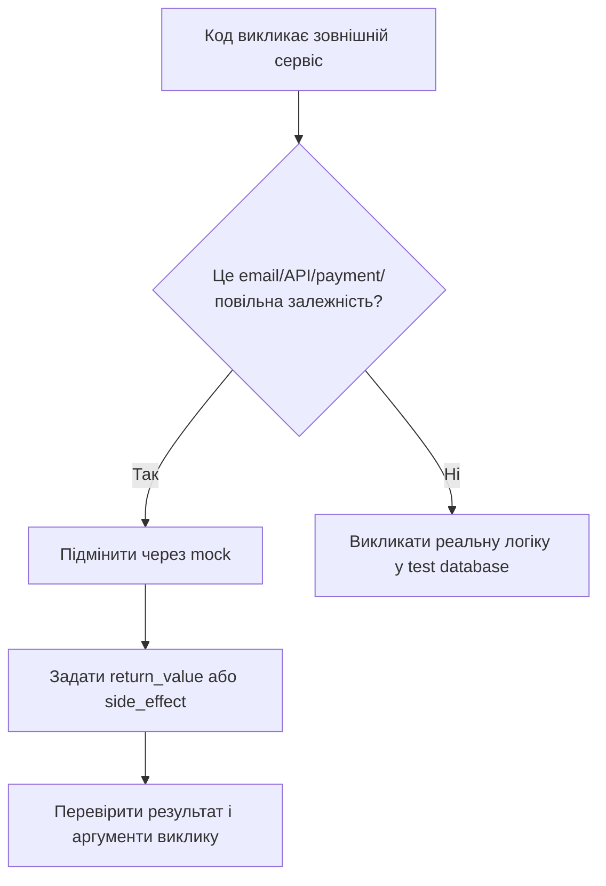

# Mock та patch: як підміняти email, API і payment у тестах

> Після цього файлу ти зрозумієш, що таке mock, коли він потрібен, як працює `patch`, чому важливо мокати правильний шлях і як не перетворити тести на фейкову виставу.

---

## 1. Навіщо це потрібно

У реальному Django-проєкті код часто взаємодіє із зовнішнім світом:

- надсилає email;
- викликає payment gateway;
- робить HTTP-запит до API;
- пише файл;
- бере поточний час;
- викликає повільний сервіс.

У тестах ми не хочемо:

- надсилати реальні листи;
- списувати реальні гроші;
- чекати повільну мережу;
- залежати від чужого сервера;
- ламати тест через нестабільний internet.

Mock дозволяє підмінити реальну залежність контрольованим об’єктом.

---

## 2. Ментальна модель

Mock — це дублер актора на репетиції.

У справжньому фільмі актор стрибає з даху. На репетиції це небезпечно, тому використовують дублера.

У тесті так само:

- реальний email-сервіс не викликаємо;
- payment gateway не чіпаємо;
- але перевіряємо, що наш код правильно звернувся до “дублера”.

---

## 3. Найпростіший приклад

`app/services.py`:

```python
def send_email(email):
    print(f"Sending email to {email}")


def register_user(email):
    # тут могла б бути логіка створення користувача
    send_email(email)
```

Тест:

```python
from unittest.mock import patch

from app.services import register_user


@patch("app.services.send_email")
def test_registration_sends_email(mock_send_email):
    register_user("student@example.com")

    mock_send_email.assert_called_once_with("student@example.com")
```

Що відбувається:

| Рядок | Пояснення |
|---|---|
| `@patch("app.services.send_email")` | Тимчасово підміняє `send_email` |
| `mock_send_email` | Фейкова функція замість реальної |
| `register_user(...)` | Запускаємо код, який має викликати email |
| `assert_called_once_with(...)` | Перевіряємо, що виклик був рівно один раз і з правильним аргументом |

---

## 4. Найважливіше правило: patch where used

Це місце, де початківці ламаються найчастіше.

Мокати треба не там, де функція оголошена, а там, де вона використовується.

Приклад:

`app/email.py`:

```python
def send_email(email):
    ...
```

`app/services.py`:

```python
from app.email import send_email


def register_user(email):
    send_email(email)
```

Тут `register_user` використовує ім’я `send_email` всередині `app.services`.

Правильний patch:

```python
@patch("app.services.send_email")
def test_registration_sends_email(mock_send_email):
    ...
```

Не такий:

```python
@patch("app.email.send_email")
def test_registration_sends_email(mock_send_email):
    ...
```

Чому? Бо `app.services` уже імпортував функцію у свій namespace. Тестований код дивиться на `app.services.send_email`.

---

## 5. Mock return value

Приклад payment gateway:

`shop/services.py`:

```python
class PaymentGateway:
    def charge(self, amount):
        # реальний запит до платіжної системи
        ...


def checkout(amount):
    gateway = PaymentGateway()
    success = gateway.charge(amount)

    if not success:
        return "payment_failed"

    return "paid"
```

Тест:

```python
from unittest.mock import patch

from shop.services import checkout


@patch("shop.services.PaymentGateway.charge")
def test_checkout_success(mock_charge):
    mock_charge.return_value = True

    result = checkout(50)

    assert result == "paid"
    mock_charge.assert_called_once_with(50)


@patch("shop.services.PaymentGateway.charge")
def test_checkout_payment_failed(mock_charge):
    mock_charge.return_value = False

    result = checkout(50)

    assert result == "payment_failed"
```

Тут ми не викликаємо реальний payment service. Ми перевіряємо, як наш код реагує на успіх і відмову.

---

## 6. Mock side effect: симуляція помилки

Іноді зовнішній сервіс падає.

```python
@patch("shop.services.PaymentGateway.charge")
def test_checkout_gateway_error(mock_charge):
    mock_charge.side_effect = TimeoutError("gateway timeout")

    with pytest.raises(TimeoutError):
        checkout(50)
```

Або якщо твій код має обробити помилку:

```python
def checkout(amount):
    gateway = PaymentGateway()

    try:
        success = gateway.charge(amount)
    except TimeoutError:
        return "payment_unavailable"

    if not success:
        return "payment_failed"

    return "paid"
```

Тест:

```python
@patch("shop.services.PaymentGateway.charge")
def test_checkout_handles_gateway_timeout(mock_charge):
    mock_charge.side_effect = TimeoutError("gateway timeout")

    result = checkout(50)

    assert result == "payment_unavailable"
```

---

## 7. Mock у Django email

Django має тестовий email backend, але іноді ти хочеш перевірити виклик свого сервісу.

`notes/services.py`:

```python
from django.core.mail import send_mail


def send_note_created_email(email, title):
    send_mail(
        subject="Note created",
        message=f"Your note '{title}' was created.",
        from_email="noreply@example.com",
        recipient_list=[email],
    )
```

Тест:

```python
from unittest.mock import patch

from notes.services import send_note_created_email


@patch("notes.services.send_mail")
def test_send_note_created_email_calls_django_send_mail(mock_send_mail):
    send_note_created_email("student@example.com", "My note")

    mock_send_mail.assert_called_once_with(
        subject="Note created",
        message="Your note 'My note' was created.",
        from_email="noreply@example.com",
        recipient_list=["student@example.com"],
    )
```

---

## 8. Коли mock корисний, а коли шкідливий

| Ситуація | Mock? | Чому |
|---|---|---|
| Email | Так | Не хочемо реальні листи |
| Payment gateway | Так | Не хочемо реальні платежі |
| Weather API | Так | Не залежимо від мережі |
| `Note.objects.create()` | Ні | Це краще перевірити через test database |
| Form validation | Зазвичай ні | Це твоя реальна логіка |
| Маленька pure function | Ні | Її дешевше викликати реально |

Правило:

> Мокай зовнішні межі системи, а не всю систему.

Поганий тест:

```python
@patch("notes.views.NoteForm")
@patch("notes.views.Note")
@patch("notes.views.send_email")
def test_note_create(mock_email, mock_note, mock_form):
    ...
```

Тут замокано майже все. Такий тест може пройти, навіть якщо реальна форма, модель і view не працюють разом.

Краще:

- form і model перевірити реально через test database;
- email замокати.

---

## 9. Mermaid-схема



---

## 10. Типові помилки початківців

| Помилка | Чому виникає | Як виправити |
| ------- | ------------ | ------------ |
| Мокають не той шлях | Не зрозуміли namespace імпорту | Patch where used |
| Мокають усе підряд | Хочуть “ізолювати” | Мокай тільки зовнішні межі |
| Не перевіряють аргументи | Дивляться лише `called` | Використовуй `assert_called_once_with` |
| Mock робить тест зеленим, але безсенсовним | Замінена вся логіка | Залиш реальні model/form/view там, де можна |
| Не тестують помилки API | Перевірили тільки success | Додай `side_effect` |

---

## 11. Практика

1. Створи `notifications.py` з функцією `send_welcome_email(email)`.
2. Створи `services.py` з функцією `register_user(email)`, яка викликає `send_welcome_email`.
3. Напиши тест, який мокає email.
4. Спеціально замокай неправильний шлях і подивись, що станеться.
5. Напиши payment-приклад:
   - success;
   - failed;
   - timeout.

---

## 12. Питання для самоперевірки

1. Що таке mock?
2. Чому не можна викликати реальний payment gateway у тесті?
3. Що означає “patch where used”?
4. Чим `return_value` відрізняється від `side_effect`?
5. Чому mock не треба використовувати для всього?
