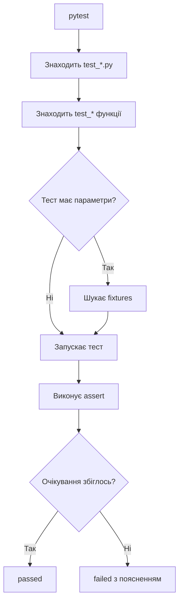

# pytest: короткі тести, fixtures і pytest-django

> Після цього файлу ти зможеш писати тести через `pytest`, запускати їх, використовувати fixtures, parametrization і підключати pytest до Django-проєкту.

---

## 1. Навіщо це потрібно

`pytest` часто вибирають, бо він дозволяє писати тести простіше:

```python
def test_add_two_numbers():
    assert add(2, 3) == 5
```

Без класу, без `self.assertEqual`, без зайвого шаблону.

Але простіший синтаксис не означає “менше думати”. Хороший pytest-тест так само має чітке очікування, зрозумілу назву і нормальні тестові дані.

Встановлення:

```bash
pip install pytest
```

Запуск:

```bash
pytest
```

---

## 2. Ментальна модель

`pytest` — це test runner, який дуже добре вміє знаходити тести і підкладати їм потрібні дані.

Уяви, що тест каже:

```python
def test_user_has_email(user_data):
    ...
```

`pytest` бачить параметр `user_data` і питає:

> “У мене є fixture з такою назвою?”

Якщо є — запускає fixture і передає результат у тест.

---

## 3. Перший приклад з нуля

Структура:

```text
testing_playground/
├── math_utils.py
└── test_math_utils.py
```

`math_utils.py`:

```python
def add(a, b):
    return a + b


def is_even(number):
    return number % 2 == 0
```

`test_math_utils.py`:

```python
from math_utils import add, is_even


def test_add_two_numbers():
    result = add(2, 3)

    assert result == 5


def test_four_is_even():
    assert is_even(4)


def test_five_is_not_even():
    assert not is_even(5)
```

Запуск:

```bash
pytest
```

Результат:

```text
3 passed in 0.03s
```

---

## 4. Як pytest знаходить тести

Типові правила:

| Що | Правило | Приклад |
|---|---|---|
| Файл | `test_*.py` або `*_test.py` | `test_math_utils.py` |
| Функція | `test_*` | `test_add_two_numbers` |
| Клас | `Test*` без `__init__` | `class TestCart:` |

pytest також може запускати unittest-тести, але для навчання краще не змішувати стилі в одному файлі без потреби.

---

## 5. Простий `assert`

У pytest використовують звичайний Python `assert`.

```python
def test_add_two_numbers():
    assert add(2, 3) == 5
```

Якщо тест падає, pytest показує деталі.

Приклад:

```text
E       assert -1 == 5
```

Це зручно: видно реальний результат і очікуване значення.

Порівняння:

| unittest | pytest |
|---|---|
| `self.assertEqual(result, 5)` | `assert result == 5` |
| `self.assertTrue(user.is_active)` | `assert user.is_active` |
| `self.assertFalse(form.is_valid())` | `assert not form.is_valid()` |
| `self.assertIn("title", errors)` | `assert "title" in errors` |

---

## 6. Fixtures: тестові дані без дублювання

Проблема:

```python
def test_user_has_email():
    user = {"username": "student", "email": "student@example.com"}

    assert user["email"] == "student@example.com"


def test_user_has_username():
    user = {"username": "student", "email": "student@example.com"}

    assert user["username"] == "student"
```

Дані дублюються.

Рішення:

```python
import pytest


@pytest.fixture
def user_data():
    return {
        "username": "student",
        "email": "student@example.com",
    }


def test_user_has_email(user_data):
    assert user_data["email"] == "student@example.com"


def test_user_has_username(user_data):
    assert user_data["username"] == "student"
```

Що відбувається:

1. pytest бачить параметр `user_data`;
2. шукає fixture з назвою `user_data`;
3. запускає fixture;
4. передає результат у тест.

---

## 7. `conftest.py`: спільні fixtures

Якщо fixture потрібна багатьом файлам, її часто кладуть у `conftest.py`.

```text
tests/
├── conftest.py
├── test_users.py
└── test_notes.py
```

`conftest.py`:

```python
import pytest


@pytest.fixture
def note_data():
    return {
        "title": "Test note",
        "content": "Hello",
    }
```

`test_notes.py`:

```python
def test_note_has_title(note_data):
    assert note_data["title"] == "Test note"
```

Не треба імпортувати `note_data`. pytest сам знайде fixture.

---

## 8. Parametrization: багато сценаріїв без копіпасти

Погано:

```python
def test_empty_title_is_invalid():
    ...


def test_empty_content_is_invalid():
    ...


def test_long_title_is_invalid():
    ...
```

Краще:

```python
import pytest


@pytest.mark.parametrize(
    "title, content",
    [
        ("", "Text"),
        ("Valid title", ""),
        ("x" * 256, "Text"),
    ],
)
def test_note_form_invalid_data(title, content):
    form = NoteForm(data={"title": title, "content": content})

    assert not form.is_valid()
```

pytest запустить цей тест тричі з різними даними.

Коли parametrization корисна:

| Ситуація | Приклад |
|---|---|
| Кілька invalid inputs | `""`, `None`, дуже довгий рядок |
| Кілька очікуваних результатів | slug generation |
| Перевірка edge cases | `0`, `-1`, max value |

---

## 9. pytest-django

Для Django потрібен plugin:

```bash
pip install pytest-django
```

Зазвичай додають файл `pytest.ini`:

```ini
[pytest]
DJANGO_SETTINGS_MODULE = notes_project.settings
python_files = tests.py test_*.py *_tests.py
```

Тест з базою:

```python
import pytest

from notes.models import Note


@pytest.mark.django_db
def test_note_str_returns_title():
    note = Note.objects.create(title="Pytest note", content="Hello")

    assert str(note) == "Pytest note"
```

Без `@pytest.mark.django_db` pytest не дозволить звертатися до бази. Це не примха. Це захист: тест має явно сказати, що йому потрібна база.

---

## 10. pytest чи unittest

| Питання | unittest | pytest |
|---|---|---|
| Чи треба встановлювати | Ні | Так |
| Стиль | Класи й methods | Функції, fixtures |
| Assertions | `self.assertEqual` | `assert` |
| Django за замовчуванням | Так | Через `pytest-django` |
| Зручно для | Django built-in style | Швидких тестів, fixtures, parametrization |

Висновок:

- якщо курс або команда використовує Django default — вчи `unittest`/`TestCase`;
- якщо хочеш коротший синтаксис і гнучкі fixtures — вчи `pytest`;
- у реальних проєктах можна зустріти обидва стилі.

---

## 11. Mermaid-схема



---

## 12. Типові помилки початківців

| Помилка | Чому виникає | Як виправити |
| ------- | ------------ | ------------ |
| Fixture називається не так, як параметр | pytest шукає fixture за назвою | Узгодь назви |
| Забули `@pytest.mark.django_db` | Тест лізе в БД без дозволу | Додай marker |
| Parametrized test став нечитабельним | Забагато даних в одному місці | Розбий або дай зрозумілі ids |
| Fixture робить усе одразу | Хочеться мати “готовий світ” | Роби маленькі fixtures |
| Змішали unittest і pytest без потреби | Копіювали з різних джерел | Обери стиль для одного файлу |

---

## 13. Практика

1. Створи `math_utils.py` з функцією `is_even(number)`.
2. Напиши pytest-тести для `2`, `3`, `0`, `-4`.
3. Перепиши ці тести через `@pytest.mark.parametrize`.
4. Створи fixture `note_data`.
5. Якщо маєш Django-проєкт, встанови `pytest-django` і напиши тест для `Note.__str__`.

Приклад parametrization:

```python
@pytest.mark.parametrize(
    "number, expected",
    [
        (2, True),
        (3, False),
        (0, True),
        (-4, True),
    ],
)
def test_is_even(number, expected):
    assert is_even(number) is expected
```

---

## 14. Питання для самоперевірки

1. Чим pytest відрізняється від unittest у стилі написання?
2. Як pytest знаходить fixtures?
3. Для чого потрібен `conftest.py`?
4. Коли parametrization краща за кілька окремих тестів?
5. Навіщо потрібен `@pytest.mark.django_db`?
