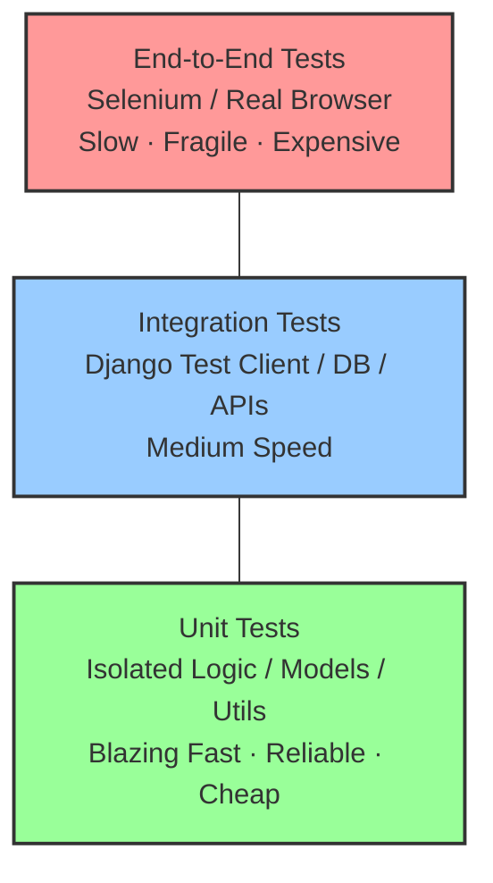
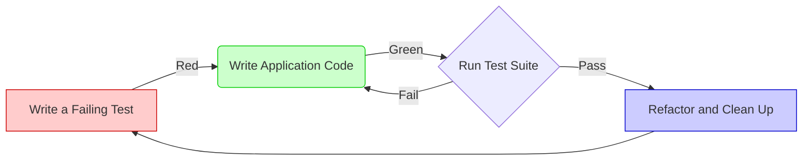
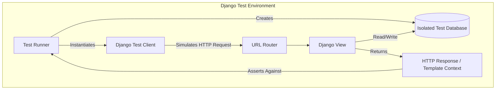
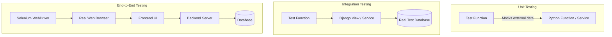
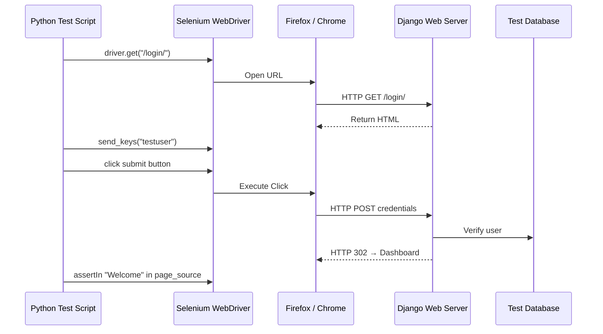
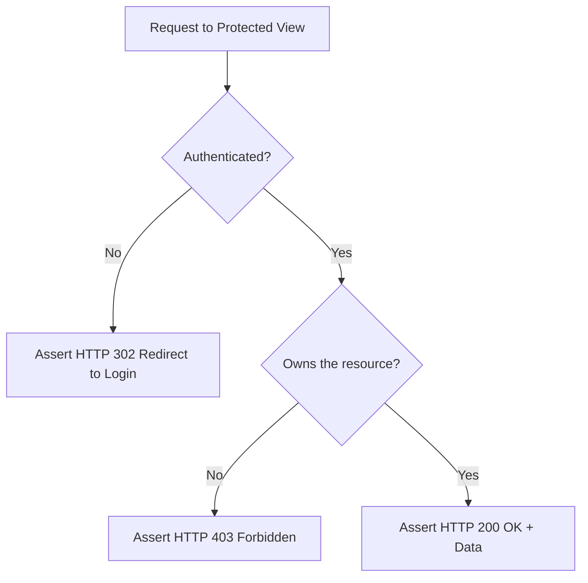
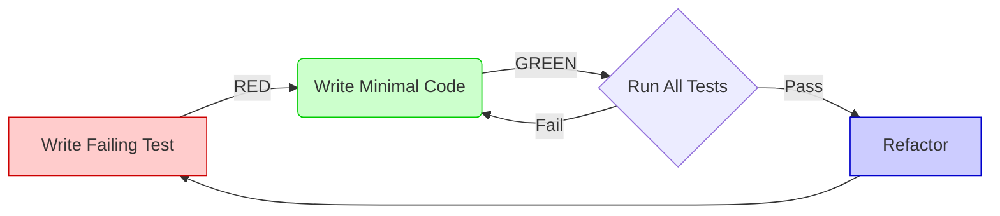

# Основи тестування: повний навчальний посібник

> Цей файл — самодостатній довідник по філософії, інструментах і практиці тестування.
> Від першого `assert` до Selenium → усе тут.
>
> Охоплює: навіщо тести існують, ментальні моделі, `unittest`, `pytest`, Django `TestCase`, Selenium, TDD, хибні уявлення, налагодження, архітектурні діаграми.

---

## Зміст

**Філософія і мислення**
- [1. Навіщо тестування існує](#1-навіщо-тестування-існує)
- [2. Страх змін і технічний борг](#2-страх-змін-і-технічний-борг)
- [3. Основна філософія: впевненість, а не доведення](#3-основна-філософія-впевненість-а-не-доведення)
- [4. Ментальні моделі](#4-ментальні-моделі)
- [5. Що таке інваріант](#5-що-таке-інваріант)

**Структура і методологія**
- [6. AAA паттерн і наукове мислення](#6-aaa-паттерн-і-наукове-мислення)
- [7. Типи тестів](#7-типи-тестів)
- [8. Піраміда тестування](#8-піраміда-тестування)
- [9. Природа багів](#9-природа-багів)

**Інструменти**
- [10. unittest.TestCase — базовий фреймворк Python](#10-unittesttestcase)
- [11. pytest — сучасний підхід](#11-pytest)
- [12. Django TestCase — тестування з БД](#12-django-testcase)
- [13. Selenium — тестування через браузер](#13-selenium)

**Глибоке розуміння**
- [14. Хибні уявлення про тестування](#14-хибні-уявлення-про-тестування)
- [15. Налагодження провалених тестів](#15-налагодження-провалених-тестів)
- [16. Тестування і архітектура](#16-тестування-і-архітектура)
- [17. Психологія розробника](#17-психологія-розробника)
- [18. Реальний контекст: ризик і вартість](#18-реальний-контекст-ризик-і-вартість)
- [19. Ручна перевірка vs автоматичний тест](#19-ручна-перевірка-vs-автоматичний-тест)

**Практика**
- [20. Типові помилки початківців](#20-типові-помилки-початківців)
- [21. Архітектурні діаграми](#21-архітектурні-діаграми)
- [22. Базовий приклад для практики](#22-базовий-приклад-для-практики)
- [23. Питання для глибокого роздуму](#23-питання-для-глибокого-роздуму)

---

## 1. Навіщо тестування існує

### Проблема, яку вирішує тестування

Помилки в коді — неминуча реальність. Не тому що програмісти погані. А тому що люди природньо роблять помилки, а в програмних системах кількість взаємодій між компонентами зростає швидше, ніж людина здатна це усвідомити.

Коли функція одна — легко перевірити в голові. Коли функцій тисячі і вони пов'язані між собою — ні.

Кожного разу, коли ти змінюєш код, додаєш фічер або виправляєш баг — ти ризикуєш зламати щось інше. Навіть якщо не збираєшся. Навіть якщо уважно читаєш код.

**Що тестування вирішує?** Систематичний, повторюваний механізм перевірки того, що система поводиться правильно — незалежно від того, що ти змінив.

### Чотири причини писати тести

**1. Запобігання регресіям**

Регресія — це коли новий фічер або виправлення бага ламає вже існуючу функціональність. Тести залишають "слід" перевіреної поведінки. Якщо регресія виникла — тест одразу покаже де.

**2. Зниження страху змін**

Зміни ламають речі. Без тестів розробники природньо бояться чіпати legacy код. Повноцінний test suite дозволяє рефакторити і оптимізувати без страху — якщо щось зламалось, тести скажуть.

**3. Жива документація**

Тести — це виконувана документація. Вони не застарівають як написаний текст. Назва тесту `test_create_notebook_default_unsets_previous_default` пояснює бізнес-правило краще за будь-який коментар.

**4. Покращення дизайну**

Написання тестів, особливо до реалізації (TDD), змушує думати про інтерфейс і писати більш модульний, слабо зв'язаний код.

### Приземлений приклад

```python
def calculate_total(price, quantity):
    return price * quantity
```

Руками можна перевірити: `print(calculate_total(10, 2))` → побачив `20` — "виглядає добре".

Але потрібно перевірити ще: `quantity=0`, від'ємне значення, округлення, знижку, великі числа.
І щоразу запускати `print()` незручно. Плюс `print()` не скаже автоматично що результат неправильний.

Тест робить це за тебе — автоматично, при кожному `git push`:

```python
def test_calculate_total_two_items():
    assert calculate_total(10, 2) == 20

def test_calculate_total_zero_quantity():
    assert calculate_total(10, 0) == 0

def test_calculate_total_rejects_negative_quantity():
    with pytest.raises(ValueError):
        calculate_total(10, -1)
```

---

## 2. Страх змін і технічний борг

> **Це, мабуть, найважливіший розділ.** Саме тут пояснюється чому без тестів великі проєкти повільно помирають.

### Чому розробники бояться змін

У системі без тестів кожна зміна — це стрибок у невідоме:

```
Ти міняєш функцію розрахунку знижки...
  → Раптом ламається API замовлень?
  → Може вплинути на виставлення рахунків?
  → А що з мобільним застосунком?
  → А якщо юзери є в системі зі старими даними?
```

Ніхто не знає. Тому ніхто не міняє. Або міняють дуже обережно, дуже повільно.

### Технічний борг із страху

Коли не вистачає впевненості, розробники:

- **відмовляються рефакторити** — "воно якось працює, краще не чіпати"
- **копіюють код** замість виносити у спільну функцію — "виніс → зламав щось ще"
- **обходять старий код** замість виправляти — "напишу нову функцію поряд"
- **відтягують деплой** — "після вихідних перевіримо ще раз вручну"

З часом кодова база стає лабіринтом із застережливими нотатками: `# НЕ ЧІПАТИ`, `# МАГІЯ НЕ РОЗУМІЮ ЯК ПРАЦЮЄ`, `# TODO вже три роки`.

Це **архітектурна деградація** — не через погані наміри, а через відсутність safety net.

### Що змінюють тести

```
БЕЗ ТЕСТІВ                              З ТЕСТАМИ
─────────────────────────────────────── ───────────────────────────────────────
"Не чіпай це, воно якось працює"        "Рефактор вільно, тести покажуть якщо зламалось"
Деплой раз на місяць (страшно)          Деплой кілька разів на день (впевнено)
Баг знаходять через тиждень клієнти     Баг знаходить тест за 30 секунд
Рефакторинг — ризикована операція       Рефакторинг — звичайна робота
1 рік: "треба все переписати"           1 рік: "спокійно розвиваємось"
```

---

## 3. Основна філософія: впевненість, а не доведення

> **"Тестування — це процес накопичення впевненості, а не доведення досконалості."**

### Чому неможливо довести відсутність багів

Це математично доведено. У будь-якій нетривіальній програмі кількість можливих шляхів виконання наближається до нескінченності.

**Edsger W. Dijkstra** сформулював це лаконічно:

> *"Testing can demonstrate the presence of bugs, but never their absence."*
> ("Тестування може довести наявність багів, але ніколи — їхню відсутність.")

Уяви просту функцію з одним `if`:

```python
def process(x):
    if x > 0:
        return x * 2
    return -x
```

Вхідних значень типу `int` — 2³² штук. Тестуємо п'ять з них. Решта 4 мільярди — не перевірені.

У реальних системах таких умов тисячі. Стану бази даних — незліченна кількість комбінацій.

### Що тоді дають тести?

```
Тест пройшов → ми не змогли довести що код зламаний в цьому сценарії → впевненість зросла
Тест впав    → ми довели що є баг в цьому сценарії → виправляємо
```

Тести збирають **емпіричні докази** того, що система правильно обробляє конкретні, передбачені сценарії. Кожен додатковий тест зменшує невизначеність.

---

## 4. Ментальні моделі

### Страхова сітка

```
        [Розробник]
            | міняє код на висоті
            |
    ════════════════════════  ← test suite
            |
         (земля)
```

З тестами можна виконувати складні операції: великий рефакторинг, заміну бібліотеки, зміну схеми БД — впевнено.

### Науковий експеримент

| Наука | Тестування |
|-------|-----------|
| Гіпотеза | "Функція має повернути 20" |
| Установка умов | `price = 10, quantity = 2` |
| Проведення | `result = calculate_total(price, quantity)` |
| Спостереження | `result = 20` |
| Висновок | Гіпотеза підтверджена / спростована |

### Жива документація

Звичайна документація застарівала. Тест — це документація, яку неможливо проігнорувати: якщо поведінка змінилась але тест не оновили — він впаде.

```python
def test_create_notebook_default_unsets_previous_default(self):
    # Ця назва = живий документ бізнес-правила:
    # "у кожного юзера може бути тільки один default записник"
```

### Контракт між компонентами

Тест фіксує договір між частинами системи:

```python
def test_create_note_returns_note_with_correct_user(self):
    note = services.create_note(user=alice, title='Test')
    self.assertEqual(note.user, alice)

def test_create_note_saves_to_database(self):
    services.create_note(user=alice, title='Test')
    self.assertEqual(Note.objects.count(), 1)
```

Якщо хтось змінить `services.create_note()` порушивши контракт — тест одразу покаже.

### Система запобігання регресіям

```
Баг знайдений → Написати тест що відтворює баг (він падає)
             → Виправити баг (тест стає зеленим)
             → Тест залишається назавжди у suite
             → Через рік: рефакторинг → той самий баг → тест падає → виправляють одразу
```

---

## 5. Що таке інваріант

**Інваріант** — це властивість системи, яка має залишатись правдивою незалежно від того, як змінюється внутрішній стан.

| Інваріант | Де порушується без тесту |
|-----------|--------------------------|
| 1 `is_default` записник на юзера | `create_notebook(is_default=True)` без скидання старого |
| Юзер бачить тільки свої нотатки | Помилковий ORM-фільтр |
| `quantity` не може бути від'ємним | Видалення `CheckConstraint` |
| Мітки тегів унікальні в межах юзера | Видалення `unique_together` |
| Видалення групи не видаляє нотатки | Зміна `on_delete=SET_NULL` на `CASCADE` |

```python
# Тест інваріанту (а не реалізації):
def test_only_one_default_notebook_per_user(self):
    services.create_notebook(user=alice, title='Old', is_default=True)
    services.create_notebook(user=alice, title='New', is_default=True)
    defaults = Notebook.objects.filter(user=alice, is_default=True)
    self.assertEqual(defaults.count(), 1)  # ← правило, а не спосіб виконання
```

---

## 6. AAA паттерн і наукове мислення

Кожен тест = три чітких кроки. Це стандарт у всіх мовах і фреймворках.

```text
Arrange → Act → Assert
```

| Крок | Що означає | Запитай себе |
|------|-----------|-------------|
| **Arrange** | Підготувати стан системи | "Що потрібно для цього тесту?" |
| **Act** | Виконати те, що тестуємо | "Яка одна дія досліджується?" |
| **Assert** | Перевірити очікуваний результат | "Що має бути правдою після?" |

### Простий приклад

```python
def test_calculate_total_for_two_items():
    # Arrange
    price    = 10
    quantity = 2

    # Act
    result = calculate_total(price, quantity)

    # Assert
    assert result == 20
```

### Django приклад

```python
def test_note_list_page_returns_200(self):
    # Arrange: створюємо юзера, логінимось
    user = User.objects.create_user(username='student', password='pw')
    self.client.login(username='student', password='pw')

    # Act: виконуємо одну дію — GET запит
    response = self.client.get(reverse('note_list'))

    # Assert: перевіряємо результат
    self.assertEqual(response.status_code, 200)
```

### Сервісний приклад з двома Assert

```python
def test_create_note_assigns_tags(self):
    # Arrange
    tag1 = Tag.objects.create(user=self.alice, name='work')
    tag2 = Tag.objects.create(user=self.alice, name='python')

    # Act
    note = services.create_note(
        user=self.alice, title='Tagged', tag_ids=[tag1.id, tag2.id]
    )

    # Assert
    note_tags = list(note.tags.all())
    self.assertIn(tag1, note_tags)
    self.assertIn(tag2, note_tags)
```

---

## 7. Типи тестів

| Тип | Що перевіряє | Приклад | Коли писати |
|-----|------------|---------|-------------|
| **Unit** | Одну функцію / метод / клас ізольовано | `calculate_tax()` | Постійно під час розробки |
| **Integration** | Кілька компонентів разом | Form + Model + DB | Коли важлива взаємодія |
| **Functional** | Один фічер / бізнес-функцію | Юзер створює нотатку | Для бізнес-вимог |
| **E2E** | Увесь шлях через браузер | Selenium: login → create note | Для критичних user flows |
| **Regression** | Конкретний старий баг | "Порожній title не має зберігатись" | Після виправлення бага |
| **Smoke** | Чи живий застосунок після деплою | Головна сторінка → 200 | Перед деплоєм |
| **Acceptance** | Чи відповідає продукт бізнес-вимогам | Checkout flow | Погодження з product owner |

---

## 8. Піраміда тестування

```
              ╱╲
             ╱E2E╲          Selenium / Cypress
            ╱──────╲        Повільно, крихко, дорого
           ╱Integration╲    Django Client, API tests
          ╱──────────────╲  Середня складність і швидкість
         ╱     Unit        ╲ pytest, TestCase
        ╱────────────────────╲ Швидко, надійно, дешево

     ~70% Unit | ~20% Integration | ~10% E2E
```



### Чому не робити все через E2E?

```
E2E тест: 15 секунд на тест × 100 тестів = 25 хвилин запуску
Unit тест: 0.05 секунди × 100 тестів = 5 секунд запуску

E2E: якщо ламається — де саме? view? сервіс? шаблон? JS? CSS?
Unit: якщо ламається — точно знаємо де, бо тестуємо ізольовано
```

---

## 9. Природа багів

### Типи багів

| Тип | Як виглядає | Який тест допомагає |
|-----|------------|---------------------|
| **Logic error** | `+` замість `-`, `>=` замість `>` | Unit test з конкретними значеннями |
| **Boundary error** | Ламається на `0`, `""`, `None` | Parametrized tests |
| **Integration failure** | Окремо частини працюють, разом ні | Integration test |
| **Permission bug** | Юзер B бачить дані юзера A | Security test з двома юзерами |
| **Requirement bug** | Код правильно виконує неправильну вимогу | Тест від бізнес-вимог |
| **Heisenbug** | Зникає щойно починаєш дебагити | Детерміновані тести, atomic() |

### Когнітивні пастки

- **Confirmation bias** — бачиш що хочеш написати, а не що написано
- **Blind spot автора** — власні помилки важче побачити
- **Happy path testing** — тестуємо те що "має працювати", уникаємо неприємних сценаріїв

Тест позбавлений цих пасток. Він перевіряє рівно те що написано. Без втоми, без упередженості.

---

## 10. unittest.TestCase

Python має вбудований `unittest` — об'єктно-орієнтований фреймворк на базі Java JUnit.

### Структура

```python
import unittest


class TestMathOperations(unittest.TestCase):

    def setUp(self):
        """Виконується ПЕРЕД кожним тестом. Готуємо стан."""
        self.x = 10

    def test_divide_normal(self):
        """Happy path — нормальний випадок."""
        self.assertEqual(divide(self.x, 2), 5.0)

    def test_divide_edge_case(self):
        """Edge case — граничний випадок."""
        self.assertTrue(divide(self.x, self.x) == 1.0)

    def test_divide_by_zero(self):
        """Wrong input — очікуємо виняток."""
        with self.assertRaises(ValueError):
            divide(self.x, 0)

    def test_divide_not_equal(self):
        """assertFalse — переконуємось що результат НЕ рівний."""
        self.assertFalse(divide(self.x, 5) == 99.0)

    def tearDown(self):
        """Виконується ПІСЛЯ кожного тесту. Прибираємо стан."""
        self.x = None
```

### Головні правила

- **Test discovery**: фреймворк автоматично знаходить файли `test*.py`
- **Naming**: кожен тест-метод ПОВИНЕН починатись з `test_`
- **setUp / tearDown**: `setUp` запускається ДО кожного тесту, `tearDown` — ПІСЛЯ

### Таблиця assert методів

| Метод | Перевіряє | Приклад |
|-------|-----------|---------|
| `assertEqual(a, b)` | `a == b` | `assertEqual(result, 20)` |
| `assertNotEqual(a, b)` | `a != b` | `assertNotEqual(result, 0)` |
| `assertTrue(x)` | `bool(x) is True` | `assertTrue(note.is_active)` |
| `assertFalse(x)` | `bool(x) is False` | `assertFalse(note.is_pinned)` |
| `assertIsNone(x)` | `x is None` | `assertIsNone(note.group)` |
| `assertIsNotNone(x)` | `x is not None` | `assertIsNotNone(note.created_at)` |
| `assertIn(a, b)` | `a in b` | `assertIn(tag, note.tags.all())` |
| `assertNotIn(a, b)` | `a not in b` | `assertNotIn(bob_nb, queryset)` |
| `assertRaises(exc)` | виняток типу `exc` | `assertRaises(ValueError)` |
| `assertAlmostEqual(a, b)` | числа з плаваючою точкою | `assertAlmostEqual(1.1+2.2, 3.3)` |
| `assertIsInstance(obj, cls)` | `isinstance(obj, cls)` | `assertIsInstance(note, Note)` |
| `assertGreaterEqual(a, b)` | `a >= b` | `assertGreaterEqual(updated, old)` |

### setUpClass / tearDownClass

Якщо `setUp` дорогий — використовуй `setUpClass` (виконується один раз для всього класу):

```python
class TestExpensiveSetup(unittest.TestCase):

    @classmethod
    def setUpClass(cls):
        """Виконується ОДИН РАЗ для всього класу. Наприклад, connect до БД."""
        cls.db_connection = create_expensive_connection()

    @classmethod
    def tearDownClass(cls):
        """Виконується ОДИН РАЗ після всього класу."""
        cls.db_connection.close()

    def test_something(self):
        # cls.db_connection доступний через self.db_connection
        ...
```

### Повний приклад: `notes.py` + `test_notes.py`

```python
# notes.py
class ValidationError(Exception):
    pass

def create_note(title, content):
    if not title:
        raise ValidationError("Title cannot be empty")
    if len(content) > 500:
        raise ValidationError("Content exceeds maximum length of 500 characters")
    return {"title": title.upper(), "content": content, "status": "saved"}
```

```python
# test_notes.py
import unittest
from notes import create_note, ValidationError


class TestNoteCreation(unittest.TestCase):

    def test_create_note_success(self):
        # Arrange
        title   = "Meeting"
        content = "Discuss project timeline."
        # Act
        result = create_note(title, content)
        # Assert — перевіряємо статус і трансформацію title
        self.assertEqual(result["status"], "saved")
        self.assertEqual(result["title"], "MEETING")

    def test_create_note_empty_title(self):
        # Порожній title → ValidationError
        with self.assertRaises(ValidationError):
            create_note("", "Some content")

    def test_create_note_exceeds_length(self):
        # Контент > 500 символів → ValidationError
        long_content = "A" * 501
        with self.assertRaises(ValidationError):
            create_note("Long Note", long_content)
```

---

## 11. pytest

Хоча `unittest` вбудований в Python, більшість команд використовує `pytest`.

### Чому pytest?

| Особливість | unittest | pytest |
|-------------|----------|--------|
| Синтаксис | Клас + `self.assertEqual` | Проста функція + `assert` |
| Повідомлення про помилки | Базове | Детальне, кольорове diff |
| Фікстури | `setUp/tearDown` (жорстко) | `@pytest.fixture` (гнучко) |
| Параметризація | Вручну | `@pytest.mark.parametrize` |
| Плагіни | Обмежено | Величезна екосистема |

### Простий pytest тест

```python
# Не потрібен клас, не потрібен TestCase
def test_calculate_total():
    assert calculate_total(10, 2) == 20  # ← просто assert, не self.assertEqual
```

### @pytest.fixture — гнучка підготовка

Фікстури — це функції підготовки стану, що вводяться в тести через аргументи:

```python
import pytest

@pytest.fixture
def sample_user():
    """Повертає словник з даними юзера."""
    return {"id": 1, "name": "Alice", "email": "alice@example.com"}

@pytest.fixture
def empty_db():
    """yield-фікстура: підготовка + очищення в одній функції."""
    db = Database()
    db.connect()
    yield db          # ← тут виконується тест
    db.close()        # ← виконується після тесту (teardown)

def test_user_has_name(sample_user):           # ← pytest ін'єктує автоматично
    assert sample_user["name"] == "Alice"

def test_db_starts_empty(empty_db):
    assert empty_db.count() == 0
```

### scope='module' — одна фікстура на весь модуль

```python
@pytest.fixture(scope='module')
def db_connection():
    """Створюється ОДИН РАЗ для всього модуля — для дорогих ресурсів."""
    conn = create_connection()
    yield conn
    conn.close()
```

### @pytest.mark.parametrize

```python
@pytest.mark.parametrize("a, b, expected", [
    (10,  2,   20),
    (0,   5,    0),
    (3,   3,    9),
    (-1,  4,   -4),
])
def test_multiply(a, b, expected):
    assert calculate_total(a, b) == expected
# ↑ Автоматично генерує 4 окремих тести
```

---

## 12. Django TestCase

### Що відрізняє від звичайного TestCase

```python
import unittest
from django.test import TestCase

class PureUnitTest(unittest.TestCase):
    def test_math(self):
        assert 2 + 2 == 4   # ← без БД, швидко

class DjangoTest(TestCase):
    def test_with_db(self):
        user = User.objects.create_user('alice')   # ← потребує тестової БД
        self.assertEqual(user.username, 'alice')
```

### Lifecycle — що відбувається автоматично

```
┌─────────────────────────────────────────────────────────────────┐
│  Перед ВСІМА тестами класу:                                     │
│    → Створює тестову БД (test_<db_name> або SQLite in-memory)   │
│    → Застосовує всі міграції                                     │
│                                                                 │
│  Перед КОЖНИМ тестом:                                           │
│    → Відкриває транзакцію                                       │
│    → Викликає setUp()                                           │
│                                                                 │
│    ┌─── ТЕСТ ВИКОНУЄТЬСЯ ──────────────────────────────────┐   │
│    │  User.objects.create(...)  ← записи в тестовій БД     │   │
│    │  Note.objects.create(...)  ← ізольовано від реальної  │   │
│    └───────────────────────────────────────────────────────┘   │
│                                                                 │
│  Після КОЖНОГО тесту:                                          │
│    → ROLLBACK транзакції (всі записи зникають!)                │
│    → Викликає tearDown()                                        │
│                                                                 │
│  Після ВСІХ тестів:                                             │
│    → Видаляє тестову БД                                         │
└─────────────────────────────────────────────────────────────────┘
```

### Три рівні ізоляції

```
1. ІЗОЛЯЦІЯ ВІД РЕАЛЬНОЇ БД:
   db.sqlite3 (твоя) ≠ тестова БД (окрема, тимчасова)
   Тести не можуть зламати реальні дані.

2. ІЗОЛЯЦІЯ МІЖ ТЕСТАМИ:
   Кожен тест — своя транзакція → rollback.
   Тест A не бачить даних Тесту B.

3. ІЗОЛЯЦІЯ ВІД ЗОВНІШНІХ СИСТЕМ:
   EMAIL_BACKEND = console (не надсилається реально)
   Файли — не змінюються в production
```

### Тестування views через Django Test Client

```python
from django.test import TestCase, Client
from django.contrib.auth.models import User
from .models import Note


class NoteApplicationTests(TestCase):

    def setUp(self):
        self.client = Client()
        self.user1 = User.objects.create_user(username='alice', password='pass123')
        self.user2 = User.objects.create_user(username='bob',   password='pass123')
        self.note  = Note.objects.create(
            author=self.user1, title="Alice's Note", content="Secret"
        )

    def test_anonymous_user_redirected_to_login(self):
        """Незалогінений → redirect 302."""
        response = self.client.get('/notes/1/')
        self.assertEqual(response.status_code, 302)

    def test_user_can_access_own_notes(self):
        """Alice бачить свою нотатку."""
        self.client.login(username='alice', password='pass123')
        response = self.client.get('/notes/1/')
        self.assertEqual(response.status_code, 200)
        self.assertContains(response, "Alice's Note")

    def test_user_cannot_edit_another_users_note(self):
        """Bob не може редагувати нотатку Alice — 403 Forbidden."""
        self.client.login(username='bob', password='pass123')
        response = self.client.post('/notes/1/edit/', {'title': 'Hacked'})
        self.assertEqual(response.status_code, 403)

    def test_form_rejects_empty_title(self):
        """Порожній title → валідаційна помилка у формі."""
        self.client.login(username='alice', password='pass123')
        response = self.client.post('/notes/new/', {'title': '', 'content': 'Body'})
        self.assertFormError(response, 'form', 'title', 'This field is required.')
```

### BaseTestCase — уникаємо дублювання

```python
class BaseServiceTest(TestCase):
    """Спільний setUp для всіх класів у test_services.py."""
    def setUp(self):
        self.alice = User.objects.create_user('alice', password='pass123')
        self.bob   = User.objects.create_user('bob',   password='pass123')


class NoteServiceTest(BaseServiceTest):
    # setUp() inherited — self.alice і self.bob доступні автоматично

    def test_create_note_sets_correct_user(self):
        note = services.create_note(user=self.alice, title='Test')
        self.assertEqual(note.user, self.alice)
```

---

## 13. Selenium

### Що таке Selenium?

Selenium — фреймворк для керування реальним браузером через Python. Замість HTTP-запиту (як Django Test Client), Selenium:

1. Відкриває Firefox / Chrome
2. Переходить на URL
3. Знаходить HTML елементи
4. Клікає, вводить текст, натискає Enter
5. Перевіряє що в DOM з'явились правильні дані

### Ключові концепції

```python
from selenium import webdriver
from selenium.webdriver.common.by import By
from selenium.webdriver.common.keys import Keys

driver = webdriver.Firefox()
driver.implicitly_wait(5)   # чекати до 5 сек на появу елементів

driver.get("http://localhost:8000/login")

# Пошук елементів
username_input = driver.find_element(By.NAME, "username")
password_input = driver.find_element(By.NAME, "password")
submit_button  = driver.find_element(By.ID, "login-btn")

# Взаємодія
username_input.send_keys("testuser")
password_input.send_keys("secret123")
submit_button.click()

# Перевірка
assert "Welcome" in driver.page_source

driver.quit()
```

### Повний тест: вхід + створення нотатки

```python
import unittest
from selenium import webdriver
from selenium.webdriver.common.by import By
from selenium.webdriver.common.keys import Keys


class TestNoteApplicationFlow(unittest.TestCase):

    def setUp(self):
        self.driver = webdriver.Firefox()
        self.driver.implicitly_wait(5)

    def test_login_and_create_note(self):
        driver = self.driver

        # 1. Відкрити сторінку входу
        driver.get("http://localhost:8000/login")

        # 2. Заповнити форму
        driver.find_element(By.NAME, "username").send_keys("testuser")
        driver.find_element(By.NAME, "password").send_keys("secret123")
        driver.find_element(By.ID,   "login-btn").click()

        # 3. Перейти до форми нотатки
        driver.get("http://localhost:8000/notes/new")
        title_input = driver.find_element(By.NAME, "title")
        title_input.send_keys("My First Note")
        title_input.send_keys(Keys.RETURN)

        # 4. Перевірити результат
        self.assertIn("My First Note", driver.page_source)

    def tearDown(self):
        self.driver.quit()
```

### Selenium vs Django Test Client

| Критерій | Django Test Client | Selenium |
|----------|-------------------|---------|
| **Що тестує** | Backend: views, permissions, API | Frontend: DOM, UI, кліки |
| **Швидкість** | Мілісекунди | Секунди (чекає рендер) |
| **Крихкість** | Стабільний | Ламається від CSS-змін |
| **Близькість до юзера** | Далеко | Точно як реальний юзер |
| **Коли використовувати** | Постійно | Тільки критичні flows |

---

## 14. Хибні уявлення про тестування

### "Тести доводять що програма без багів"

**Хибно.** Тести доводять що конкретні описані сценарії поводяться правильно. Всі інші сценарії залишаються неперевіреними.

### "Тестування тільки для великих проєктів"

**Хибно.** Навіть 50-рядковий скрипт може зламатись коли оновиться залежність або прийдуть несподівані дані. Якщо код важливий — він вартий тесту.

### "Selenium замінює unit тести"

**Хибно.** Selenium тестує весь стек. Якщо тест впав — де саме? view? сервіс? JS? CSS? Невідомо.
Unit тест показує точне місце. Крім того, 100 Selenium тестів = 25 хвилин. 100 unit тестів = 5 секунд.

### "Більше тестів = краща якість"

**Хибно.** Тести — це код. Код потребує підтримки. Тест що:
- перевіряє тривіальну поведінку Django ORM
- тестує implementation details замість поведінки
- написаний некоректно (завжди зелений)

— підвищує вартість підтримки, не якість.

### "Тестування уповільнює розробку"

**Хибно у довгостроковій перспективі:**

```
1-й місяць без тестів: +20% швидкість
3-й місяць: перші регресії, страх змін
6-й місяць: деплой раз на тиждень, більшість часу — дебаг
12-й місяць: "треба переписати"

1-й місяць з тестами: трохи повільніше
3-й місяць: рефакторинг вільний
12-й місяць: деплой щодня, довіра висока
```

### "Тестування — відповідальність QA"

**Хибно.** Якість не можна "прикрутити зовні". Якщо розробник пише код без тестів → архітектура природньо стає нетестованою. Правильно: розробник пише unit/integration тести, QA — acceptance і E2E.

### "Один великий тест кращий за багато маленьких"

**Хибно.** Якщо перший з 20 assert-ів впав — тест зупинився. Ти не знаєш про решту 19. Маленькі тести = точна діагностика.

---

## 15. Налагодження провалених тестів

> Провалений тест — не покарання. Це система, що захищає тебе від регресії.

### Читання повідомлень pytest

pytest переписує `assert` і показує детальний diff:

```
FAILED test_services.py::test_create_note_assigns_tags
AssertionError: assert <Tag: #work> in []
E       assert <Tag: #work> in []
E         where [] = <built-in method all of ManyRelatedManager object at 0x...>()

→ Тест каже: очікував що tag є у note.tags.all(), але список порожній
→ Шукаємо в services.create_note() чому теги не прикріпились
```

### Ізоляція провального тесту

```bash
# Не запускай всі 500 тестів кожного разу:
pytest tests/test_services.py::NoteServiceTest::test_create_note_assigns_tags

# Зупинитись після першого провалу:
pytest --failfast

# Verbose — бачити кожен тест:
pytest -v
```

### TDD для виправлення багів

```
1. Юзер повідомив про баг в production
2. НЕ чіпаємо application код одразу
3. Пишемо тест що відтворює баг → він падає (RED)
4. Виправляємо код → тест стає зеленим (GREEN)
5. Тест залишається у suite — баг ніколи не повернеться
```

### Коли потрібно виправляти тест, а не код

Запитай себе: "Чи application logic зламалась, або бізнес-вимоги змінились?"

- Зламалась логіка → виправляємо код
- Вимоги змінились → виправляємо тест (він застарів)

**Ніколи не видаляй тест просто щоб він не падав.** Тест впав — це інформація, не незручність.

---

## 16. Тестування і архітектура

### Тестованість як сигнал дизайну

Якщо код важко тестувати — це симптом поганої архітектури:

```python
# Важко тестувати (приховані залежності):
def send_welcome_email():
    user = User.objects.get(id=settings.CURRENT_USER_ID)  # ← глобальний стан
    smtp.send(user.email, "Welcome!")                       # ← side effect

# Легко тестувати (залежності явні):
def send_welcome_email(user, email_backend):
    email_backend.send(user.email, "Welcome!")
    # ← у тесті: email_backend = MockEmailBackend()
```

Якщо тест потребує 10+ mock-ів — це сигнал що функція має забагато відповідальності.

### TDD — дизайн через тести

```
[Написати failing test] → RED
        ↓
[Написати мінімальний код що проходить] → GREEN
        ↓
[Рефакторити не змінюючи поведінки] → REFACTOR
        ↓
[Написати наступний failing test] → RED
```



### Layered архітектура (CrispyNotes)

```
domain / services  ← чиста логіка, без I/O → unit тести прямо
    ↑
infrastructure     ← БД, email, API → integration тести або mock
    ↑
api / views        ← HTTP → integration тести через self.client
```

---

## 17. Психологія розробника

### Overconfidence bias

Після написання складного алгоритму хочеться бачити що він працює — і тестуємо happy path. Тест написаний з наміром **спробувати зламати** код — протилежна позиція. Саме вона знаходить реальні баги.

### Колективна пам'ять команди

```python
def test_create_note_ignores_other_users_tags(self):
    """
    Mass Assignment вразливість: зловмисник надсилає tag_id чужого юзера.
    Фільтруємо за user перед set() щоб заблокувати.
    """
```

Новий розробник читає назву → розуміє security правило → не ламає захист при рефакторингу.

---

## 18. Реальний контекст: ризик і вартість

| Тип системи | Ризик від бага | Фокус тестування |
|-------------|----------------|------------------|
| Прототип, MVP | Низький | Мінімальний або без |
| Веб-застосунок SaaS | Середній | Unit + integration тести |
| Note app з багатьма юзерами | **Authorization** | Security тести з alice + bob |
| Фінансова система | Високий — гроші юзерів | Вичерпне тестування + аудит |
| Медичне / Aerospace | Критичний — життя людей | Формальна верифікація |

**Закон спадної цінності:**

```
1-й тест ~~~~~~~~~~~~~~~~  ← максимальна цінність: ловить найбільші ризики
10-й тест ~~~~~~~~~~~~~~
100-й тест ~~~          ← менша цінність: рідкісні edge cases
1000-й тест ~           ← маргінальна: витрати > вигода
```

---

## 19. Ручна перевірка vs автоматичний тест

| Критерій | Ручна перевірка | Автоматичний тест |
|----------|----------------|-------------------|
| Перший запуск | Миттєво (немає що писати) | Треба написати код |
| Повторюваність | Повільно, можна забути крок | Миттєво, ідентично |
| Регресії | Легко пропустити | Добре ловить |
| Edge cases | Обмежено часом | Вичерпно |
| UX дослідження | Незамінна | Не підходить |

**Правило:** Ручна перевірка незамінна для нової поведінки і UX. Але якщо ти перевіряєш одне й те саме більше двох разів вручну — час написати тест.

---

## 20. Типові помилки початківців

| Помилка | Як виправити |
|---------|-------------|
| Тест без чіткого очікування | Сформулюй: "має повернути X при умові Y" |
| Один величезний тест | Розбий: кожен тест — одна поведінка |
| Тестування implementation details | Перевіряй поведінку і інваріанти, не внутрішні деталі |
| Тільки happy path | Спеціально шукай boundary + edge + error cases |
| Тест що "завжди зелений" | Переконайся що тест ПАДАЄ коли код неправильний |
| Мокати все підряд | Mock = ехо-камера. Мокай тільки зовнішні I/O, не власну логіку |
| Тестувати Django internals | Не тестуй `.save()` в БД — Django вже це зробив |
| Неправильна назва | `test_1` → `test_delete_group_sets_note_group_to_null` |

### Особливо: тест що "завжди зелений"

```python
# НЕБЕЗПЕЧНО — завжди проходить, нічого не гарантує:
def test_create_note(self):
    try:
        note = services.create_note(user=self.user, title='Test')
    except Exception:
        pass   # ← ігноруємо помилки!

# ПРАВИЛЬНО:
def test_create_note(self):
    note = services.create_note(user=self.user, title='Test')
    self.assertIsNotNone(note)
    self.assertEqual(note.title, 'Test')
```

**Правило:** Тимчасово "зламай" код і переконайся що тест справді падає.

---

## 21. Архітектурні діаграми

### A. Django Testing Architecture



### B. Unit vs Integration vs E2E



### C. Selenium E2E Flow



### D. Authentication Testing Flow



### E. TDD Cycle



---

## 22. Базовий приклад для практики

Зроби зараз — два файли, 5 хвилин:

**`cart.py`:**

```python
def calculate_total(price, quantity):
    if quantity < 0:
        raise ValueError("quantity cannot be negative")
    return price * quantity
```

**`test_cart.py`:**

```python
import pytest
from cart import calculate_total


def test_two_items():
    assert calculate_total(10, 2) == 20       # happy path

def test_zero_quantity():
    assert calculate_total(10, 0) == 0         # edge case

def test_negative_quantity_raises():
    with pytest.raises(ValueError):
        calculate_total(10, -1)                # error case

def test_large_values():
    assert calculate_total(1_000_000, 1_000) == 1_000_000_000  # boundary
```

**Кроки:**

```bash
# 1. Запусти — всі зелені
pytest test_cart.py -v

# 2. Зламай функцію: return price + quantity
# 3. Запусти — побачиш провалений тест (це правильно!)
# 4. Відновити функцію → знову зелені
```

Побачити як тест падає при неправильному коді — найкраще підтвердження що тест справжній.

---

## 23. Питання для глибокого роздуму

**Про межі тестування:**
1. Якщо всі тести проходять — що ми знаємо з впевненістю? Що залишається невідомим?
2. Що тести НЕ можуть перевірити: UX, бізнес-цінність, продуктивність під навантаженням?

**Про вартість:**
3. Коли вартість підтримки тесту перевищує його цінність? Як це визначити?
4. При якому рівні покриття стає "достатньо впевнено" для деплою в production?
5. Чому 100% code coverage не гарантує відсутність багів?

**Про архітектуру:**
6. Чому важкотестований код майже завжди означає погану архітектуру?
7. Якщо ти не можеш написати unit тест без 10 mock-ів — що це говорить про дизайн функції?

**Про реальний світ:**
8. Чому катастрофічні баги інколи виживають після тисяч тестів і ретельного code review?
9. Як відрізнити "баг у реалізації" від "баг у вимогах"? Який небезпечніший?
10. Як ти вирішиш яку поведінку тестувати коли є вибір між 100 можливими сценаріями?

---

## Підсумок

```
Без тестів:  "Здається, все добре"     ← емоційна впевненість
З тестами:   "82/82 tests passed"      ← доказова впевненість
```

Тестування — це інженерна дисципліна управління невизначеністю. Вона дає:

| Що | Як |
|----|-----|
| Страхова сітка | Рефакторинг без страху |
| Жива документація | Назва тесту = бізнес-правило |
| Виявлення регресій | Старі баги не повертаються |
| Security guard | IDOR і Mass Assignment неможливі |
| Архітектурний тиск | Поганий дизайн важко тестується → видно де проблема |

**Наступний крок:** `basics/01_first_test.py` → перший запущений тест.
