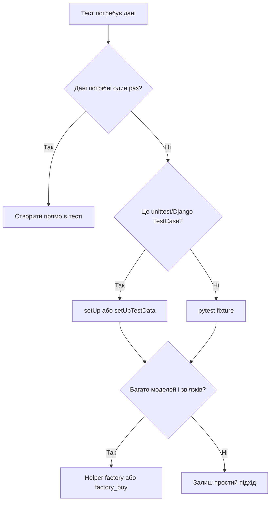

# Тестові дані та fixtures: як готувати стан для тестів

> Після цього файлу ти зрозумієш, як створювати дані для тестів, коли використовувати об’єкт прямо в тесті, `setUp()`, `setUpTestData()`, pytest fixtures і factories.

---

## 1. Навіщо це потрібно

Тест майже ніколи не живе в порожнечі.

Щоб перевірити список нотаток, потрібна нотатка. Щоб перевірити permissions, потрібні два користувачі. Щоб перевірити форму, потрібні дані, схожі на POST-запит.

Поганий підхід:

> “У мене в локальній базі вже є користувач `student`, тест хай використовує його”.

Такий тест зламається:

- на іншому комп’ютері;
- у CI;
- після очищення бази;
- якщо хтось змінить локальні дані.

Правильний підхід:

> Кожен тест сам створює мінімальні дані, які йому потрібні.

---

## 2. Ментальна модель

Тестові дані — це реквізит для сцени.

Якщо у сцені потрібен стілець, режисер не сподівається, що стілець випадково вже стоїть на сцені. Його ставлять перед сценою, а після сцени прибирають.

Так само з тестами:

- перед тестом створили user/note/category;
- тест перевірив поведінку;
- Django очистив test database.

---

## 3. Найпростіший спосіб: створити дані прямо в тесті

```python
def test_note_str_returns_title(self):
    user = User.objects.create_user(username="student", password="pw")
    note = Note.objects.create(
        owner=user,
        title="First note",
        content="Hello",
    )

    self.assertEqual(str(note), "First note")
```

Це нормально, якщо:

- даних мало;
- тест один;
- усе важливе видно прямо в тесті.

Плюс: тест легко читати.

Мінус: якщо таких тестів 20, починається копіпаста.

---

## 4. `setUp()`: дані перед кожним тестом

```python
class NoteModelTest(TestCase):
    def setUp(self):
        self.user = User.objects.create_user(username="student", password="pw")
        self.note = Note.objects.create(
            owner=self.user,
            title="First note",
            content="Hello",
        )

    def test_note_str_returns_title(self):
        self.assertEqual(str(self.note), "First note")

    def test_note_belongs_to_user(self):
        self.assertEqual(self.note.owner, self.user)
```

`setUp()` запускається перед кожним тестовим методом.

Це добре, коли кожен тест має отримати чисті нові об’єкти.

Але не клади в `setUp()` усе підряд. Якщо тесту не потрібна `category`, не створюй її просто “про всяк випадок”.

---

## 5. `setUpTestData()`: дані один раз на клас

У Django є оптимізація:

```python
class NoteModelTest(TestCase):
    @classmethod
    def setUpTestData(cls):
        cls.user = User.objects.create_user(username="student", password="pw")
        cls.note = Note.objects.create(
            owner=cls.user,
            title="First note",
            content="Hello",
        )

    def test_note_str_returns_title(self):
        self.assertEqual(str(self.note), "First note")
```

`setUpTestData()` створює дані один раз для всього класу, а не перед кожним тестом.

Коли використовувати:

| Підхід | Коли |
|---|---|
| `setUp()` | Тест змінює дані або потрібен чистий об’єкт |
| `setUpTestData()` | Дані однакові й не мають змінюватись |

Якщо тест змінює shared data з `setUpTestData()`, будь уважний. Не роби так, щоб один тест впливав на інший.

---

## 6. Helper factory без додаткових бібліотек

Можна створити просту helper-функцію:

```python
def make_user(username="student"):
    return User.objects.create_user(username=username, password="pw")


def make_note(owner=None, title="Test note", content="Hello"):
    if owner is None:
        owner = make_user()

    return Note.objects.create(
        owner=owner,
        title=title,
        content=content,
    )
```

Тоді тест:

```python
def test_note_str_returns_title(self):
    note = make_note(title="Readable note")

    self.assertEqual(str(note), "Readable note")
```

Перевага: менше дублювання.

Небезпека: helper може приховати важливі деталі. Якщо для тесту важливий owner, краще явно показати його в тесті.

---

## 7. pytest fixtures для Django

```python
import pytest

from notes.models import Note


@pytest.fixture
def user(db, django_user_model):
    return django_user_model.objects.create_user(
        username="student",
        password="pw",
    )


@pytest.fixture
def note(user):
    return Note.objects.create(
        owner=user,
        title="Fixture note",
        content="Hello",
    )


def test_note_str_returns_title(note):
    assert str(note) == "Fixture note"
```

Що важливо:

- `db` дозволяє fixture працювати з базою;
- `django_user_model` дає правильну User model;
- fixture `note` може залежати від fixture `user`.

---

## 8. Factory libraries

У великих проєктах часто використовують `factory_boy`.

Приклад:

```python
import factory

from notes.models import Note


class UserFactory(factory.django.DjangoModelFactory):
    class Meta:
        model = "auth.User"

    username = factory.Sequence(lambda n: f"user{n}")


class NoteFactory(factory.django.DjangoModelFactory):
    class Meta:
        model = Note

    owner = factory.SubFactory(UserFactory)
    title = factory.Sequence(lambda n: f"Note {n}")
    content = "Hello"
```

Тест:

```python
def test_note_str_returns_title():
    note = NoteFactory(title="Factory note")

    assert str(note) == "Factory note"
```

Для початківця factory library не обов’язкова. Спочатку навчися створювати об’єкти руками й через helpers.

---

## 9. Порівняння підходів

| Спосіб | Коли використовувати | Плюс | Мінус |
|---|---|---|---|
| Об’єкт прямо в тесті | Один простий тест | Все видно | Копіпаста |
| `setUp()` | Кілька тестів у класі | Чистий стан для кожного тесту | Може роздутись |
| `setUpTestData()` | Спільні незмінні дані | Швидше | Треба не псувати shared state |
| Helper factory | Повторюване створення | Просто й гнучко | Може приховати важливі поля |
| pytest fixture | pytest-проєкти | Композиція fixtures | Треба зрозуміти механіку |
| `factory_boy` | Багато моделей і зв’язків | Потужно | Додаткова бібліотека |

---

## 10. Mermaid-схема



---

## 11. Типові помилки початківців

| Помилка | Чому виникає | Як виправити |
| ------- | ------------ | ------------ |
| Тест залежить від локальної БД | “У мене ж є такі дані” | Створюй дані в тесті |
| `setUp()` створює цілий світ | Хочеться мати все готове | Створюй мінімум |
| Helper factory приховує важливі поля | Занадто багато defaults | Явно передавай важливе |
| Один тест змінює дані іншого | Shared state | Не покладайся на порядок тестів |
| Використовують factory library занадто рано | Хочеться “як у продакшені” | Спочатку прості helpers |

---

## 12. Практика

1. Напиши `make_user()` і `make_note()`.
2. Перепиши два model tests через `make_note()`.
3. Напиши test ownership:
   - User A має свою note;
   - User B має свою note;
   - список User A не містить note User B.
4. Перепиши той самий сценарій через `setUp()`.
5. Якщо використовуєш pytest — зроби fixtures `user` і `note`.

---

## 13. Питання для самоперевірки

1. Чому тест не має залежати від реальної бази?
2. Коли краще створити об’єкт прямо в тесті?
3. Чим `setUp()` відрізняється від `setUpTestData()`?
4. Чим helper factory відрізняється від pytest fixture?
5. Чому занадто “розумні” factories можуть заважати читати тест?
