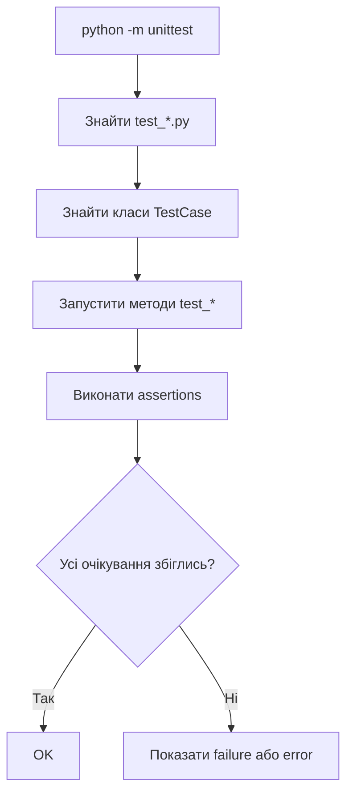

# unittest: перші тести стандартними засобами Python

> Після цього файлу ти зможеш створити тестовий файл, написати клас `unittest.TestCase`, запустити тести через `python -m unittest` і зрозуміти базові assert-методи.

---

## 1. Навіщо це потрібно

`unittest` — це стандартна бібліотека Python для тестування. Її не треба встановлювати.

Навіщо її вивчати, якщо є `pytest`?

1. Django `TestCase` побудований на ідеях `unittest`.
2. Багато старих і великих проєктів використовують саме цей стиль.
3. `unittest` добре показує структуру тесту: клас, метод, assertion.
4. Якщо ти зрозумієш `unittest`, Django-тести стануть набагато яснішими.

---

## 2. Ментальна модель

`unittest.TestCase` — це окрема лабораторна кімната для групи схожих перевірок.

Клас `TestMathFunctions` означає:

> “Тут лежать перевірки для математичних функцій”.

Метод `test_add_two_numbers` означає:

> “Ось конкретний експеримент: додавання двох чисел”.

---

## 3. Перший приклад з нуля

Структура папки:

```text
testing_playground/
├── math_utils.py
└── test_math_utils.py
```

Файл `math_utils.py`:

```python
def add(a, b):
    return a + b


def divide(a, b):
    return a / b
```

Файл `test_math_utils.py`:

```python
import unittest

from math_utils import add, divide


class TestMathFunctions(unittest.TestCase):
    def test_add_two_numbers(self):
        result = add(2, 3)

        self.assertEqual(result, 5)

    def test_divide_by_zero_raises_error(self):
        with self.assertRaises(ZeroDivisionError):
            divide(10, 0)


if __name__ == "__main__":
    unittest.main()
```

Запуск усіх тестів у папці:

```bash
python -m unittest
```

Запуск конкретного файлу:

```bash
python -m unittest test_math_utils.py
```

Можливий результат:

```text
..
----------------------------------------------------------------------
Ran 2 tests in 0.001s

OK
```

Що означають дві крапки:

| Символ | Значення |
|---|---|
| `.` | Один тест пройшов |
| `F` | Assertion failed |
| `E` | Error у коді тесту або тестованому коді |

---

## 4. Як `unittest` знаходить тести

`unittest` шукає:

| Що | Правило | Приклад |
|---|---|---|
| Файл | Часто `test_*.py` | `test_math_utils.py` |
| Клас | Успадковує `unittest.TestCase` | `class TestMathFunctions(unittest.TestCase)` |
| Метод | Починається з `test_` | `def test_add_two_numbers(self):` |

Якщо метод назвати так:

```python
def check_add_two_numbers(self):
    ...
```

`unittest` його не запустить.

Це часта помилка: код тесту є, але test runner його не бачить.

---

## 5. Arrange -> Act -> Assert у unittest

Поганий варіант:

```python
def test_add_two_numbers(self):
    self.assertEqual(add(2, 3), 5)
```

Він короткий, але початківцю не видно кроків.

Краще для навчання:

```python
def test_add_two_numbers(self):
    a = 2
    b = 3

    result = add(a, b)

    self.assertEqual(result, 5)
```

| Крок | Рядки |
|---|---|
| Arrange | `a = 2`, `b = 3` |
| Act | `result = add(a, b)` |
| Assert | `self.assertEqual(result, 5)` |

---

## 6. Основні assert-методи

| Метод | Що перевіряє | Приклад |
|---|---|---|
| `assertEqual(a, b)` | `a == b` | `self.assertEqual(result, 5)` |
| `assertNotEqual(a, b)` | `a != b` | `self.assertNotEqual(status, "error")` |
| `assertTrue(value)` | Значення істинне | `self.assertTrue(user.is_active)` |
| `assertFalse(value)` | Значення хибне | `self.assertFalse(form.is_valid())` |
| `assertIn(a, b)` | `a` є всередині `b` | `self.assertIn("title", form.errors)` |
| `assertIsNone(value)` | Значення `None` | `self.assertIsNone(result)` |
| `assertRaises(Error)` | Код має викликати помилку | `with self.assertRaises(ValueError): ...` |

Приклад з `assertIn`:

```python
def test_error_message_contains_field_name(self):
    errors = {"title": ["This field is required."]}

    self.assertIn("title", errors)
```

Приклад з `assertRaises`:

```python
def parse_age(value):
    age = int(value)

    if age < 0:
        raise ValueError("age cannot be negative")

    return age


class TestParseAge(unittest.TestCase):
    def test_negative_age_raises_error(self):
        with self.assertRaises(ValueError):
            parse_age("-5")
```

---

## 7. `setUp()`: підготовка даних перед кожним тестом

Якщо кілька тестів використовують однакові дані, можна додати `setUp()`.

```python
class TestCart(unittest.TestCase):
    def setUp(self):
        self.cart = []

    def test_cart_starts_empty(self):
        self.assertEqual(self.cart, [])

    def test_can_add_item_to_cart(self):
        self.cart.append("Book")

        self.assertIn("Book", self.cart)
```

`setUp()` запускається перед кожним тестом.

Це важливо: кожен тест отримує чистий стан.

Погано:

```python
cart = []


class TestCart(unittest.TestCase):
    def test_add_book(self):
        cart.append("Book")

    def test_cart_is_empty(self):
        self.assertEqual(cart, [])
```

Другий тест може впасти, бо перший залишив після себе дані.

---

## 8. Як виглядає падіння тесту

Припустимо, тест:

```python
def test_add_two_numbers(self):
    result = add(2, 3)

    self.assertEqual(result, 5)
```

А функція:

```python
def add(a, b):
    return a - b
```

Результат:

```text
AssertionError: -1 != 5
```

Як читати:

| Частина | Значення |
|---|---|
| `-1` | Реальний результат |
| `5` | Очікуваний результат |
| `AssertionError` | Очікування не збіглося |

Після цього не треба панікувати. Треба відповісти:

1. Код неправильний?
2. Тест неправильний?
3. Очікування змінилось через нову вимогу?

---

## 9. Mermaid-схема



---

## 10. Типові помилки початківців

| Помилка | Чому виникає | Як виправити |
| ------- | ------------ | ------------ |
| Метод названий без `test_` | Test runner його не бачить | Починай назву з `test_` |
| Клас не успадковує `unittest.TestCase` | Це просто клас, не тестовий case | Додай `(unittest.TestCase)` |
| Один тест залежить від іншого | Спільний mutable стан | Використовуй `setUp()` |
| Пишуть `assert result == 5` у unittest-стилі | Змішали pytest і unittest | У `unittest` краще `self.assertEqual(result, 5)` |
| Перевіряють багато логіки в одному методі | Хочеться швидше | Один тест — одна поведінка |

---

## 11. Практика

1. Створи файл `string_utils.py`.
2. Напиши функцію:

```python
def normalize_email(email):
    return email.strip().lower()
```

3. Створи `test_string_utils.py`.
4. Напиши тести:

```text
" STUDENT@EXAMPLE.COM " -> "student@example.com"
"test@example.com" -> "test@example.com"
```

5. Додай тест на порожній рядок. Спочатку виріши, що має статися: повернути `""` чи викликати помилку.

---

## 12. Питання для самоперевірки

1. Чому метод тесту має починатися з `test_`?
2. Для чого потрібен `unittest.TestCase`?
3. Чим `failure` відрізняється від `error`?
4. Коли варто використовувати `setUp()`?
5. Чому тести не мають залежати від порядку запуску?
