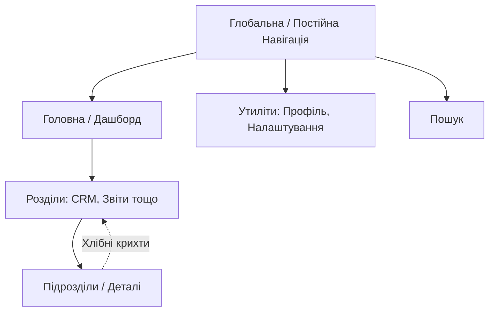
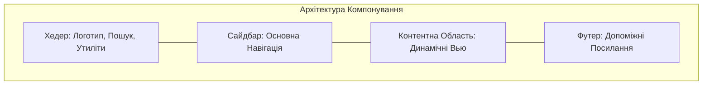
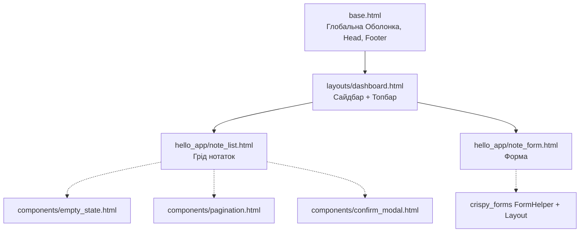
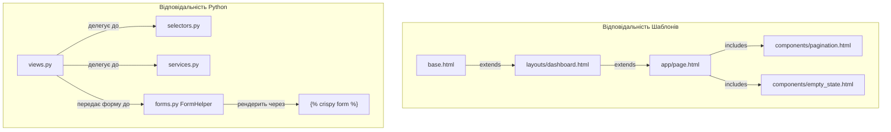
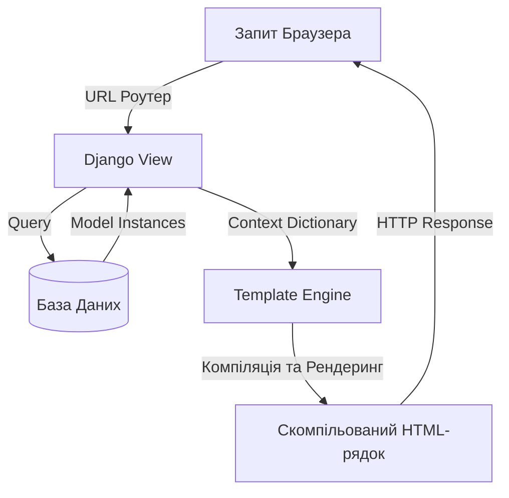
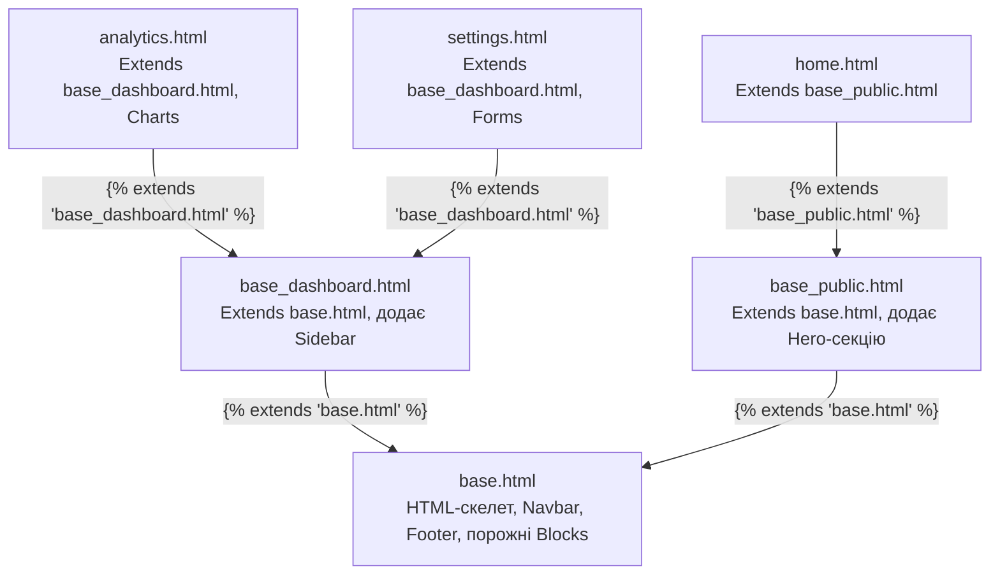
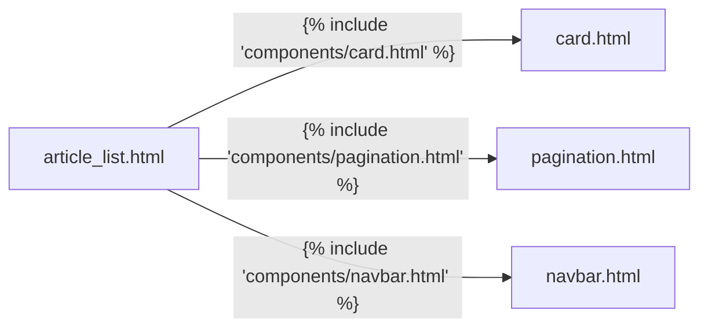
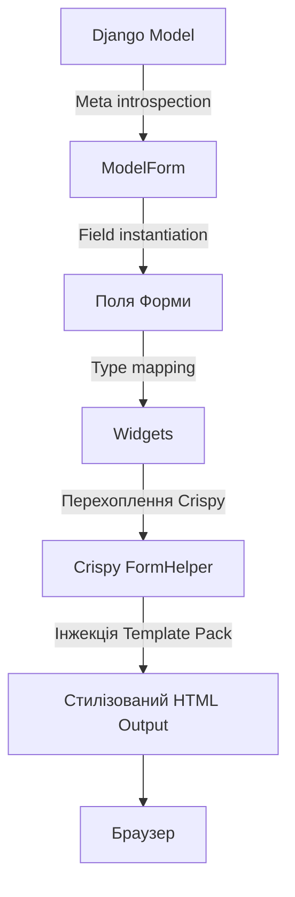
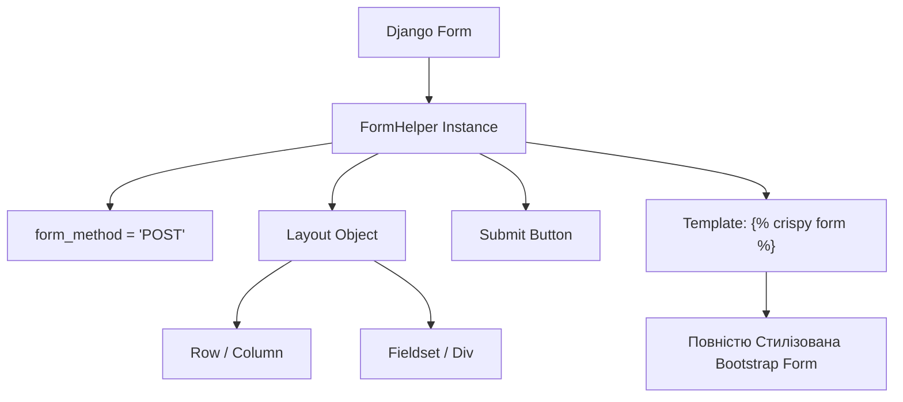
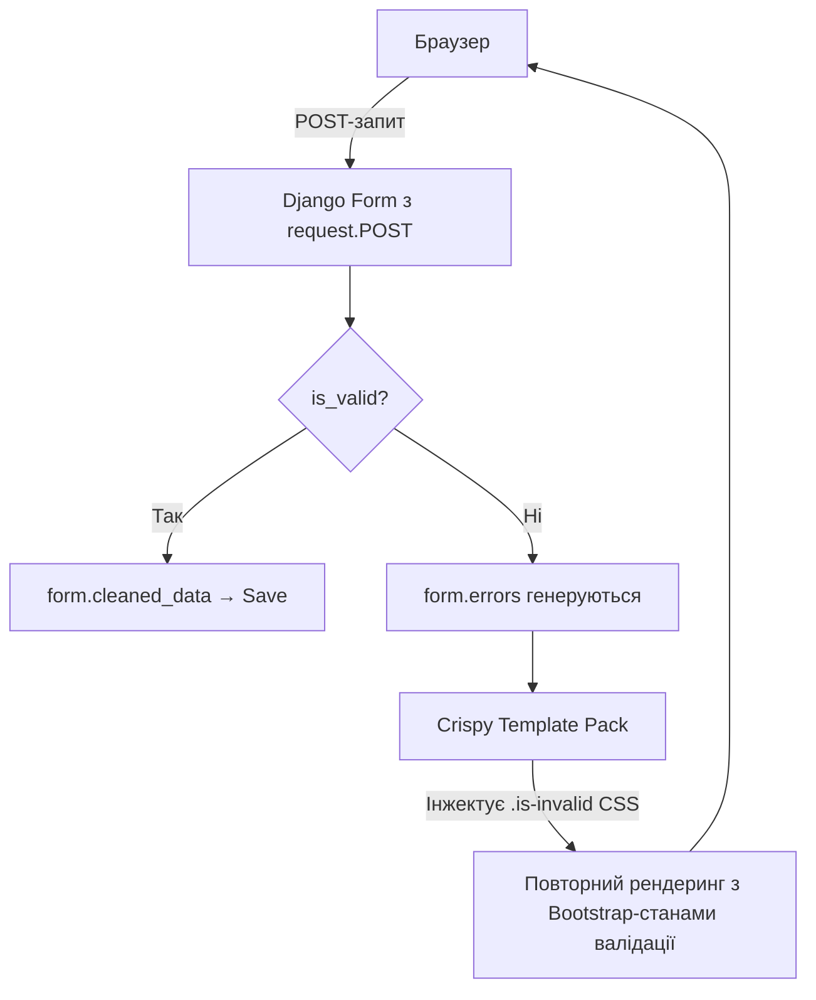

# Основи Дизайну для Django-проєктів

> **Архітектура користувацьких інтерфейсів у Django-застосунках**
>
> Щоб будувати масштабовані, підтримувані та зручні Django-застосунки, розробник мусить
> змінити мислення: не «малювати сторінки», а проєктувати системні фронтенд-архітектури.
> Професійний Django-інтерфейс базується на чіткому розділенні структури, представлення
> і даних — з активним використанням компонентів та передбачуваних інформаційних ієрархій.

---

## Зміст

- [1. Дизайн-мислення та UX-принципи](#1-дизайн-мислення-та-ux-принципи)
- [2. Інформаційна Архітектура (IA)](#2-інформаційна-архітектура-ia)
- [3. Системи Компонування та Приклади](#3-системи-компонування-та-приклади)
- [4. Дизайн-Системи та Філософія Bootstrap](#4-дизайн-системи-та-філософія-bootstrap)
- [5. Архітектура Django-шаблонів](#5-архітектура-django-шаблонів)
- [6. Дизайн Форм та Представлення Даних](#6-дизайн-форм-та-представлення-даних)
- [7. Дизайн Дашборду](#7-дизайн-дашборду)
- [8. Типові Помилки Початківців](#8-типові-помилки-початківців)
- [9. Організація Великих Django-проєктів](#9-організація-великих-django-проєктів)
- [10. Tailwind CSS проти Bootstrap у Django](#10-tailwind-css-проти-bootstrap-у-django)
- [11. Статичні Файли у Django](#11-статичні-файли-у-django)
- [12. Інтеграція React з Django](#12-інтеграція-react-з-django)
- [13. Детальна Архітектура Django-шаблонів](#13-детальна-архітектура-django-шаблонів)
- [14. Детальна Архітектура Crispy Forms](#14-детальна-архітектура-crispy-forms)

---

## 1. Дизайн-мислення та UX-принципи

### «Не змушуй мене думати» (Стів Круг)

Головний принцип UX — **«Don't make me think»** (Стів Круг, класична книга про юзабіліті). Користувачі не читають сторінки — вони їх **сканують**, шукаючи візуальні орієнтири. Вони «задовольняються» — обирають першу прийнятну опцію, а не аналізують усі можливі варіанти.

Твоя архітектура повинна втілювати ключові UX-характеристики:
**Корисна, Зручна, Знаходима, Довірена, Бажана, Доступна, Цінна.**

**Практичні наслідки:**
- Кожна сторінка має мати **одну очевидну дію**
- Клікабельні елементи мають виглядати клікабельними
- Назви кнопок: «Зберегти нотатку», а не «ОК»
- Якщо зареєстрований користувач опиняється на сторінці входу — перенаправ його автоматично

### CRAP-принципи дизайну

**CRAP** — абревіатура чотирьох фундаментальних принципів дизайну, які описала Робін Вільямс у книзі «Дизайн для не-дизайнерів»:

| Принцип | Опис |
|---------|------|
| **C** — Proximity (Близькість) | Пов'язані елементи групуються разом. Більше простору *між* групами, менше *всередині* |
| **R** — Alignment (Вирівнювання) | Кожен елемент пов'язаний з іншими. Уникай розміщення «на вічко» |
| **A** — Repetition (Повторюваність) | Візуальні елементи повторюються по всьому дизайну — колір, шрифт, форма, кнопки |
| **P** — Contrast (Контраст) | Якщо два елементи не однакові — зроби їх **зовсім різними**, щоб уникнути плутанини |

### Узгодженість та Конвенції

Стандартизовані паттерни (конвенції) знижують когнітивне навантаження. Якщо ти використовуєш стандартний кошик або іконку профілю — користувачі миттєво розуміють функцію без пояснень.

### Запобігання помилкам та Зворотній зв'язок

Хороший інтерфейс «толерантний до помилок». Він обмежує можливість зробити щось неправильне (наприклад, дозволяє вводити лише цифри у поле кредитної картки) і надає негайний, чіткий зворотній зв'язок після кожної дії.

### Простота та Відкритість

Завжди починай проєктування з основної функції, а не з оточуючої оболонки. Встанови чітку **візуальну ієрархію** — найважливіші елементи мають бути найпомітнішими, природно спрямовуючи погляд користувача.

### Візуальна ієрархія та Вага

Не кожен елемент може бути «важливим». Якщо все кричить — нічого не чути. Будуй ієрархію через:
- **Розмір**: великий → малий
- **Колір**: яскравий → приглушений
- **Жирність**: Bold → Regular → Light
- **Позиція**: верх-ліво притягує увагу першим
- **Пробіл**: ізольований елемент сприймається важливіше

### Типографіка на Екрані

- Основний текст: **16px мінімум** (менше стомлює очі)
- Міжрядковий інтервал: **1.5–1.6** для читабельності
- Довжина рядка: **45–75 символів** в ідеалі (ні занадто вузько, ні занадто широко)
- Максимум **2–3 шрифти** в одному дизайні
- Bootstrap-шкала: `.fs-1` (2.5rem) → `.fs-6` (1rem)

---

## 2. Інформаційна Архітектура (IA)

Інформаційна архітектура — структурне проєктування спільних інформаційних середовищ застосунку, що балансує бізнес-цілі, потреби користувачів та зміст.

### Ієрархія Сторінок

Застосунки використовують архітектуру «зверху-вниз» (головна сторінка передбачає основні потреби) та «знизу-вгору» (користувачі переходять безпосередньо з глибоких посилань або результатів пошуку).

### Постійна Навігація

Глобальна навігація має залишатися на одному місці на кожній сторінці — це створює відчуття «де я знаходжуся». Вона має містити:
- Логотип (ідентифікатор сайту)
- Основні розділи (головні посилання)
- Утиліти (Допомога, Вхід)
- Пошук

### Навігаційні «хлібні крихти»

Для глибоких застосунків «хлібні крихти» показують шлях від головної сторінки до поточного місця, надаючи очевидний спосіб повернутися вгору по ієрархії.



---

## 3. Системи Компонування та Приклади

Професійні веб-застосунки як правило використовують секційне компонування — як пульт управління з окремими функціональними фреймами.

### Адмін-панелі та Дашборди

Зазвичай використовують фіксований сайдбар для первинної навігації, верхній хедер для утиліт (пошук, профіль) та плавну контентну область.

### SaaS та CRM

Покладаються на адаптивні грід-системи, де складні дані представлені в основній контентній зоні, з переходом на одноколонковий вигляд на мобільних пристроях.

### E-commerce та Блоги

Зазвичай використовують верхню навігацію, секцію-герой для ціннісної пропозиції та грід карток для товарів або статей.



---

## 4. Дизайн-Системи та Філософія Bootstrap

Фронтенд-фреймворки на кшталт Bootstrap існують як шар абстракції для стандартизації дизайну, усунення хаосу кастомного CSS та прискорення створення інтерфейсів.

### Обмеження Вибору

Дизайн-система обмежує твої варіанти (наприклад, конкретні розміри шрифтів, визначена шкала відступів та палітра кольорів). Це запобігає «паралічу вибору» і гарантує узгодженість. Замість того, щоб гадати між 120px і 125px — ти використовуєш попередньо визначену шкалу відступів на базі 16px.

### Грід-Системи

Побудовані на 12-колоночній мобільно-орієнтованій flexbox-системі:
- **Контейнери** обмежують ширину та центрують контент
- **Рядки (Row)** слугують обгортками з негативними відступами
- **Колонки (Col)** визначають відсоткову ширину

### Утилітарні Класи

Класи для відступів (`m-3`), падінгів (`p-4`) та відображення (`d-none`, `d-md-block`) дозволяють змінювати рендеринг та адаптивну поведінку прямо в HTML без написання кастомного CSS.

### Готові Компоненти

Елементи як кнопки, картки та сповіщення — це заздалегідь визначені абстракції. Комбінуючи ці компоненти, ти швидко створюєш складний UI без дублювання.

---

## 5. Архітектура Django-шаблонів

Дизайн-системи ідеально відображаються на систему наслідування шаблонів Django. Розбиваючи UI на блоки — ти дотримуєшся принципу DRY (Don't Repeat Yourself).

- `base.html` — головна оболонка: структура `<html>`, `<head>` (CSS/JS), постійна навігація, футер.
- **Наслідування шаблонів**: дочірні шаблони `` вставляють конкретний UI у ``.
- **Партіали/Компоненти**: дрібні UI-елементи (KPI-картка, меню, сповіщення) зберігаються у `components/` і підключаються через ``.



### 3-Рівнева Ієрархія Шаблонів (Паттерн SaaS-Дашборду)

```
templates/
├── base.html                   ← HTML5 оболонка, Bootstrap CDN, слоти 
├── layouts/
│   ├── dashboard.html          ← base + сайдбар + топбар (extends base.html)
│   ├── auth.html               ← base + центрована картка (логін/реєстрація)
│   └── landing.html            ← base + маркетингова навігація
├── components/
│   ├── pagination.html         ← Bootstrap-пагінація для повторного використання
│   ├── empty_state.html        ← «Ще немає елементів» з CTA
│   └── confirm_modal.html      ← Діалог підтвердження видалення
└── hello_app/
    ├── note_list.html          ← extends layouts/dashboard.html
    ├── note_form.html          ←  — ОДИН ТЕГ!
    └── note_detail.html        ← extends layouts/dashboard.html
```

---

## 6. Дизайн Форм та Представлення Даних

### Візуальна Ієрархія Форм

Форми мають чітко передавати зв'язки між елементами. Уникай надмірної залежності від семантичних HTML-заголовків (`<h1>`, `<h2>`), якщо вони візуально перекривають зміст форми. Відокремлюй візуальну ієрархію від документальної.

### Підписи та Зворотній Зв'язок

Не приховуй підписи полів і не покладайся лише на placeholder-и — це шкодить доступності. Форми мають надавати **негайний зворотній зв'язок** через кольорові стани (зелений — успіх, червоний — помилка) та чіткий допоміжний текст.

**Помилки форм у Bootstrap:** Django автоматично додає CSS-клас `is-invalid` до полів з помилками — crispy-forms підключає це автоматично.

### Три Рівні Рендерингу Форм у Django

| Підхід | Код у Шаблоні | Рядків | Результат |
|--------|--------------|--------|-----------|
| Чистий Django | `{{ form.as_p }}` | 1 | Без стилів |
| Ручний Bootstrap | `<div class="mb-3">...` для кожного поля | 60+ | Bootstrap-стиль |
| `django-bootstrap5` | `` | 1 | Bootstrap-стиль |
| **Crispy Forms** | **``** | **1** | **Bootstrap + власне компонування** |

### Таблиці

Для представлення даних використовуй `.table-responsive`, щоб уникнути горизонтального прокручування на мобільних. Підвищуй читабельність через контекстні класи (`.table-striped`, `.table-hover`).

---

## 7. Дизайн Дашборду

Дашборди мають перетворювати складні дані на зручний для перегляду формат.

### Організація Інформації

Дашборди часто використовують секційне компонування — навігація, фільтри та легенди розміщені в бічних панелях.

### KPI та Графіки

Ключові метрики розміщуються зверху (компонент-картка). Обирай правильний тип графіку (кругова діаграма, стовпчик, рядок, точки) залежно від потреби порівняння (часовий ряд, кореляція, елемент).

### Порожні Стани (Empty States)

Не ігноруй порожні стани. Коли користувач вперше відкриває CRM і даних немає — використай порожній стан з чітким **Заклик до Дії** (CTA): «Додати перший контакт» замість порожньої або зламаної таблиці.


---

## 8. Типові Помилки Початківців

### Архітектурні Помилки

#### Гігантські Шаблони

Розміщення тисяч рядків HTML в одному файлі замість використання компонентів ``.

**Рішення:** Виноси блоки UI, що повторюються, у директорію `components/` або `partials/`.

#### Логіка у Шаблонах

Написання `` у шаблонах.

**Рішення:** Переноси у кастомний template-фільтр або сервісний шар. Тримай шаблони «дурними».

#### Дублювання HTML

Копіювання header/footer/navbar у кожен файл шаблону.

**Рішення:** Обов'язкове наслідування шаблонів через ``.

---

### UI/UX Помилки

#### Занадто Багато Всього (Clutter/Noise)

Забагато елементів на одному екрані без чіткої ієрархії. Три кольори, п'ять різних розмірів шрифтів, кнопки скрізь.

**Рішення:** Максимум **3 рівні ієрархії** в одному вью. Одна первинна дія (`.btn-primary`), вторинні — `.btn-outline-secondary`.

#### Слабкий Контраст

Сірий текст на білому фоні, «м'які» кнопки, які виглядають як текст.

**Рішення:** Мінімум контрасту за WCAG: **4.5:1** для звичайного тексту. Перевіряй через [Colour Contrast Checker](https://colourcontrast.cc/).

#### Неправильне Вирівнювання та Центрування

Розміщення елементів «на вічко», перецентрування всього — центрований лівий навігаційний сайдбар, центрована таблиця з даними.

**Рішення:** Bootstrap-сітка + Flexbox + вирівнювання `text-start` для даних, `text-center` тільки для заголовків/іконок.

#### Помилки Дизайну Форм

- Placeholder замість label (приховує підказку після введення першого символу)
- Кнопка «Скасувати» таким самим кольором, що й «Зберегти»
- Немає підтвердження видалення

**Рішення:**
```html
{# ПОГАНО — label всередині input #}
<input placeholder="Введіть email" type="email">

{# ДОБРЕ — окремий label #}
<label for="email" class="form-label">Email</label>
<input id="email" type="email" class="form-control" placeholder="you@example.com">
```

#### Покладання Лише на Колір

Використання тільки кольору для позначення статусу (червоний/зелений) не працює для людей з порушенням кольорового зору.

**Рішення:**
```html
{# ПОГАНО: лише колір #}
<span class="badge bg-success"></span>

{# ДОБРЕ: колір + іконка + текст #}
<span class="badge bg-success"><i class="bi bi-check-circle me-1"></i>Активний</span>
```

#### Відсутність Порожніх Станів

Показ порожньої таблиці або сторінки, коли даних немає.

**Рішення:** Завжди рендеруй компонент `empty_state.html` з корисним CTA.

---

## 9. Організація Великих Django-проєктів

Для підтримки масштабованості у production Django-застосунках:

```
my_project/
├── templates/                  ← Глобальні компонування (base.html, layouts/)
│   ├── base.html
│   ├── layouts/
│   │   ├── dashboard.html
│   │   └── auth.html
│   └── components/             ← Елементи UI для повторного використання
│       ├── pagination.html
│       ├── empty_state.html
│       └── confirm_modal.html
│
├── my_app/
│   ├── templates/my_app/       ← Специфічні для застосунку шаблони сторінок
│   │   ├── note_list.html      ← extends layouts/dashboard.html
│   │   └── note_form.html      ← 
│   ├── static/my_app/
│   │   ├── css/app.css         ← Кастомні перевизначення (мінімум!)
│   │   └── js/app.js
│   ├── models.py
│   ├── services.py             ← Бізнес-логіка (INSERT/UPDATE/DELETE)
│   ├── selectors.py            ← Запити на читання (SELECT)
│   ├── views.py                ← Лише HTTP-шар
│   └── forms.py                ← FormHelper + Layout (crispy)
│
└── static/                     ← Вивід collectstatic (production)
```

**Правило:** Уникай написання кастомного CSS для компонування, якщо грід-система (Bootstrap) вже обробляє це. Кастомний CSS має перевизначати лише **брендинг** (кольори, шрифти), а не компонування.



---

## 10. Tailwind CSS проти Bootstrap у Django

### Bootstrap у Django

**Переваги:**
- Готові компоненти «з коробки» (картки, модальні вікна, navbar)
- `django-crispy-forms` + `crispy-bootstrap5` — відмінна інтеграція
- Менша крива навчання
- Просто підключити через CDN

**Недоліки:**
- «Bootstrap-вигляд» — сайти схожі між собою без кастомізації
- Більший CSS-файл (навіть із purge)
- Менше гнучкості для унікальних дизайнів

### Tailwind CSS у Django

**Переваги:**
- Унікальний дизайн — немає «tailwind-вигляду»
- Атомарні CSS-класи — менший фінальний файл (після purge)
- Повний контроль над стилями без написання кастомного CSS

**Недоліки:**
- Потребує `django-tailwind` + Node.js для збірки
- `crispy-tailwind` — менш зрілий, ніж `crispy-bootstrap5`
- Вища крива навчання
- Немає готових компонентів (потрібен Flowbite, Headless UI тощо)

### Інтеграція Tailwind з Django

```python
# settings.py
INSTALLED_APPS = [
    ...
    'tailwind',
    'theme',  # генерується django-tailwind
]
TAILWIND_APP_NAME = 'theme'
NPM_BIN_PATH = '/usr/local/bin/npm'

# Запуск у розробці:
# python manage.py tailwind start
```

### Коли обирати що

| Ситуація | Рекомендація |
|----------|-------------|
| Навчальний проєкт / прототип | Bootstrap (CDN, без збірки) |
| SaaS з унікальним брендингом | Tailwind |
| Адмін-панель / бекофіс | Bootstrap + django-unfold |
| Публічний сайт з дизайном від дизайнера | Tailwind |
| Команда знає Bootstrap добре | Bootstrap |

---

## 11. Статичні Файли у Django

### Налаштування `settings.py`

```python
# URL для доступу до статичних файлів у розробці
STATIC_URL = '/static/'

# Директорії зі статичними файлами ПОЗА застосунками (project-level)
STATICFILES_DIRS = [
    BASE_DIR / 'static',        # project/static/css/global.css
]

# Директорія для production (collectstatic)
STATIC_ROOT = BASE_DIR / 'staticfiles'
```

### Структура Директорій

```
my_project/
├── static/                     ← project-level (STATICFILES_DIRS)
│   ├── css/
│   │   └── global.css
│   └── js/
│       └── global.js
│
└── my_app/
    └── static/
        └── my_app/             ← namespace (важливо!)
            ├── css/
            │   └── app.css
            └── js/
                └── app.js
```

**Простір імен:** Завжди кладіть файли у підпапку з назвою застосунку (`static/my_app/`), щоб уникнути конфліктів між застосунками при `collectstatic`.

### Використання у Шаблонах

```html


{# Завантаження CSS #}
<link rel="stylesheet" href="">

{# Завантаження JS #}
<script src=""></script>

{# Зображення #}

```

### Команди для Production

```bash
# Збирає всі статичні файли у STATIC_ROOT
python manage.py collectstatic

# Перевірка конфігурації
python manage.py findstatic css/global.css
```

### Обслуговування у Production

Django **не обслуговує** статичні файли у production (DEBUG=False).
Використовуй Nginx, WhiteNoise або CDN:

```python
# WhiteNoise (найпростіший варіант для Heroku/Railway)
MIDDLEWARE = [
    'whitenoise.middleware.WhiteNoiseMiddleware',
    ...
]
STATICFILES_STORAGE = 'whitenoise.storage.CompressedManifestStaticFilesStorage'
```

---

## 12. Інтеграція React з Django

### Підхід 1: Вбудований Віджет (Embedded Widget)

Одна або кілька сторінок Django рендерять HTML де React монтується у конкретний `<div>`.
Решта застосунку — звичайні Django-шаблони.

```html
{# Django шаблон #}


  <!-- React монтується тут -->
  <div id="react-root"
       data-notes="{{ notes_json|escapejs }}"
       data-user="{{ user.pk }}">
  </div>



  <script src=""></script>

```

**Коли використовувати:** Один складний компонент (наприклад, інтерактивна карта, редактор тексту), решта сайту — SSR Django.

### Підхід 2: SPA + API (Повне Розділення)

Django надає тільки REST API (DRF або API Views), React — окремий застосунок на Vite/CRA.

```
backend/   ← Django REST API (порт 8000)
├── api/
│   ├── views.py     ← APIView або ViewSet
│   └── serializers.py
└── settings.py      ← CORS_ALLOWED_ORIGINS = ['http://localhost:5173']

frontend/  ← React + Vite (порт 5173)
├── src/
│   ├── api/         ← axios/fetch клієнти
│   └── components/
└── vite.config.js
```

**Налаштування CORS для Django:**
```python
# pip install django-cors-headers
INSTALLED_APPS = [..., 'corsheaders']
MIDDLEWARE = ['corsheaders.middleware.CorsMiddleware', ...]
CORS_ALLOWED_ORIGINS = ['http://localhost:5173', 'https://my-app.com']
```

### Порівняння Підходів

| Критерій | Вбудований Віджет | SPA + API |
|----------|------------------|-----------|
| Складність налаштування | Низька | Висока |
| SEO | Django SSR (відмінно) | Потребує SSR/SSG |
| Автентифікація Django | Вбудована (cookies/sessions) | Потрібен JWT або token |
| Повторне використання API | Обмежено | Так (мобільний, партнери) |
| Час до MVP | Швидко | Повільніше |
| Коли обирати | Один складний компонент | Повноцінний SPA |

---

## 13. Детальна Архітектура Django-шаблонів

### Концепція SSR та Роль Шаблону

Django-шаблони — це потужна система **Server-Side Rendering (SSR)**, яка суворо розділяє бізнес-логіку від представлення. У правильній бекенд-архітектурі:

- **View** виступає контролером: отримує дані з ORM та готує їх
- **Template Engine** має єдине завдання: взяти дані (контекст) та вставити їх у HTML

Django навмисно обмежує Django Template Language (DTL), щоб запобігти виконанню довільного Python-коду у шаблонах. Це архітектурне обмеження змушує тримати складну бізнес-логіку, запити до БД та мутації — виключно у View або Model.

### Конвеєр Рендерингу Шаблону



**Кроки конвеєра:**

1. **Request** — браузер ініціює HTTP-запит, маршрутизований до Django View
2. **View Logic** — View обробляє запит, виконує запити до БД і будує словник `context`
3. **Template Compilation** — Template Engine парсить HTML-файл і компілює його у AST (дерево вузлів) у пам'яті сервера
4. **Context Interpolation** — рушій проходить AST, замінює змінні шаблону та виконує теги
5. **Response Generation** — рушій об'єднує результати у фінальний HTML-рядок і повертає `HttpResponse`

### Наслідування Шаблонів

Наслідування — **архітектурна основа DRY UI-систем** у Django. Замість копіювання `<head>`, навігації та футера в кожен файл — створюється базовий шаблон-«скелет» (`base.html`) з `` тегами. Дочірні шаблони успадковують весь скелет та перевизначають лише потрібні блоки.



### Композиція Шаблонів ()

Наслідування будує сторінки **зверху-вниз**, композиція — **знизу-вгору**. Складний UI розбивається на ізольовані мікрошаблони (картки, пагінація, форми), які підключаються через ``.



### Розширені DTL-Теги

| Тег | Призначення |
|-----|------------|
| `` / `` | Основна пара для дерев наслідування |
| `` | Вставка підшаблону |
| `` | Кешування складної змінної або передача ізольованих аргументів у компонент |
| `` | Розв'язання іменованих URL-маршрутів у абсолютні шляхи |
| `` | Вставка прихованого input з токеном безпеки від CSRF |
| `` | Завантаження бібліотек тегів/фільтрів (наприклад, `static`, `crispy_forms_tags`) |

### Фільтри Шаблонів

Фільтри трансформують дані контексту безпосередньо перед рендерингом у HTML, використовуючи синтаксис `|`:

| Фільтр | Приклад | Результат |
|--------|---------|-----------|
| `default` | `{{ value\|default:"Не вказано" }}` | Fallback, якщо значення False |
| `length` | `{{ list\|length }}` | Розмір списку або рядка |
| `truncatechars` | `{{ text\|truncatechars:50 }}` | Обрізає рядок до N символів |
| `date` | `{{ dt\|date:"d.m.Y" }}` | Форматує `datetime` |
| `safe` | `{{ html\|safe }}` | ⚠️ Вимикає HTML-екранування (тільки для перевіреного HTML!) |
| `lower` / `upper` | `{{ name\|lower }}` | Регістр рядка |

### Архітектурні Помилки у Шаблонах

| Помилка | Наслідок | Рішення |
|---------|----------|---------|
| Бізнес-логіка у шаблонах (фільтрація QuerySet, запити до БД) | Порушення MVT, неможливість тестування | Вся підготовка даних — у View або selectors.py |
| Копіювання HTML (navbar у кожному файлі) | Зміна дизайну = правка десятків файлів | `` |
| Монолітні шаблони (2000+ рядків HTML) | Неможливість підтримки | `` компоненти |
| Зловживання `\|safe` на недовіреному введенні | XSS-уразливості | Ніколи не використовуй `\|safe` для даних від користувача |

---

## 14. Детальна Архітектура Crispy Forms

### Основна Концепція

Стандартні Django Forms відмінно справляються з **валідацією даних та безпекою**, але навмисно залишають HTML-компонування неструктурованим. Методи `as_p()`, `as_table()` генерують сирий HTML без Bootstrap-класів.

**Django Crispy Forms** вирішує це, виступаючи потужним **шаром UI-абстракції**. Він перехоплює стандартний рендеринг Django та програматично вставляє специфічні для фреймворку стилі **прямо з Python-коду**, тримаючи архітектуру UI DRY та різко зменшуючи boilerplate.

### Конвеєр Рендерингу Форми



**Без Crispy Forms** конвеєр зупиняється на Widgets — виходить сирий HTML без Bootstrap-класів.
**З Crispy Forms** — FormHelper перехоплює рендеринг та через `CRISPY_TEMPLATE_PACK` автоматично додає всі потрібні класи.

### Архітектура Crispy Forms



### Компоненти FormHelper

**FormHelper** — оркестратор, прикріплений до форми, що визначає:
- Атрибути тегу `<form>` (method, id, class, action)
- HTTP-метод (GET/POST)
- Загальну структуру Layout

**FormHelper НЕ впливає на:**
- Валідацію (`is_valid()` працює ідентично)
- `cleaned_data` (не змінюється)
- Бізнес-логіку

### Компоненти Layout

| Компонент | Рендеринг у HTML | Призначення |
|-----------|-----------------|-------------|
| `Fieldset('назва', ...)` | `<fieldset><legend>назва</legend>` | Групування пов'язаних полів |
| `Row(...)` | `<div class="row">` | Bootstrap-рядок сітки |
| `Column('поле', css_class='col-md-6')` | `<div class="col-md-6">` | Bootstrap-колонка |
| `Field('поле', placeholder='...')` | `<input class="form-control" ...>` | Поле з HTML-атрибутами |
| `Div('поле', css_class='custom')` | `<div class="custom">` | Довільний контейнер |
| `Submit('submit', 'Зберегти')` | `<button type="submit" class="btn">` | Кнопка відправки |
| `HTML('<hr>')` | Довільний HTML-рядок | Вставка будь-якого HTML |
| `ButtonHolder(...)` | `<div class="form-group">` | Групування кнопок |

### Інтеграція з Bootstrap 5

Встановивши `CRISPY_TEMPLATE_PACK = 'bootstrap5'`, Crispy Forms автоматично:
- Обгортає inputs у Bootstrap-сітку
- Вставляє обов'язковий клас `.form-control` у текстові поля
- Динамічно застосовує `.is-invalid` разом з Bootstrap-повідомленнями про помилки валідації

### Конвеєр Валідації



### Розширена Система Layout

```python
# Приклад складного Layout — чистий Python, ніякого HTML у шаблоні!
self.helper.layout = Layout(
    Fieldset(
        'Основна інформація',          # → <legend>
        Field('title', autofocus=True), # → <input class="form-control" autofocus>
        Row(
            Column('priority', css_class='col-md-4'),  # → <div class="col-md-4">
            Column('notebook', css_class='col-md-8'),  # → <div class="col-md-8">
        ),
    ),
    Fieldset(
        'Зміст',
        Field('content', rows=8),
    ),
    HTML('<hr class="my-4">'),
    Submit('submit', 'Зберегти', css_class='btn btn-primary me-2'),
    HTML('<a href="javascript:history.back()" class="btn btn-outline-secondary">Скасувати</a>'),
)
```

### Поширені Хибні Уявлення

| Хибне уявлення | Правда |
|---------------|--------|
| Crispy Forms — це валідація | Ні. Crispy впливає лише на **представлення**. Валідація — виключно Django |
| Crispy замінює Django Forms | Ні. Це обгортка-покращення. Ти все ще визначаєш поля та `Meta` як завжди |
| Crispy змінює дані | Ні. Лише трансформує HTML-вивід: `<form>` теги, CSRF-токени, CSS-класи |

### Порівняння: Before vs After

**BEFORE — ручний Bootstrap (notes_project):**
```python
class NoteFormManual(forms.ModelForm):
    class Meta:
        widgets = {
            'title': forms.TextInput(attrs={'class': 'form-control', 'placeholder': '...'}),
            'content': forms.Textarea(attrs={'class': 'form-control', 'rows': 8}),
            'priority': forms.Select(attrs={'class': 'form-select'}),
            # ... повторити для КОЖНОГО поля!
        }
# Шаблон: 60+ рядків Bootstrap HTML
```

**AFTER — Crispy Forms (crispy_notes_project):**
```python
class NoteForm(forms.ModelForm):
    def __init__(self, *args, **kwargs):
        super().__init__(*args, **kwargs)
        self.helper = FormHelper()
        self.helper.layout = Layout(
            Row(Column('title'), Column('priority')),
            'content',
            Submit('submit', 'Зберегти'),
        )
# Шаблон:  — 1 рядок!
```

---

## Пов'язані Файли

| Файл | Що показує |
|------|-----------|
| [BOOTSTRAP_5.md](BOOTSTRAP_5.md) | Грід-система, breakpoints, утилітарні класи |
| [DJANGO_TEMPLATES_BOOTSTRAP.md](DJANGO_TEMPLATES_BOOTSTRAP.md) | Наслідування шаблонів, DTL-синтаксис, SSR |
| [ADVANCED_TEMPLATES.md](ADVANCED_TEMPLATES.md) §3 | crispy-forms FormHelper + Layout — теорія |
| [ADVANCED_TEMPLATES.md](ADVANCED_TEMPLATES.md) §5 | Архітектура SaaS-Дашборду — 3-рівнева ієрархія |
| [CRISPY_FORMS.md](CRISPY_FORMS.md) | Короткий довідник по django-crispy-forms |
| [crispy_notes_project/](crispy_notes_project/) | **Практична демонстрація** всіх концепцій вище |

---

> **Навчальний шлях:** Прочитай цей файл → вивчи `ADVANCED_TEMPLATES.md §3 + §5` → запусти `crispy_notes_project` → порівняй `note_form_raw.html`, `note_form_manual.html`, `note_form.html`
